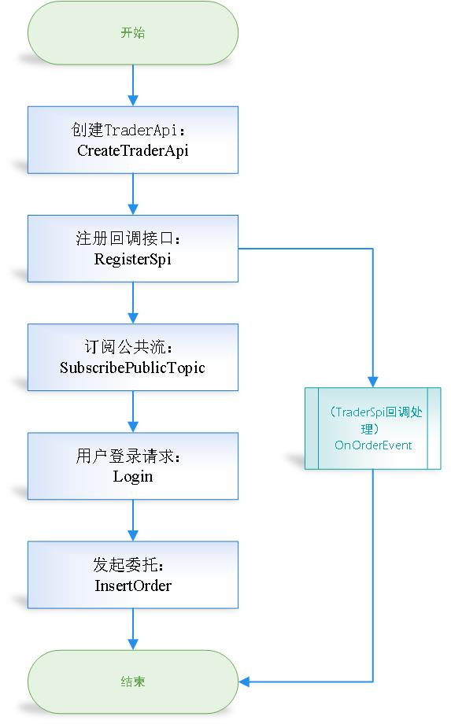
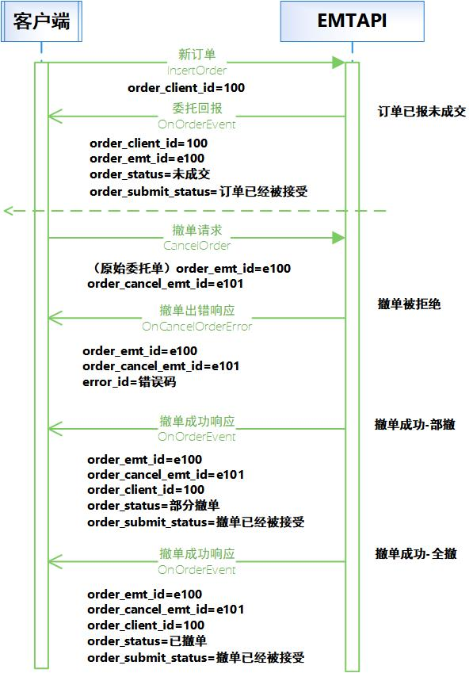
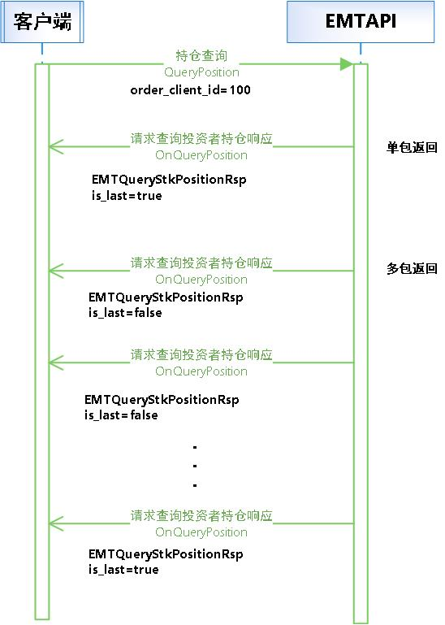

<font size="6">**东方财富证券极速交易系统交易API开发手册(Ver2.23.0)**</font><br>

<font size="6">文档说明</font>

<table><tbody>
    <tr>
        <th>日期</th><th>api 版本</th><th>修订摘要</th>
    </tr>
    <tr>
        <td>20210508</td><td>2.0.0</td><td>初版</td>
    </tr>
    <tr>
        <td>20210517</td><td>2.0.0</td><td>增加两融业务接口</td>
    </tr>
    <tr>
        <td>20210527</td><td>2.1.1</td>
        <td>现货：<br>
            增加功能根据报单ID请求查询报单<br>
            增加功能根据委托编号请求查询相关成交<br>
            增加功能请求查询资金划拨<br>
            增加功能请求查询用户新股申购额度信息<br>
            废弃功能查询分级基金<br>
            两融：<br>
            增加查询未完成订单<br>
            增加融券头寸全额占用费率<br>
            增加查询融券头寸全额占用费率</td>
    </tr>
    <tr>
        <td>20210611</td><td>2.1.2</td>
        <td>现货：<br>
            增加功能请求查询未完结报单<br>
            增加功能设置心跳检测时间间隔<br>
            增加功能获取API版本号<br>
            修改委托流程图<br>
        </td>
    </tr>
    <tr>
        <td>20210709</td><td>2.2.0</td>
        <td>
            增加功能融资融券标的证券查询<br>
            增加功能融资融券可担保标的证券查询<br>
            性能优化<br>
            交易-行情API模块合并<br>
            终端信息采集问题,参考EMTTraderApi常见问题66<br>
        </td>
    </tr>
    <tr>
        <td>20210719</td><td>2.3.0</td>
        <td>
            修改委托、撤单时序<br>
        </td>
    </tr>
    <tr>
        <td>20210901</td><td>2.4.0</td>
        <td>
            配股配债信息查询功能QueryIssueInfoList<br>
            两融信用额度调拨请求CreditQuotaTransfer<br>
            支持两融信用额度调拨查询QueryCreditQuotaTransfer<br>
        </td>
    </tr>
    <tr>
        <td>20210911</td><td>2.4.1</td>
        <td>
            昨日市值查询QueryYesterdayAsset<br>
        </td>
    </tr>
    <tr>
        <td>20211117</td><td>2.4.3</td>
        <td>
            增加登出功能 Logout<br>
            增加错误编码,见《EMTTraderApi错误编码列表》<br>
        </td>
    </tr>
     <tr>
        <td>20211203</td><td>2.5.0</td>
        <td>
            现货分页查询逻辑保持与注释一致:<br>
            QueryOrdersByPage<br>
            QueryTradesByPage<br>
            QueryPositionByPage<br>
        </td>
    </tr>
    <tr>
        <td>20211230</td><td>2.6.0</td>
        <td>
            Login增加支持终端信息传入,默认不传<br>
        </td>
    </tr>
    <tr>
        <td>20220510</td><td>2.7.0</td>
        <td>
            API增加场外OTC委托相关业务功能：<br>
            增加OTC系统登录：Login增加访问系统类型参数，支持登录场外OTC系统,默认原有系统<br>
            增加OTC委托：复用InsertOrder接口<br>
            增加OTC撤单：复用CancelOrder接口<br>
            增加OTC委托分页查询：复用QueryOrdersByPage接口<br>
            增加OTC成交分页查询：复用QueryTradesByPage接口<br>
            增加OTC资产信息查询：QueryOtcAsset<br>
            增加OTC持仓信息查询：QueryOtcPositionByPage<br>
            增加OTC系统登出：复用Logout接口<br>
            增加系统类型数据字典：EMT_SYSTEM_LOGIN<br>
            增加委托回报状态：支持OTC系统状态返回
        </td>
    </tr>
     <tr>
        <td>20220618</td><td>2.7.1</td>
        <td>
            删除接口SetSoftwareKey-设置软件开发Key；无需调用此接口<br>
            现货业务增加支持etf基本信息查询功能接口：QueryETF
        </td>
    </tr>
    <tr>
        <td>20220704</td><td>2.7.2</td>
        <td>
            日志输出简化<br>
        </td>
    </tr>
    <tr>
        <td>20220725</td><td>2.8.0</td>
        <td>
            InsertOrder线程安全<br>
            内部流控、查询相关优化<br>
            支持OnDisconnect断线回调接口<br>
            增加OTC委托分页查询：QueryOtcOrdersByPage独立接口<br>
            增加OTC成交分页查询：QueryOtcTradesByPage独立接口<br>
        </td>
    </tr>
    <tr>
        <td>20220827</td><td>2.9.0</td>
        <td>
            查询对端节点资金QueryOtherServerFund接口实现<br>
            内部同步推送优化<br>
        </td>
    </tr>
    <tr>
        <td>20220924</td><td>2.10.0</td>
        <td>
            现货业务新增etf清单文件分页查询功能接口：QueryETFByPage<br>
            现货业务新增标的基本信息分页查询功能接口：QuerySecurityByPage<br>
            完善自动重连机制<br>
            新增OnConnected连接成功通知接口<br>
            断线回调OnDisconnected出参修改<br>
        </td>
	</tr>
    <tr>
        <td>20221014</td><td>2.11.0</td>
        <td>
            成交类型字段数据字典重定义<br>
            现货etf基本信息查询新增返回字段：是否为rtgs<br>
        </td>
	</tr>
    <tr>
        <td>20221102</td><td>2.12.0</td>
        <td>
            OTC资产查询、分页委托查询、分页成交查询、分页持仓查询请求新增'业务类型'入参字段<br>
            OTC资产查询应答新增业务字段<br>
            OTC分页持仓查询应答字段修改<br>
            ETF基础信息查询、ETF信息分页查询新增应答字段<br>
        </td>
	</tr>
    <tr>
        <td>20221130</td><td>2.13.0</td>
        <td>
            OTC委托查询、成交查询、资产查询新增'市场'入参字段<br>
            支持OTC资金划拨<br>
            OTC场外登录内部优化<br>
        </td>
	</tr>
    <tr>
        <td>20221221</td><td>2.13.1</td>
        <td>
            优化流控<br>
        </td>
	</tr>
    <tr>
        <td>20230113</td><td>2.14.0</td>
        <td>
            删除OTC接口及相关结构体：<br>
                QueryOtcAsset 场外OTC请求查询资产 <br>
                QueryOtcPositionByPage 场外OTC请求查询投资者持仓分页 <br>
                QueryOtcOrdersByPage 场外OTC请求查询报单分页 <br>
                QueryOtcTradesByPage 场外OTC请求查询成交分页 <br>
            登录入参调整：<br>
                删除入参：EMT_SYSTEM_LOGIN  login_type<br>
        <br>
        </td>
	</tr>
    <tr>
        <td>20230217</td><td>2.15.0</td>
        <td>
            删除两融偿还指定负债息费功能接口：CreditCashRepayDebtInterestFee <br>
            两融业务新增指定负债偿还功能接口：CreditCashRepaySpecifiedDebt <br>
    </tr>
    <tr>
        <td>20230320</td><td>2.15.1</td>
        <td>
            修复了期权相关问题 <br>
    </tr>
    <tr>
        <td>20230413</td><td>2.16.0</td>
        <td>
            内部优化 <br>
    </tr>
    <tr>
        <td>20230526</td><td>2.17.0</td>
        <td>
            TCP模式支持API跨节点接入 <br>
            UDP模式优化登录速度 <br>
            查询ETF股票篮回调新增creation_premium_ratio、redemption_discount_ratio、creation_amount、redemption_amount字段赋值 <br>
            期权内部优化 <br>
    </tr>
    <tr>
        <td>20230714</td><td>2.18.0</td>
        <td>
            新增期权行权/组合行权接口 <br>
            期权内部优化 <br>
    </tr>
    <tr>
        <td>20230825</td><td>2.19.0</td>
        <td>
            市场类型EMT_MARKET_TYPE新增枚举值: 深港通(EMT_MKT_SZ_HK_CONNECT)和沪港通(EMT_MKT_SH_HK_CONNECT) <br>
            价格类型EMT_PRICE_TYPE新增枚举值: 港股通竞价限价(EMT_PRICE_HK_LIMIT_BIDDING)和港股通增强限价(EMT_PRICE_HK_LIMIT_ENHANCED) <br>
            账户资金查询响应EMTQueryAssetRsp新增港股通可用资金和港股通可用冻结金额 <br>
            新增港股通参考汇率信息查询接口: QueryHKConnectIndicativeExchangeRateInfo <br>
            新增港股通最小价差信息查询接口: QueryHkConnectSpreadTable <br>
            移除融资融券可担保证券分页查询接口: QueryCreditPledgeStkPagination <br>
            移除融资融券标的证券分页查询接口: QueryCreditTargetStkPagination <br>
            新增新版融资融券可担保证券分页查询接口: QueryCreditPledgeStkByPage <br>
            新增新版融资融券标的证券分页查询接口: QueryCreditTargetStkByPage <br>
            重新定义BusinessType字段类型: 移除类型EMT_BUSINESS_TYPE(32bit)，新增类型EMT_BUSINESS_TYPE_EXT(8bit) <br>
            新增期权资金划拨与资金划拨流水查询功能 <br>
    </tr>
    <tr>
        <td>20240119</td><td>2.20.0</td>
        <td>
            标的信息查询响应接口(OnQuerySecurityInfo)支持返回标的名称字段(ticker_name) <br>
            分页请求查询持仓响应接口(OnQueryPositionByPage)支持返回标的名称字段(ticker_name) <br>
            两融融券头寸全额占用费率查询响应接口(OnQueryCreditPositionFullRate)新增首次调拨的收盘价(即计息价格)字段(posistkprice) <br>
    </tr>
    <tr>
        <td>20240126</td><td>2.20.1</td>
        <td>
            错误码列表更新 <br>
    </tr>
    <tr>
        <td>20240412</td><td>2.21.0</td>
        <td>
            新增非交易持仓变动回调接口：OnHoldingChangeEvent <br>
            新增分页查询融券负债当日应还接口：QueryCreditDebtToRepayTodayByPage <br>
            期权支持重拉流水功能 <br>
            可合并行权头寸查询接口(QueryOptionCombinedExecPosition)支持返回全部可能头寸 <br>
            两融业务错误码修改为中文报错 <br>
            demo优化，新增分页查询请求示例 <br>
    </tr>
    <tr>
        <td>20240927</td><td>2.22.0</td>
        <td>
            Level-2行情API发布 <br>
        </td>
    </tr>
    <tr>
        <td>20241025</td><td>2.23.0</td>
        <td>
            新股新债申购信息查询接口(QueryIPOInfoList)新增北交所申购价格上限字段(highest_price)和申购价格下限字段(minimum_price) <br>
            新增资金查询接口：QueryFund <br>
        </td>
    </tr>
</table>


<font size="6">前言</font>

本接口规范用以指导开发通过 EMTAPI 对接的方式访问东财快速交易系统，进行现货、两融、期权的相关业务。

本接口规范描述内容包括可开展的业务、必要的运行指导以及详细的数据交换格式

# 1. EMTTraderAPI介绍

本部分主要介绍现货极速交易系统的接口，包括：

* EMTTraderAPI简介。
* EMTTraderAPI运行模式。
* EMTTraderAPI编程接口

## 1.1. EMTTraderAPI简介

### 1.1.1. 背景

&emsp;&emsp;为实现客户快速交易，东方财富证券推出了现货极速交易系统。客户端系统调用 EMTTraderAPI 即可完成与现货极速交易系统的对接，接收到极速交易系统的报单和成交回报后 EMTTraderAPI 将回调（Callback）客户端系统。

### 1.1.2. 简介

&emsp;&emsp;EMTTraderAPI是一个基于C++的类库，通过使用和扩展类库提供的接口来实现全部的交易功能，支持现货、两融、期权系统相关业务功能。包括资金账号登陆、报单的录入、报单的撤销、报单的查询、成交单查询、融资负债查询、负债合约查询、资金划转等功能。

&emsp;&emsp;该类库包含以下文件：

|文件路径        |文件名                    |文件描述                  |
|:--------------|:------------------------|:-------------------------|
|demo           |CMakeLists.txt           |示例编译文件               |
|               |emt_api_demo.cpp         |示例主函数                 |
|               |MySPI.cpp                |示例接口方法封装            |
|               |MySPI.h                  |示例接口方法头文件          |
|doc            |API开发手册               |                          |
|include        |emt_trader_api.h         |定义交易接口的头文件        |
|               |eoms_api_struct.h        |定义交易类相关数据结构      |
|               |emt_api_struct.h         |定义业务数据结构            |
|               |emt_api_struct_common.h  |定义业务公共数据结构        |
|               |eoms_api_fund_struct.h   |定义资金划拨相关结构体类型   |
|               |emt_api_data_type.h      |定义兼容数据基本类型        |
|lib/windows/x64|emt_api.dll              |Windows交易接口动态链接库   |
|               |emt_api.lib              |Windows交易接口导入库文件   |
|linux          |libemt_api.so            |Linux交易接口动态链接库     |

&emsp;&emsp;客户系统在开发过程中需注意<font color=red>"当前版本不开放的业务"</font>，同时在每个功能描述中的具体描述。

### 1.1.3. 发行的平台

目前发布了以下操作系统平台的版本：

* Intel X86/Windows10：包括.h文件、.dll文件和.lib文件。
* Intel Linux：包括.h文件和.so文件；在CentOS kernel 3.10.0-1127.el7.x86_64下完成编译。

如果需要其他操作系统版本，请联系交易专线。

## 1.2. 运行模式

### 1.2.1. 工作线程

&emsp;&emsp;客户系统应用程序至少由两个线程组成，一个是应用程序主线程，一个是API工作线程（EMTTraderAPI）。应用程序与极速交易系统的通信是由API工作线程驱动的。

&emsp;&emsp;TraderSpi提供的接口回调是由EMTTraderAPI工作线程驱动，通过实现SPI中的接口方法，从极速交易系统收取所需数据。

&emsp;&emsp;如果重载的客户系统的应用程序的某个回调函数阻塞，则等于阻塞了EMTTraderAPI工作线程，API与极速交易系统的通信会停止，因此通常应该迅速返回。在TraderSpi派生类的回调函数中，可以利用将数据放入缓冲区或通过Windows的消息机制来实现迅速返回。

### 1.2.2. 运行流程

客户系统和极速交易系统的交互过程分为2个阶段：

* 初始化阶段。
* 功能调用阶段。

#### 1.2.2.1. 初始化阶段

&emsp;&emsp;在初始化阶段，客户系统的程序必须完成如下步骤（具体代码请参考开发实例）：

|顺序    |客户系统    |调用方法|
|------|-----------|-------|
|1    |创建一个TraderApi实例；              |TraderApi::CreateTraderApi|
|2    |产生一个事件处理的实例；（步骤1返回）  ||
|3    |注册一个事件处理的实例；              |TraderApi::RegisterSpi|
|4    |订阅公共流                           |TraderApi::SubscribePublicTopic|
|5    |设置开发代码1                        |相关业务实现及返回处理：<br/>TraderApi::InsertOrder<br/>TraderApi::CancelOrder<br/>TraderApi::QueryOrders <br/>…|

&emsp;&emsp;<font color=red>*开发代码由我司人员提供，需客户申请。*</font>

#### 1.2.2.2. 功能调用阶段

&emsp;&emsp;在功能调用阶段，客户系统可以任意调用交易接口中的请求方法，如Login、InsertOrder等；同时提供回调函数以响应回报信息，如OnOrderEvent、OnTradeEvent等。

#### 1.2.2.3. 流程图示例



### 1.2.3. 时序示例

&emsp;&emsp;EMTTraderAPI提供了两个接口，分别为TraderApi和TraderSpi。

&emsp;&emsp;客户系统可以通过TraderApi发出操作请求，通过继承TraderSpi并重载回调函数来处理极速交易系统的回复或响应。

#### 1.2.3.1. 委托流程时序

&emsp;&emsp;对于提交的新订单，交易系统以执行报告消息作为响应。执行报告消息分为两类报文，一类报文用于**报单状态响应（OnOrderEvent）**，一类报文用于**新订单达成成交时的响应（OnTradeEvent）**。


#### 1.2.3.2. 撤单流程时序

&emsp;&emsp;撤单成功的响应是通过**报单状态响应（OnOrderEvent）** 进行回报，撤单失败的响应是通过**撤单出错响应（OnCancelOrderError）** 进行回报。



#### 1.2.3.3. 查询流程时序

&emsp;&emsp;各种查询功能，是通过不同的请求功能方法实现的，但大体流程基本相似。

&emsp;&emsp;查询多条数据，会分多次返回，包头中有 islast 作为标记是否为最后一条

&emsp;&emsp;以持仓查询为例：



### 1.2.4. 连接方式

#### 1.2.4.1. 支持多账户登录

&emsp;&emsp;同一个进程中只允许存在一个API实例。当用户多账户登录时，请确保程序中只Create了一次api(调用一次CreateTraderApi)。

&emsp;&emsp;Create时client_id的作用区别同一account在不同客户端登录时的场景（多点登录场景）；但客户收到的session_id是一样的，因此多点登录情况一个客户端的交易回报另一个客户端也能收到响应的回报信息。

&emsp;&emsp;多账户登录时，只需要在创建API后进行多次Login即可，Login后返回的session_id会不同，所以登录后请及时更新。

&emsp;&emsp;API中登录Login()接口为同步的，返回后，可以视为已经登录成功，返回值即为生成的session_id。

&emsp;&emsp;api内部会自动重连。在服务器与客户端断线的时候会回调OnDisconnected()断线通知方法，若出现断线通知，用户无需做特殊处理，等待重连即可，重连后将回调OnConnected连接成功通知。


# 2. EMTTraderAPI公共接口

## 2.1. 业务支持索引

|方法  | 描述|
|:----|:----|
|[CreateTraderApi](#createtraderapi)           |创建TraderApi|
|[RegisterSpi](#registerspi)                   |注册回调接口|
|[SubscribePublicTopic](#subscribepublictopic) |订阅公共流|
|[Login](#login)                               |用户登录请求|
|[Logout](#logout)                             |用户登出请求|
|[OnConnected](#onconnected)                   |连接成功回调通知|
|[OnDisconnected](#ondisconnected)             |连接通讯断开回调处理|
|[GetTradingDay](#gettradingday)               |获取当前交易日|
|[GetApiLastError](#getapilasterror)           |获取API的系统错误|
|[GetApiVersion](#getapiversion)               |获取API的发行版本号|
|[SetHeartBeatInterval](#setheartbeatinterval) |设置心跳检测时间间隔，单位为秒|
|[Release](#release)                           |释放接口对象|

## 2.2. API接口描述

### 2.2.1. <a id="createtraderapi">创建TraderApi</a>

```cpp
///创建TraderApi
///@param client_id （必须输入）客户端id，用于区分同一用户的不同客户端，由用户自定义
///@param save_file_path （必须输入）存贮订阅信息文件的目录，请设定一个真实存在的有可写权限的路径
///@param log_level 日志输出级别
///@return 创建出的UserApi
///@remark 如果一个账户需要在多个客户端登录，请使用不同的client_id，系统允许一个账户同时登录多个客户端，但是对于同一账户，相同的client_id只能保持一个session连接，后面的登录在前一个session存续期间，无法连接。系统不支持过夜，请确保每天开盘前重新启动
///@remark 管理端接口client_id必须大于255
static TraderApi *CreateTraderApi(uint16_t client_id, const char *save_file_path, EMT_LOG_LEVEL log_level = EMT_LOG_LEVEL_DEBUG);
```

### 2.2.2. <a id="registerspi">注册回调接口</a>

```cpp
///注册回调接口
///@param spi 派生自回调接口类的实例，请在登录之前设定
virtual void RegisterSpi(TraderSpi *spi) = 0;
```

### 2.2.3. <a id="subscribepublictopic">订阅公共流</a>

```cpp
///订阅公共流。
///@param resume_type 公共流（订单响应、成交回报）重传方式  
///        EMT_TERT_RESTART:从本交易日开始重传
///        EMT_TERT_RESUME:(保留字段，此方式暂未支持)从上次收到的续传
///        EMT_TERT_QUICK:只传送登录后公共流的内容
///@remark 该方法要在Login方法前调用。若不调用则不会收到公共流的数据。注意在用户断线后，如果不登出就login()，公共流订阅方式不会起作用。用户只会收到断线后的所有消息。如果先logout()再login()，那么公共流订阅方式会起作用，用户收到的数据会根据用户的选择方式而定。
virtual void SubscribePublicTopic(EMT_TE_RESUME_TYPE resume_type) = 0;
```

### 2.2.4. <a id="login">用户登录请求</a>

```cpp
///用户登录请求
///@return session_id表明此资金账号登录是否成功，“0”表示登录失败，可以调用GetApiLastError()来获取错误代码，非“0”表示登录成功，此时需要记录下这个返回值session_id，与登录的资金账户对应
///@param ip 服务器地址，类似“127.0.0.1”
///@param port 服务器端口号
///@param user 登录用户名
///@param password 登录密码
///@param sock_type “1”代表TCP，“2”代表UDP
///@param local_ip 本地网卡地址，类似“127.0.0.1”
///@param info 终端信息
///@remark 此函数为同步阻塞式，不需要异步等待登录成功，当函数返回即可进行后续操作，此api可支持多个账户连接，但是同一个账户同一个client_id只能有一个session连接，后面的登录在前一个session存续期间，无法连接
virtual uint64_t Login(const char* ip, int port, const char* user, const char* password, EMT_PROTOCOL_TYPE sock_type, const char* local_ip = NULL, const EMTUserTerminalInfoReq* info = NULL) = 0;
```
### 2.2.5. <a id="logout">用户登出请求</a>

```cpp
///登出请求
///@return 登出是否成功，“0”表示登出成功，“-1”表示登出失败
///@param session_id 资金账户对应的session_id,登录时得到
virtual int Logout(uint64_t session_id) = 0;
```

### 2.2.6. <a id="onconnected">连接成功回调通知</a>

```cpp
///连接成功通知
///@remark 当客户端与交易后台成功建立连接时，该方法被调用；OnConnected接口仅用作连接成功通知，需要快速返回，用户无需在此函数中做特殊处理
virtual void OnConnected() = 0;
```

### 2.2.7. <a id="ondisconnected">连接通讯断开回调通知</a>

```cpp
///断线通知
///@param reason 错误原因，请与错误代码表对应
///@remark 当客户端与交易后台的通信连接断开时，该方法被调用；api内部支持自动重连机制，OnDisconnected接口仅用做断线通知，需要快速返回，用户无需在此函数中做特殊处理
virtual void OnDisconnected(int reason) = 0;
```

### 2.2.8. <a id="gettradingday">获取当前交易日</a>

```cpp
///获取当前交易日
///@return 获取到的交易日
///@remark 只有登录成功后,才能得到正确的交易日
virtual const char *GetTradingDay() = 0;

```

### 2.2.9. <a id="getapilasterror">获取API的系统错误</a>

```cpp
///获取API的系统错误
///@return 返回的错误信息，可以在Login、InsertOrder、CancelOrder返回值为0时调用，获取失败的原因
///@remark 可以在调用api接口失败时调用，例如login失败时
virtual EMTRI *GetApiLastError() = 0;
```

### 2.2.10. <a id="getapiversion">获取API的发行版本号</a>

```cpp
///获取API的发行版本号
///@return 返回api发行版本号
virtual const char* GetApiVersion() = 0;
```

### 2.2.11. <a id="setheartbeatinterval">设置心跳检测时间间隔，单位为秒</a>

```cpp
///设置心跳检测时间间隔，单位为秒
///@param interval 心跳检测时间间隔，单位为秒
///@remark 此函数必须在Login之前调用
virtual void SetHeartBeatInterval(uint32_t interval) = 0;
```

### 2.2.12. <a id="release">释放接口对象</a>

```cpp
///删除接口对象本身
///@remark 不再使用本接口对象时,调用该函数删除接口对象
virtual void Release() = 0;
```


# 3. EMTTraderAPI业务接口

## 3.1. 业务支持索引

|请求方法(TraderApi)  |应答回调TraderSpi| 描述 |
|:----|:----|:---|
|[InsertOrder](#insertorder)  |[OnOrderEvent](#onorderevent)<br>[OnTradeEvent](#ontradeevent)   |报单录入请求|
|[CancelOrder](#cancelorder)  |[OnOrderEvent](#onorderevent)<br>[OnCancelOrderError](#oncancelordererror)|撤单请求|
|[FundTransfer](#fundTransfer)|[OnFundTransfer](#onfundtransfer)                                |资金划拨|
|[QueryFundTransfer](#queryfundtransfer)|[OnQueryFundTransfer](#onqueryfundtransfer)            |请求查询资金划拨|
|[QueryAsset](#queryasset)    |[OnQueryAsset](#onqueryasset)                                    |请求查询资产|
|[QueryFund](#queryfund)    |[OnQueryFund](#onqueryfund)                                        |请求查询资金|
|[QueryPosition](#queryposition)  |[OnQueryPosition](#onqueryposition)                          |请求查询投资者持仓|
|[QueryPositionByPage](#querypositionbypage)  |[OnQueryPositionByPage](#onquerypositionbypage)  |请求查询投资者持仓分页|
|[QueryIPOInfoList](#queryipoInfolist) |[OnQueryIPOInfoList](#onqueryipoInfolist)               |请求查询今日新股申购信息列表|
|[QueryIPOQuotaInfo](#queryipoquotainfo) |[OnQueryIPOQuotaInfo](#onqueryipoquotainfo)           |请求查询用户新股申购额度信息|
|[QueryETF](#queryetf) |[OnQueryETF](#onqueryetf)           |请求查询ETF基础信息|
|[QueryETFTickerBasket](#queryetftickerbasket) |[OnQueryETFBasket](#onqueryetfbasket)           |请求查询ETF股票篮|
|[QueryOrders](#queryorders)     |[OnQueryOrder](#onqueryorder)                                 |请求查询报单|
|[QueryUnfinishedOrders](#queryunfinishedorders)|[OnQueryOrder](#onqueryorder)                  |请求查询未完结报单|
|[QueryTrades](#querytrades)     |[OnQueryTrade](#onquerytrade)                                 |请求查询已成交|
|[QueryOrderByEMTID](#queryorderbyemtid)     |[OnQueryOrder](#onqueryorder)                     |根据报单ID请求查询报单|
|[QueryOrdersByPage](#queryordersbypage)     |[OnQueryOrderByPage](#onqueryorderbypage)         |分页请求查询报单|
|[QueryTradesByEMTID](#querytradesbyemtid)   |[OnQueryTrade](#onquerytrade)                     |根据委托编号请求查询相关成交|
|[QueryTradesByPage](#querytradesbypage)     |[OnQueryTradeByPage](#onquerytradebypage)         |分页请求查询成交回报|
|[CreditCashRepay](#creditcashrepay)     |[OnCreditCashRepay](#oncreditcashrepay)               |现金直接还款请求|
|[QueryCreditCashRepayInfo](#querycreditcashrepayinfo)|[OnQueryCreditCashRepayInfo](#onquerycreditcashrepayinfo)|请求查询融资融券业务中的现金直接还款报单|
|[QueryCreditFundInfo](#querycreditfundinfo)            |[OnQueryCreditFundInfo](#onquerycreditfundinfo)          |请求查询信用账户特有信息|
|[QueryCreditDebtInfo](#querycreditdebtinfo)            |[OnQueryCreditDebtInfo](#onquerycreditdebtinfo)          |请求查询信用账户负债合约信息|
|[QueryCreditDebtInfoByPage](#querycreditdebtinfobypage)|[OnQueryCreditDebtInfoByPage](#onquerycreditdebtinfobypage) |请求查询信用账户负债合约信息|
|[QueryCreditTickerDebtInfo](#querycredittickerdebtinfo)|[OnQueryCreditTickerDebtInfo](#onquerycredittickerdebtinfo)|请求查询指定证券负债未还信息|
|[QueryCreditAssetDebtInfo](#querycreditassetdebtinfo)  |[OnQueryCreditAssetDebtInfo](#onquerycreditassetdebtinfo)|请求查询信用账户待还资金信息|
|[QueryCreditTickerAssignInfo](#querycredittickerassigninfo)|[OnQueryCreditTickerAssignInfo](#onquerycredittickerassigninfo)|请求查询信用账户可融券头寸信息|
|[QueryCreditTickerAssignInfoByPage](#querycredittickerassigninfobypage)|[OnQueryCreditTickerAssignInfoByPage](#onquerycredittickerassigninfobypage)|分页请求信用账户证券头寸信息|
|[QueryCreditExcessStock](#querycreditexcessstock)      |[OnQueryCreditExcessStock](#onquerycreditexcessstock)    |融资融券业务中请求查询指定证券的余券|
|[QueryMulCreditExcessStock](#querymulcreditexcessstock)|[OnQueryMulCreditExcessStock](#onquerymulcreditexcessstock)|融资融券业务中请求查询余券|
|[CreditExtendDebtDate](#creditextenddebtdate)          |[OnCreditExtendDebtDate](#oncreditextenddebtdate)        |融资融券业务中请求负债合约展期|
|[QueryCreditExtendDebtDateOrders](#querycreditextenddebtdateorders)|[OnQueryCreditExtendDebtDateOrders](#onquerycreditextenddebtdateorders)|融资融券业务中请求查询负债合约展期|
|[QueryCreditFundExtraInfo](#querycreditfundextrainfo)  |[OnQueryCreditFundExtraInfo](#onquerycreditfundextrainfo)|请求查询融资融券业务中账戶的附加信息|
|[QueryCreditPositionExtraInfo](#querycreditpositionextrainfo)|[OnQueryCreditPositionExtraInfo](#onquerycreditpositionextrainfo)|请求查询融资融券业务中账戶指定证券的附加信息|
|[QueryCreditPledgeStkRate](#querycreditpledgestkrate)|[OnQueryCreditPledgeStkRate](#onquerycreditpledgestkrate)  |融资融券业务中请求查询担保品折算率|
|[QueryCreditMarginRate](#querycreditmarginrate)      |[OnQueryCreditMarginRate](#onquerycreditmarginrate)        |融资融券业务中请求查询保证金率|
|[QueryCreditPositionFullRate](#querycreditpositionfullrate)|[OnQueryCreditPositionFullRate](#onquerycreditpositionfullrate)|融资融券查询融券头寸全额占用费率|
|[QueryCreditPledgeStkByPage](#querycreditpledgestkbypage) |[OnQueryCreditPledgeStkByPage](#onquerycreditpledgestkbypage) |融资融券可担保证券分页查询|
|[QueryCreditTargetStkByPage](#querycredittargetstkbypage) |[OnQueryCreditTargetStkByPage](#onquerycredittargetstkbypage) |融资融券标的证券分页查询|
|[QueryOptionAuctionInfo](#queryoptionauctioninfo)        |[OnQueryOptionAuctionInfo](#onqueryoptionauctioninfo) |请求查询期权合约|
|[InsertOptionExerciseOrder](#insertoptionexercisedorder)  |[OnOptionExerciseOrderEvent](#onoptionexerciseorderevent) |期权行权/组合行权报单录入请求|
|[InsertOptionCombinedOrder](#insertoptioncombinedorder)  |[OnOptionCombinedOrderEvent](#onoptioncombinedorderevent) |期权组合策略报单录入请求|
|[QueryOptionCombinedUnfinishedOrders](#queryoptioncombinedunfinishedorders) |[OnQueryOptionCombinedOrders](#onqueryoptioncombinedorders) |请求查询期权组合策略未完结报单|
|[QueryOptionCombinedOrderByEMTID](#queryoptioncombinedorderbyemtid) |[OnQueryOptionCombinedOrders](#onqueryoptioncombinedorders) |根据报单ID请求查询期权组合策略报单|
|[QueryOptionCombinedOrders](#queryoptioncombinedorders) |[OnQueryOptionCombinedOrders](#onqueryoptioncombinedorders) |请求查询期权组合策略报单|
|[QueryOptionCombinedTradesByEMTID](#queryoptioncombinedtradesbyemtid) |[OnQueryOptionCombinedTrades](#onqueryoptioncombinedtrades) |根据期权组合策略委托编号请求查询相关成交|
|[QueryOptionCombinedTrades](#queryoptioncombinedtrades)    |[OnQueryOptionCombinedTrades](#onqueryoptioncombinedtrades) |请求查询期权组合策略的成交回报|
|[QueryOptionCombinedPosition](#queryoptioncombinedposition)|[OnQueryOptionCombinedPosition](#onqueryoptioncombinedposition) |请求查询投资者期权组合策略持仓|
|[QueryOptionCombinedStrategyInfo](#queryoptioncombinedstrategyinfo) |[OnQueryOptionCombinedStrategyInfo](#onqueryoptioncombinedstrategyinfo) |请求查询期权组合策略信息|
|[QueryOptionCombinedExecPosition](#queryoptioncombinedexecposition) |[OnQueryOptionCombinedExecPosition](#onqueryoptioncombinedexecposition) |请求查询期权行权合并头寸|
|[QueryIssueInfoList](#queryissueinfolist) |[OnQueryIssueInfoList](#onqueryissueinfolist) |请求查询配股业务信息列表|
|[CreditQuotaTransfer](#creditquotatransfer) |[OnCreditQuotaTransfer](#oncreditquotatransfer) |融资融券两地分仓信用额度调拨请求|
|[QueryCreditQuotaTransfer](#querycreditquotatransfer) |[OnQueryCreditQuotaTransfer](#onquerycreditquotatransfer) |融资融券两地分仓信用额度调拨查询请求|
|[QueryYesterdayAsset](#queryyesterdayasset) |[OnQueryYesterdayAsset](#onqueryyesterdayasset) |请求查询昨日资产|
|[QueryOtherServerFund](#queryotherserverfund) |[OnQueryOtherServerFund](#onqueryotherserverfund) |请求查询其他节点可用资金|
|[QueryETFByPage](#queryetfbypage) |[OnQueryETFByPage](#onqueryetfbypage) |分页请求查询ETF清单文件|
|[QuerySecurityByPage](#querysecuritybypage) |[OnQuerySecurityByPage](#onquerysecuritybypage) |分页请求查询标的基本信息|
|[QueryHKConnectIndicativeExchangeRateInfo](#queryhkconnectindicativeexchangerateinfo) |[OnQueryHKConnectIndicativeExchangeRateInfo](#onqueryhkconnectindicativeexchangerateinfo) |查询港股通参考汇率信息|
|[QueryHkConnectSpreadTable](#queryhkconnectspreadtable) |[OnQueryHkConnectSpreadTable](#onqueryhkconnectspreadtable) |查询港股通最小价差信息|
|[QueryCreditDebtToRepayTodayByPage](#querycreditdebttorepaytodaybypage) |[OnQueryCreditDebtToRepayTodayByPage](#onquerycreditdebttorepaytodaybypage) |查询融资融券业务中账户融券负债当日应还情况|


## 3.2. API接口描述

### 3.2.1. <a id="insertorder">报单录入请求</a>

|接口名称 |InsertOrder     |                          ||
|:----------------|:--|:--|:--|
|功能描述 |报单录入请求    |                             ||
|         |<b>名称</b>   |<b>类型及长度</b>                            |<b>描述</b>|
|入参     |新订单请求     |[EMTOrderInsertInfo](#emtorderinsertinfo)*  |类型参见入参结构体定义|
|         |会话号        |uint64_t  session_id                        |资金账户对应的session_id,登录时得到|
|出参     |函数返回值     |uint64_t                                    ||
|         |报单响应结构体 |[EMTOrderInfo](#emtorderinfo)*              |类型参见出参结构体定义；异步调用回调函数返回|
|         |报单成交结构体 |[EMTTradeReport](#emttradereport)*          |类型参见出参结构体定义；订单成交时异步调用回调函数返回|
|         |错误响应结构体 |[EMTRspInfoStruct](#emtrspinfostruct)*      |类型参见出参结构体定义|
|备注信息  |              |                                            |||

### 3.2.2. <a id="cancelorder">撤单请求</a>

|接口名称 |CancelOrder     |                          ||
|:-------|:--|:--|:--|
|功能描述 |撤单请求                           |                             ||
|         |<b>名称</b>                       |<b>类型及长度</b>                            |<b>描述</b>|
|入参     |需要撤销的委托单在EMT系统中的ID     |uint64_t  order_emt_id   |委托时返回序号|
|         |会话号                            |uint64_t  session_id     |资金账户对应的session_id,登录时得到|
|出参     |函数返回值                         |uint64_t                                    ||
|         |报单响应结构体                     |[EMTOrderInfo](#emtorderinfo)*              |类型参见出参结构体定义；（撤单成功）异步调用回调函数返回|
|         |撤单失败响应消息                   |[EMTOrderCancelInfo](#emtordercancelinfo)*  |类型参见出参结构体定义；（撤单失败）异步调用回调函数返回|
|         |错误响应结构体                     |[EMTRspInfoStruct](#emtrspinfostruct)*      |类型参见出参结构体定义|
|备注信息  |                                  |                                            |||

### 3.2.3. <a id="fundtransfer">资金划拨</a>

|接口名称 |FundTransfer     |                          ||
|:-------|:--|:--|:--|
|功能描述 |资金划拨                           |                             ||
|         |<b>名称</b>   |<b>类型及长度</b>                            |<b>描述</b>|
|入参     |资金请求       |[EMTFundTransferReq](#emtfundtransferreq)*  |类型参见入参结构体定义|
|         |会话号        |uint64_t  session_id                         |资金账户对应的session_id,登录时得到|
|出参     |函数返回值     |uint64_t                                    ||
|         |报单响应结构体 |[EMTFundTransferNotice](#emtfundtransfernotice)* |类型参见出参结构体定义；异步调用回调函数返回|
|         |错误响应结构体 |[EMTRspInfoStruct](#emtrspinfostruct)*      |类型参见出参结构体定义|
|         |会话号        |uint64_t                                    |资金账户对应的session_id,登录时得到|
|备注信息  |              |                                            |||

### 3.2.4. <a id="queryfundtransfer">请求查询资金划拨</a>

|接口名称 |QueryFundTransfer     |                          ||
|:-------|:--|:--|:--|
|功能描述 |请求查询资金划拨                           |                             ||
|         |<b>名称</b>   |<b>类型及长度</b>                            |<b>描述</b>|
|入参     |资金内转流水查询|[EMTQueryFundTransferLogReq](#emtqueryfundtransferlogreq)*  |类型参见入参结构体定义|
|         |会话号        |uint64_t  session_id                         |资金账户对应的session_id,登录时得到|
|         |请求序号      |int       request_id                         |用于用户定位查询响应的ID，由用户自定义|
|出参     |函数返回值     |int                                         ||
|         |账户资金查询响应|[EMTFundTransferNotice](#emtfundtransfernotice)* |类型参见出参结构体定义；异步调用回调函数返回|
|         |错误响应结构体 |[EMTRspInfoStruct](#emtrspinfostruct)*  |类型参见出参结构体定义|
|         |请求序号      |int       request_id                     |此消息响应函数对应的请求ID|
|         |结束标识      |bool      is_last                        |当为最后一个的时候为true，如果为false，表示还有其他后续消息响应|
|         |会话号        |uint64_t  session_id                     |资金账户对应的session_id,登录时得到|
|备注信息  |              |                                            |||

### 3.2.5. <a id="queryasset">请求查询资产</a>

|接口名称 |QueryAsset     |                          ||
|:-------|:--|:--|:--|
|功能描述 |请求查询资产                           |                             ||
|         |<b>名称</b>   |<b>类型及长度</b>                            |<b>描述</b>|
|入参     |会话号        |uint64_t  session_id                         |资金账户对应的session_id,登录时得到|
|         |请求序号      |int       request_id                         |用于用户定位查询响应的ID，由用户自定义|
|出参     |函数返回值     |int                                         ||
|         |账户资金查询响应|[EMTQueryAssetRsp](#emtqueryassetrsp)* |类型参见出参结构体定义；异步调用回调函数返回|
|         |错误响应结构体 |[EMTRspInfoStruct](#emtrspinfostruct)*  |类型参见出参结构体定义|
|         |请求序号      |int       request_id                     |此消息响应函数对应的请求ID|
|         |结束标识      |bool      is_last                        |当为最后一个的时候为true，如果为false，表示还有其他后续消息响应|
|         |会话号        |uint64_t  session_id                     |资金账户对应的session_id,登录时得到|
|备注信息  |              |                                            |||

### 3.2.6. <a id="queryposition">请求查询投资者持仓</a>

|接口名称 |QueryPosition     |                          ||
|:-------|:--|:--|:--|
|功能描述 |请求查询投资者持仓                           |查询记录数不能超过1000，否则会报错，甚至崩溃，推荐使用对应分页查询接口QueryPositionByPage。||
|         |<b>名称</b>   |<b>类型及长度</b>                            |<b>描述</b>|
|入参     |持仓合约代码   |const char * ticker                         |需要查询的持仓合约代码，可以为空，如果不为空，请不带空格，并以'\0'结尾|
|         |会话号        |uint64_t  session_id                         |资金账户对应的session_id,登录时得到|
|         |请求序号      |int       request_id                         |用于用户定位查询响应的ID，由用户自定义|
|         |市场类型      |enum      market                             |参考字典<br>[EMT_MARKET_TYPE](#emt_market_type)|
|出参     |函数返回值     |int                                         ||
|         |账户资金查询响应|[EMTQueryStkPositionRsp](#emtquerystkpositionrsp)* |类型参见出参结构体定义；异步调用回调函数返回|
|         |错误响应结构体 |[EMTRspInfoStruct](#emtrspinfostruct)*              |类型参见出参结构体定义|
|         |请求序号      |int       request_id                                 |此消息响应函数对应的请求ID|
|         |结束标识      |bool      is_last                                    |当为最后一个的时候为true，如果为false，表示还有其他后续消息响应|
|         |会话号        |uint64_t  session_id                                 |资金账户对应的session_id,登录时得到|
|备注信息  |              |                                            |||

### 3.2.7. <a id="querypositionbypage">请求查询投资者持仓分页</a>

|接口名称 |QueryPositionByPage     |                          ||
|:-------|:--|:--|:--|
|功能描述 |请求查询投资者持仓分页        |每此请求订单条数req_count不超过200，超过时按200处理。||
|         |<b>名称</b>   |<b>类型及长度</b>                            |<b>描述</b>|
|入参     |查询信用账户持仓信息-分页查询|[EMTQueryPositionByPageReq](#emtquerybypagereq)*  |类型参见入参结构体定义|
|         |会话号        |uint64_t  session_id                         |资金账户对应的session_id,登录时得到|
|         |请求序号      |int       request_id                         |用于用户定位查询响应的ID，由用户自定义|
|出参     |函数返回值     |int                                          ||
|         |查询股票持仓情况|[EMTQueryStkPositionRsp](#emtquerystkpositionrsp)* |类型参见出参结构体定义；异步调用回调函数返回|
|         |请求到的最大数量             |int64_t   req_count                   ||
|         |分页请求的当前回报数量       |int64_t   trade_sequence               ||
|         |当前报单信息所对应的查询索引  |int64_t   query_reference              |需要记录下来，在进行下一次分页查询的时候需要用到|
|         |请求序号                    |int       request_id                   |此消息响应函数对应的请求ID|
|         |结束标识                    |bool      is_last                      |当为最后一个的时候为true，如果为false，表示还有其他后续消息响应|
|         |会话号                      |uint64_t  session_id                   |资金账户对应的session_id,登录时得到|
|备注信息  |                            |                                     |||

### 3.2.8. <a id="queryipoinfolist">请求查询今日新股申购信息列表</a>

|接口名称 |QueryIPOInfoList     |                          ||
|:-------|:--|:--|:--|
|功能描述 |请求查询今日新股申购信息列表        |                             ||
|         |<b>名称</b>   |<b>类型及长度</b>                            |<b>描述</b>|
|入参     |会话号        |uint64_t  session_id                         |资金账户对应的session_id,登录时得到|
|         |请求序号      |int       request_id                         |用于用户定位查询响应的ID，由用户自定义|
|出参     |函数返回值     |int                                          ||
|         |当日可申购新股信息|[EMTQueryIPOTickerRsp](#emtqueryipotickerrsp)*     |类型参见出参结构体定义；异步调用回调函数返回|
|         |错误响应结构体 |[EMTRspInfoStruct](#emtrspinfostruct)*              |类型参见出参结构体定义|
|         |请求序号      |int       request_id                                 |此消息响应函数对应的请求ID|
|         |结束标识      |bool      is_last                                    |当为最后一个的时候为true，如果为false，表示还有其他后续消息响应|
|         |会话号        |uint64_t  session_id                                 |资金账户对应的session_id,登录时得到|
|备注信息  |              |                                            |||

### 3.2.9. <a id="queryipoquotainfo">请求查询用户新股申购额度信息</a>

|接口名称 |QueryIPOQuotaInfo     |                          ||
|:-------|:--|:--|:--|
|功能描述 |请求查询用户新股申购额度信息        |                             ||
|         |<b>名称</b>   |<b>类型及长度</b>                            |<b>描述</b>|
|入参     |会话号        |uint64_t  session_id                         |资金账户对应的session_id,登录时得到|
|         |请求序号      |int       request_id                         |用于用户定位查询响应的ID，由用户自定义|
|出参     |函数返回值     |int                                          ||
|         |当日可申购新股信息|[EMTQueryIPOQuotaRsp](#emtqueryipoquotarsp)*     |类型参见出参结构体定义；异步调用回调函数返回|
|         |错误响应结构体 |[EMTRspInfoStruct](#emtrspinfostruct)*              |类型参见出参结构体定义|
|         |请求序号      |int       request_id                                 |此消息响应函数对应的请求ID|
|         |结束标识      |bool      is_last                                    |当为最后一个的时候为true，如果为false，表示还有其他后续消息响应|
|         |会话号        |uint64_t  session_id                                 |资金账户对应的session_id,登录时得到|
|备注信息  |              |                                            |||

### 3.2.10. <a id="queryetftickerbasket">请求查询ETF股票篮</a>

|接口名称 |QueryETFTickerBasket     |                          ||
|:-------|:--|:--|:--|
|功能描述 |请求查询ETF股票篮                           |                             ||
|         |<b>名称</b>   |<b>类型及长度</b>                            |<b>描述</b>|
|入参     |持仓合约代码   |[EMTQueryETFComponentReq](#emtqueryetfcomponentreq)*   |类型参见入参结构体定义|
|         |会话号        |uint64_t  session_id                         |资金账户对应的session_id,登录时得到|
|         |请求序号      |int       request_id                         |用于用户定位查询响应的ID，由用户自定义|
|出参     |函数返回值     |int                                    ||
|    |请求查询ETF股票篮的响应|[EMTQueryETFComponentRsp](#emtqueryetfcomponentrsp)* |类型参见出参结构体定义；异步调用回调函数返回|
|         |错误响应结构体 |[EMTRspInfoStruct](#emtrspinfostruct)*              |类型参见出参结构体定义|
|         |请求序号      |int       request_id                                 |此消息响应函数对应的请求ID|
|         |结束标识      |bool      is_last                                    |当为最后一个的时候为true，如果为false，表示还有其他后续消息响应|
|         |会话号        |uint64_t  session_id                                 |资金账户对应的session_id,登录时得到|
|备注信息  |              |                                            |||

### 3.2.11. <a id="queryorders">请求查询报单</a>

|接口名称 |QueryOrders     |                          ||
|:-------|:--|:--|:--|
|功能描述 |请求查询报单|查询记录数不能超过1000，否则会报错，甚至崩溃，推荐使用对应分页查询接口QueryOrdersByPage。||
|         |<b>名称</b>   |<b>类型及长度</b>                            |<b>描述</b>|
|入参     |请求查询报单   |[EMTQueryOrderReq](#emtqueryorderreq)*   |类型参见入参结构体定义|
|         |会话号        |uint64_t  session_id                         |资金账户对应的session_id,登录时得到|
|         |请求序号      |int       request_id                         |用于用户定位查询响应的ID，由用户自定义|
|出参     |函数返回值     |int                                    ||
|         |报单查询响应结构体|[EMTQueryOrderRsp](#emtorderinfo)* |类型参见出参结构体定义；异步调用回调函数返回|
|         |错误响应结构体 |[EMTRspInfoStruct](#emtrspinfostruct)*              |类型参见出参结构体定义|
|         |请求序号      |int       request_id                                 |此消息响应函数对应的请求ID|
|         |结束标识      |bool      is_last                                    |当为最后一个的时候为true，如果为false，表示还有其他后续消息响应|
|         |会话号        |uint64_t  session_id                                 |资金账户对应的session_id,登录时得到|
|备注信息  |              |                                            |||

### 3.2.12. <a id="queryunfinishedorders">请求查询未完结报单</a>

|接口名称 |QueryUnfinishedOrders     |                          ||
|:-------|:--|:--|:--|
|功能描述 |请求查询未完结报单|                             ||
|         |<b>名称</b>   |<b>类型及长度</b>                            |<b>描述</b>|
|入参     |会话号        |uint64_t  session_id                         |资金账户对应的session_id,登录时得到|
|         |请求序号      |int       request_id                         |用于用户定位查询响应的ID，由用户自定义|
|出参     |函数返回值     |int                                    ||
|         |报单查询响应结构体|[EMTQueryOrderRsp](#emtorderinfo)* |类型参见出参结构体定义；异步调用回调函数返回|
|         |错误响应结构体 |[EMTRspInfoStruct](#emtrspinfostruct)*              |类型参见出参结构体定义|
|         |请求序号      |int       request_id                                 |此消息响应函数对应的请求ID|
|         |结束标识      |bool      is_last                                    |当为最后一个的时候为true，如果为false，表示还有其他后续消息响应|
|         |会话号        |uint64_t  session_id                                 |资金账户对应的session_id,登录时得到|
|备注信息  |              |                                            |||

### 3.2.13. <a id="queryorderbyemtid">根据报单ID请求查询报单</a>

|接口名称 |QueryOrderByEMTID     |                          ||
|:-------|:--|:--|:--|
|功能描述 |根据报单ID请求查询报单                           |                             ||
|         |<b>名称</b>   |<b>类型及长度</b>                            |<b>描述</b>|
|入参     |需要查询的报单在emt系统中的ID   |const uint64_t order_emt_id  |即InsertOrder()成功时返回的order_emt_id|
|         |会话号        |uint64_t  session_id                         |资金账户对应的session_id,登录时得到|
|         |请求序号      |int       request_id                         |用于用户定位查询响应的ID，由用户自定义|
|出参     |函数返回值     |int                                          ||
|         |报单查询响应结构体|[EMTQueryOrderRsp](#emtorderinfo)*        |类型参见出参结构体定义；异步调用回调函数返回|
|         |错误响应结构体 |[EMTRspInfoStruct](#emtrspinfostruct)*      |类型参见出参结构体定义|
|         |请求序号      |int       request_id                         |此消息响应函数对应的请求ID|
|         |结束标识      |bool      is_last                            |当为最后一个的时候为true，如果为false，表示还有其他后续消息响应|
|         |会话号        |uint64_t  session_id                         |资金账户对应的session_id,登录时得到|
|备注信息  |              |                                            |||

### 3.2.14. <a id="queryordersbypage">分页请求查询报单</a>

|接口名称 |QueryOrdersByPage     |                          ||
|:-------|:--|:--|:--|
|功能描述 |分页请求查询报单|每此请求订单条数req_count不超过200，超过时按200处理。||
|         |<b>名称</b>   |<b>类型及长度</b>                            |<b>描述</b>|
|入参     |请求查询报单   |[EMTQueryOrderByPageReq](#emtquerybypagereq)*   |类型参见入参结构体定义|
|         |会话号        |uint64_t  session_id                         |资金账户对应的session_id,登录时得到|
|         |请求序号      |int       request_id                         |用于用户定位查询响应的ID，由用户自定义|
|出参     |函数返回值     |int                                          ||
|         |报单查询响应结构体|[EMTQueryOrderRsp](#emtorderinfo)*        |类型参见出参结构体定义；异步调用回调函数返回|
|         |错误响应结构体 |[EMTRspInfoStruct](#emtrspinfostruct)*      |类型参见出参结构体定义|
|         |请求序号      |int       request_id                         |此消息响应函数对应的请求ID|
|         |结束标识      |bool      is_last                            |当为最后一个的时候为true，如果为false，表示还有其他后续消息响应|
|         |会话号        |uint64_t  session_id                         |资金账户对应的session_id,登录时得到|
|备注信息  |              |                                            |||

### 3.2.15. <a id="querytrades">请求查询已成交</a>

|接口名称 |QueryTrades     |                          ||
|:-------|:--|:--|:--|
|功能描述 |请求查询已成交|查询记录数不能超过1000，否则会报错，甚至崩溃，推荐使用对应分页查询接口QueryTradesByPage。||
|         |<b>名称</b>   |<b>类型及长度</b>                            |<b>描述</b>|
|入参     |查询成交回报请求   |[EMTQueryTraderReq](#emtquerytraderreq)*   |类型参见入参结构体定义|
|         |会话号        |uint64_t  session_id                         |资金账户对应的session_id,登录时得到|
|         |请求序号      |int       request_id                         |用于用户定位查询响应的ID，由用户自定义|
|出参     |函数返回值     |int                                    ||
|         |成交回报查询响应结构体|[EMTQueryTradeRsp](#emttradereport)* |类型参见出参结构体定义；异步调用回调函数返回|
|         |错误响应结构体 |[EMTRspInfoStruct](#emtrspinfostruct)*              |类型参见出参结构体定义|
|         |请求序号      |int       request_id                                 |此消息响应函数对应的请求ID|
|         |结束标识      |bool      is_last                                    |当为最后一个的时候为true，如果为false，表示还有其他后续消息响应|
|         |会话号        |uint64_t  session_id                                 |资金账户对应的session_id,登录时得到|
|备注信息  |              |                                            |||

### 3.2.16. <a id="querytradesbyemtid">根据委托编号请求查询相关成交</a>

|接口名称 |QueryTradesByEMTID     |                          ||
|:-------|:--|:--|:--|
|功能描述 |根据委托编号请求查询相关成交                           |                             ||
|         |<b>名称</b>   |<b>类型及长度</b>                            |<b>描述</b>|
|入参     |需要查询的报单在emt系统中的ID   |const uint64_t order_emt_id  |即InsertOrder()成功时返回的order_emt_id|
|         |会话号        |uint64_t  session_id                         |资金账户对应的session_id,登录时得到|
|         |请求序号      |int       request_id                         |用于用户定位查询响应的ID，由用户自定义|
|出参     |函数返回值     |int                                          ||
|         |成交回报查询响应结构体|[EMTTradeReport](#emttradereport)*        |类型参见出参结构体定义；异步调用回调函数返回|
|         |错误响应结构体 |[EMTRspInfoStruct](#emtrspinfostruct)*      |类型参见出参结构体定义|
|         |请求序号      |int       request_id                         |此消息响应函数对应的请求ID|
|         |结束标识      |bool      is_last                            |当为最后一个的时候为true，如果为false，表示还有其他后续消息响应|
|         |会话号        |uint64_t  session_id                         |资金账户对应的session_id,登录时得到|
|备注信息  |              |                                            |||

### 3.2.17. <a id="querytradesbypage">分页请求查询成交回报</a>

|接口名称 |QueryTradesByPage     |                          ||
|:-------|:--|:--|:--|
|功能描述 |分页请求查询成交回报|每此请求订单条数req_count不超过200，超过时按200处理。||
|         |<b>名称</b>   |<b>类型及长度</b>                            |<b>描述</b>|
|入参     |查询成交回报请求|[EMTQueryTraderByPageReq](#emtquerybypagereq)*   |类型参见入参结构体定义|
|         |会话号        |uint64_t  session_id                         |资金账户对应的session_id,登录时得到|
|         |请求序号      |int       request_id                         |用于用户定位查询响应的ID，由用户自定义|
|出参     |函数返回值     |int                                          ||
|         |成交回报查询响应结构体|[EMTTradeReport](#emttradereport)*        |类型参见出参结构体定义；异步调用回调函数返回|
|         |错误响应结构体 |[EMTRspInfoStruct](#emtrspinfostruct)*      |类型参见出参结构体定义|
|         |请求序号      |int       request_id                         |此消息响应函数对应的请求ID|
|         |结束标识      |bool      is_last                            |当为最后一个的时候为true，如果为false，表示还有其他后续消息响应|
|         |会话号        |uint64_t  session_id                         |资金账户对应的session_id,登录时得到|
|备注信息  |              |                                            |||

### 3.2.18. <a id="creditcashrepay">融资融券业务中现金直接还款请求</a>

|接口名称 |CreditCashRepay     |                          ||
|:-------|:--|:--|:--|
|功能描述 |融资融券业务中现金直接还款请求                    |                             ||
|         |<b>名称</b>   |<b>类型及长度</b>                            |<b>描述</b>|
|入参     |现金还款的金额   |double  amount                            ||
|         |会话号        |uint64_t  session_id                         |资金账户对应的session_id,登录时得到|
|出参     |函数返回值     |uint64_t                                    ||
|         |成交回报查询响应结构体|[EMTCrdCashRepayRsp](#emtcrdcashrepayrsp)* |类型参见出参结构体定义；异步调用回调函数返回|
|         |融资融券直接还款响应信息 |[EMTRspInfoStruct](#emtrspinfostruct)*  |类型参见出参结构体定义|
|         |会话号        |uint64_t  session_id                              |资金账户对应的session_id,登录时得到|
|备注信息  |              |                                            |||

### 3.2.19. <a id="querycreditcashrepayinfo">请求查询融资融券业务中的现金直接还款报单</a>

|接口名称 |QueryCreditCashRepayInfo     |                          ||
|:-------|:--|:--|:--|
|功能描述 |请求查询现金直接还款报单                           |                             ||
|         |<b>名称</b>   |<b>类型及长度</b>                            |<b>描述</b>|
|入参     |会话号        |uint64_t  session_id                         |资金账户对应的session_id,登录时得到|
|         |请求序号      |int       request_id                         |用于用户定位查询响应的ID，由用户自定义|
|出参     |函数返回值     |int                                    ||
|         |现金直接还款报单响应|[EMTCrdCashRepayInfo](#emtcrdcashrepayinfo)* |类型参见出参结构体定义；异步调用回调函数返回|
|         |错误响应结构体 |[EMTRspInfoStruct](#emtrspinfostruct)*              |类型参见出参结构体定义|
|         |请求序号      |int       request_id                                 |此消息响应函数对应的请求ID|
|         |结束标识      |bool      is_last                                    |当为最后一个的时候为true，如果为false，表示还有其他后续消息响应|
|         |会话号        |uint64_t  session_id                                 |资金账户对应的session_id,登录时得到|
|备注信息  |              |                                            |||

### 3.2.20. <a id="querycreditfundinfo">请求查询信用账户特有信息</a>

|接口名称 |QueryCreditFundInfo     |                          ||
|:-------|:--|:--|:--|
|功能描述 |请求查询信用账户特有信息                           |                             ||
|         |<b>名称</b>   |<b>类型及长度</b>                            |<b>描述</b>|
|入参     |会话号        |uint64_t  session_id                         |资金账户对应的session_id,登录时得到|
|         |请求序号      |int       request_id                         |用于用户定位查询响应的ID，由用户自定义|
|出参     |函数返回值     |int                                    ||
|         |查询信用账户额外信息响应|[EMTCrdFundInfo](#emtcrdfundinfo)* |类型参见出参结构体定义；异步调用回调函数返回|
|         |错误响应结构体 |[EMTRspInfoStruct](#emtrspinfostruct)*              |类型参见出参结构体定义|
|         |请求序号      |int       request_id                                 |此消息响应函数对应的请求ID|
|         |结束标识      |bool      is_last                                    |当为最后一个的时候为true，如果为false，表示还有其他后续消息响应|
|         |会话号        |uint64_t  session_id                                 |资金账户对应的session_id,登录时得到|
|备注信息  |              |                                            |||

### 3.2.21. <a id="querycreditdebtinfo">请求查询信用账户负债合约信息</a>

|接口名称 |QueryCreditDebtInfo     |                          ||
|:-------|:--|:--|:--|
|功能描述 |请求查询信用账户负债合约信息                           |                             ||
|         |<b>名称</b>   |<b>类型及长度</b>                            |<b>描述</b>|
|入参     |会话号        |uint64_t  session_id                         |资金账户对应的session_id,登录时得到|
|         |请求序号      |int       request_id                         |用于用户定位查询响应的ID，由用户自定义|
|出参     |函数返回值     |int                                    ||
|         |查询信用账户额外信息响应|[EMTCrdDebtInfo](#emtcrddebtinfo)* |类型参见出参结构体定义；异步调用回调函数返回|
|         |错误响应结构体 |[EMTRspInfoStruct](#emtrspinfostruct)*              |类型参见出参结构体定义|
|         |请求序号      |int       request_id                                 |此消息响应函数对应的请求ID|
|         |结束标识      |bool      is_last                                    |当为最后一个的时候为true，如果为false，表示还有其他后续消息响应|
|         |会话号        |uint64_t  session_id                                 |资金账户对应的session_id,登录时得到|
|备注信息  |              |                                            |||

### 3.2.22. <a id="querycreditdebtinfobypage">分页请求信用账户负债合约信息</a>

|接口名称 |QueryCreditDebtInfoByPage     |                          ||
|:-------|:--|:--|:--|
|功能描述 |分页请求信用账户负债合约信息|每此请求订单条数req_count不超过200，超过时按200处理。||
|         |<b>名称</b>   |<b>类型及长度</b>                            |<b>描述</b>|
|入参     |查询信用账户负债合约信息|[EMTQueryCreditDebtInfoByPageReq](#emtquerycreditdebtinfobypagereq)*   |类型参见入参结构体定义|
|         |会话号        |uint64_t  session_id                         |资金账户对应的session_id,登录时得到|
|         |请求序号      |int       request_id                         |用于用户定位查询响应的ID，由用户自定义|
|出参     |函数返回值     |int                                    ||
|         |查询信用账户额外信息响应|[EMTCrdDebtInfo](#emtcrddebtinfo)* |类型参见出参结构体定义；异步调用回调函数返回|
|         |请求到的最大数量             |int64_t   req_count                   ||
|         |分页请求的当前回报数量       |int64_t   order_sequence               ||
|         |当前报单信息所对应的查询索引  |int64_t   query_reference              |需要记录下来，在进行下一次分页查询的时候需要用到|
|         |请求序号                    |int       request_id                   |此消息响应函数对应的请求ID|
|         |结束标识                    |bool      is_last                      |当为最后一个的时候为true，如果为false，表示还有其他后续消息响应|
|         |会话号                      |uint64_t  session_id                   |资金账户对应的session_id,登录时得到|
|备注信息  |              |                                            |||

### 3.2.23. <a id="querycredittickerdebtinfo">请求查询指定证券负债未还信息</a>

|接口名称 |QueryCreditTickerDebtInfo     |                          ||
|:-------|:--|:--|:--|
|功能描述 |请求查询指定证券负债未还信息|查询记录数不能超过1000，推荐使用对应分页查询接口QueryCreditDebtInfoByPage。||
|         |<b>名称</b>   |<b>类型及长度</b>                            |<b>描述</b>|
|入参     |负债未还数量请求|[EMTClientQueryCrdDebtStockReq](#emtclientquerycrddebtstockreq)* |类型参见入参结构体定义|
|         |会话号        |uint64_t  session_id                         |资金账户对应的session_id,登录时得到|
|         |请求序号      |int       request_id                         |用于用户定位查询响应的ID，由用户自定义|
|出参     |函数返回值     |int                                    ||
|         |查询信用账户额外信息响应|[EMTCrdDebtStockInfo](#emtcrddebtstockinfo)* |类型参见出参结构体定义；异步调用回调函数返回|
|         |错误响应结构体 |[EMTRspInfoStruct](#emtrspinfostruct)*              |类型参见出参结构体定义|
|         |请求序号      |int       request_id                                 |此消息响应函数对应的请求ID|
|         |结束标识      |bool      is_last                                    |当为最后一个的时候为true，如果为false，表示还有其他后续消息响应|
|         |会话号        |uint64_t  session_id                                 |资金账户对应的session_id,登录时得到|
|备注信息  |              |                                            |||

### 3.2.24. <a id="querycreditassetdebtinfo">请求查询信用账户待还资金信息</a>

|接口名称 |QueryCreditAssetDebtInfo     |                          ||
|:-------|:--|:--|:--|
|功能描述 |请求查询信用账户待还资金信息                           |                             ||
|         |<b>名称</b>   |<b>类型及长度</b>                            |<b>描述</b>|
|入参     |会话号        |uint64_t  session_id                         |资金账户对应的session_id,登录时得到|
|         |请求序号      |int       request_id                         |用于用户定位查询响应的ID，由用户自定义|
|出参     |函数返回值     |int                                    ||
|         |信用账户待还资金|double remain_amount | 查询到的信用账户待还资金|
|         |错误响应结构体 |[EMTRspInfoStruct](#emtrspinfostruct)*              |类型参见出参结构体定义|
|         |请求序号      |int       request_id                                 |此消息响应函数对应的请求ID|
|         |会话号        |uint64_t  session_id                                 |资金账户对应的session_id,登录时得到|
|备注信息  |              |                                            |||

### 3.2.25. <a id="querycredittickerassigninfo">请求查询信用账户可融券头寸信息</a>

|接口名称 |QueryCreditTickerAssignInfo     |                          ||
|:-------|:--|:--|:--|
|功能描述 |请求查询信用账户可融券头寸信息|查询记录数不能超过1000，推荐使用对应分页查询接口QueryCreditTickerAssignInfoByPage。||
|         |<b>名称</b>   |<b>类型及长度</b>                            |<b>描述</b>|
|入参     |融券头寸证券查询请求|[EMTClientQueryCrdPositionStockReq](#emtclientquerycrdpositionstockreq)*  |类型参见入参结构体定义|
|         |会话号        |uint64_t  session_id                         |资金账户对应的session_id,登录时得到|
|         |请求序号      |int       request_id                         |用于用户定位查询响应的ID，由用户自定义|
|出参     |函数返回值     |int                                    ||
|         |融券头寸证券信息|[EMTClientQueryCrdPositionStkInfo](#emtclientquerycrdpositionstkinfo)* |类型参见出参结构体定义；异步调用回调函数返回|
|         |错误响应结构体 |[EMTRspInfoStruct](#emtrspinfostruct)*              |类型参见出参结构体定义|
|         |请求序号      |int       request_id                                 |此消息响应函数对应的请求ID|
|         |结束标识      |bool      is_last                                    |当为最后一个的时候为true，如果为false，表示还有其他后续消息响应|
|         |会话号        |uint64_t  session_id                                 |资金账户对应的session_id,登录时得到|
|备注信息  |              |                                            |||

### 3.2.26. <a id="querycredittickerassigninfobypage">分页请求信用账户证券头寸信息</a>

|接口名称 |QueryCreditTickerAssignInfoByPage     |                          ||
|:-------|:--|:--|:--|
|功能描述 |分页请求信用账户证券头寸信息|每此请求订单条数req_count不超过200，超过时按200处理。||
|         |<b>名称</b>   |<b>类型及长度</b>                            |<b>描述</b>|
|入参     |融券头寸证券查询请求|[EMTQueryTickerAssignInfoByPageReq](#emtquerybypagereq)*  |类型参见入参结构体定义|
|         |会话号        |uint64_t  session_id                         |资金账户对应的session_id,登录时得到|
|         |请求序号      |int       request_id                         |用于用户定位查询响应的ID，由用户自定义|
|出参     |函数返回值     |int                                    ||
|         |融券头寸证券信息|[EMTClientQueryCrdPositionStkInfo](#emtclientquerycrdpositionstkinfo)* |类型参见出参结构体定义；异步调用回调函数返回|
|         |请求到的最大数量             |int64_t   req_count                   ||
|         |分页请求的当前回报数量       |int64_t   order_sequence               ||
|         |当前报单信息所对应的查询索引  |int64_t   query_reference              |需要记录下来，在进行下一次分页查询的时候需要用到|
|         |请求序号                    |int       request_id                   |此消息响应函数对应的请求ID|
|         |结束标识                    |bool      is_last                      |当为最后一个的时候为true，如果为false，表示还有其他后续消息响应|
|         |会话号                      |uint64_t  session_id                   |资金账户对应的session_id,登录时得到|
|备注信息  |              |                                            |||

### 3.2.27. <a id="querycreditexcessstock">融资融券业务中请求查询指定证券的余券</a>

|接口名称 |QueryCreditExcessStock     |                          ||
|:-------|:--|:--|:--|
|功能描述 |请求查询指定证券余券                           |                             ||
|         |<b>名称</b>   |<b>类型及长度</b>                            |<b>描述</b>|
|入参     |信用业务余券查询请求|[EMTClientQueryCrdSurplusStkReqInfo](#emtclientquerycrdsurplusstkreqinfo)*   |类型参见入参结构体定义|
|         |会话号        |uint64_t  session_id                         |资金账户对应的session_id,登录时得到|
|         |请求序号      |int       request_id                         |用于用户定位查询响应的ID，由用户自定义|
|出参     |函数返回值     |int                                    ||
|         |融券头寸证券信息|[EMTClientQueryCrdSurplusStkRspInfo](#emtclientquerycrdsurplusstkrspinfo)* |类型参见出参结构体定义；异步调用回调函数返回|
|         |错误响应结构体 |[EMTRspInfoStruct](#emtrspinfostruct)*              |类型参见出参结构体定义|
|         |请求序号      |int       request_id                                 |此消息响应函数对应的请求ID|
|         |会话号        |uint64_t  session_id                                 |资金账户对应的session_id,登录时得到|
|备注信息  |              |                                            |||

### 3.2.28. <a id="querymulcreditexcessstock">融资融券业务中请求查询余券</a>

|接口名称 |QueryMulCreditExcessStock     |                          ||
|:-------|:--|:--|:--|
|功能描述 |请求查询余券                           |                             ||
|         |<b>名称</b>   |<b>类型及长度</b>                            |<b>描述</b>|
|入参     |信用业务余券查询请求|[EMTClientQueryCrdSurplusStkReqInfo](#emtclientquerycrdsurplusstkreqinfo)*   |类型参见入参结构体定义|
|         |会话号        |uint64_t  session_id                         |资金账户对应的session_id,登录时得到|
|         |请求序号      |int       request_id                         |用于用户定位查询响应的ID，由用户自定义|
|出参     |函数返回值     |int                                    ||
|         |融券头寸证券信息|[EMTClientQueryCrdSurplusStkRspInfo](#emtclientquerycrdsurplusstkrspinfo)* |类型参见出参结构体定义；异步调用回调函数返回|
|         |错误响应结构体 |[EMTRspInfoStruct](#emtrspinfostruct)*              |类型参见出参结构体定义|
|         |请求序号      |int       request_id                                 |此消息响应函数对应的请求ID|
|         |会话号        |uint64_t  session_id                                 |资金账户对应的session_id,登录时得到|
|         |结束标识      |bool      is_last                                    |当为最后一个的时候为true，如果为false，表示还有其他后续消息响应|
|备注信息  |              |                                            |||

### 3.2.29. <a id="creditextenddebtdate">融资融券业务中请求负债合约展期</a>

|接口名称 |CreditExtendDebtDate     |                          ||
|:-------|:--|:--|:--|
|功能描述 |请求负债合约展期                           |                             ||
|         |<b>名称</b>   |<b>类型及长度</b>                            |<b>描述</b>|
|入参     |用户展期请求|[EMTCreditDebtExtendReq](#emtcreditdebtextendreq)*   |类型参见入参结构体定义|
|         |会话号        |uint64_t  session_id                         |资金账户对应的session_id,登录时得到|
|出参     |函数返回值     |int                                    ||
|         |用户展期请求的响应|[EMTCreditDebtExtendNotice](#emtcreditdebtextendnotice)* |类型参见出参结构体定义；异步调用回调函数返回|
|         |错误响应结构体 |[EMTRspInfoStruct](#emtrspinfostruct)*              |类型参见出参结构体定义|
|         |请求序号      |int       request_id                                 |此消息响应函数对应的请求ID|
|         |会话号        |uint64_t  session_id                                 |资金账户对应的session_id,登录时得到|
|备注信息  |              |                                            |||

### 3.2.30. <a id="querycreditextenddebtdateorders">融资融券业务中请求查询负债合约展期</a>

|接口名称 |QueryCreditExtendDebtDateOrders     |                          ||
|:-------|:--|:--|:--|
|功能描述 |请求查询负债合约展期                           |                             ||
|         |<b>名称</b>   |<b>类型及长度</b>                            |<b>描述</b>|
|入参     |负债合约展期订单ID|uint64_t emt_id|需要查询的负债合约展期订单筛选条件，emt_id可以为0，则默认所有负债合约展期订单，如果不为0，则请求特定的负债合约展期订单|
|         |会话号        |uint64_t  session_id                         |资金账户对应的session_id,登录时得到|
|         |请求序号      |int       request_id                         |用于用户定位查询响应的ID，由用户自定义|
|出参     |函数返回值     |int                                    ||
|         |用户展期请求的响应|[EMTCreditDebtExtendNotice](#emtcreditdebtextendnotice)* |类型参见出参结构体定义；异步调用回调函数返回|
|         |错误响应结构体 |[EMTRspInfoStruct](#emtrspinfostruct)*              |类型参见出参结构体定义|
|         |请求序号      |int       request_id                                 |此消息响应函数对应的请求ID|
|         |会话号        |uint64_t  session_id                                 |资金账户对应的session_id,登录时得到|
|         |结束标识      |bool      is_last                                    |当为最后一个的时候为true，如果为false，表示还有其他后续消息响应|
|备注信息  |              |                                            |||

### 3.2.31. <a id="querycreditfundextrainfo">请求查询融资融券业务中账戶的附加信息</a>

|接口名称 |QueryCreditFundExtraInfo     |                          ||
|:-------|:--|:--|:--|
|功能描述 |请求查询账戶附加信息                           |                             ||
|         |<b>名称</b>   |<b>类型及长度</b>                            |<b>描述</b>|
|入参     |会话号        |uint64_t  session_id                         |资金账户对应的session_id,登录时得到|
|         |请求序号      |int       request_id                         |用于用户定位查询响应的ID，由用户自定义|
|出参     |函数返回值     |int                                    ||
|         |融资融券帐户附加信息|[EMTCrdFundExtraInfo](#emtcrdfundextrainfo)* |类型参见出参结构体定义；异步调用回调函数返回|
|         |错误响应结构体 |[EMTRspInfoStruct](#emtrspinfostruct)*              |类型参见出参结构体定义|
|         |请求序号      |int       request_id                                 |此消息响应函数对应的请求ID|
|         |会话号        |uint64_t  session_id                                 |资金账户对应的session_id,登录时得到|
|备注信息  |              |                                            |||

### 3.2.32. <a id="querycreditpositionextrainfo">请求查询融资融券业务中账戶指定证券的附加信息</a>

|接口名称 |QueryCreditPositionExtraInfo     |                          ||
|:-------|:--|:--|:--|
|功能描述 |请求查询账戶指定证券的附加信息                           |                             ||
|         |<b>名称</b>   |<b>类型及长度</b>                            |<b>描述</b>|
|入参     |融资融券帐户持仓附加信息|[EMTClientQueryCrdPositionStockReq](#emtclientquerycrdpositionstockreq)*  |类型参见入参结构体定义|
|         |会话号        |uint64_t  session_id                         |资金账户对应的session_id,登录时得到|
|         |请求序号      |int       request_id                         |用于用户定位查询响应的ID，由用户自定义|
|出参     |函数返回值     |int                                    ||
|         |用户展期请求的响应|[EMTCrdPositionExtraInfo](#emtcrdpositionextrainfo)* |类型参见出参结构体定义；异步调用回调函数返回|
|         |错误响应结构体 |[EMTRspInfoStruct](#emtrspinfostruct)*              |类型参见出参结构体定义|
|         |请求序号      |int       request_id                                 |此消息响应函数对应的请求ID|
|         |会话号        |uint64_t  session_id                                 |资金账户对应的session_id,登录时得到|
|         |结束标识      |bool      is_last                                    |当为最后一个的时候为true，如果为false，表示还有其他后续消息响应|
|备注信息  |              |                                            |||

### 3.2.33. <a id="querycreditpledgestkrate">融资融券业务中请求查询担保品折算率</a>

|接口名称 |QueryCreditPledgeStkRate     |                          ||
|:-------|:--|:--|:--|
|功能描述 |请求查询担保品折算率                           |                             ||
|         |<b>名称</b>   |<b>类型及长度</b>                            |<b>描述</b>|
|入参     |担保品折算率查询请求|[EMTClientQueryCreditPledgeStkRateReq](#emtclientquerycreditpledgestkratereq)*  |类型参见入参结构体定义|
|         |会话号        |uint64_t  session_id                         |资金账户对应的session_id,登录时得到|
|         |请求序号      |int       request_id                         |用于用户定位查询响应的ID，由用户自定义|
|出参     |函数返回值     |int                                    ||
|         |担保品折算率查询应答|[EMTClientQueryCreditPledgeStkRateRsp](#emtclientquerycreditpledgestkratersp)* |类型参见出参结构体定义；异步调用回调函数返回|
|         |错误响应结构体 |[EMTRspInfoStruct](#emtrspinfostruct)*              |类型参见出参结构体定义|
|         |请求序号      |int       request_id                                 |此消息响应函数对应的请求ID|
|         |会话号        |uint64_t  session_id                                 |资金账户对应的session_id,登录时得到|
|         |结束标识      |bool      is_last                                    |当为最后一个的时候为true，如果为false，表示还有其他后续消息响应|
|备注信息  |              |                                            |||

### 3.2.34. <a id="querycreditmarginrate">融资融券业务中请求查询保证金率</a>

|接口名称 |QueryCreditMarginRate     |                          ||
|:-------|:--|:--|:--|
|功能描述 |请求查询保证金率                           |                             ||
|         |<b>名称</b>   |<b>类型及长度</b>                            |<b>描述</b>|
|入参     |保证金率查询请求|[EMTClientQueryCreditMarginRateReq](#emtclientquerycreditmarginratereq)*  |类型参见入参结构体定义|
|         |会话号        |uint64_t  session_id                         |资金账户对应的session_id,登录时得到|
|         |请求序号      |int       request_id                         |用于用户定位查询响应的ID，由用户自定义|
|出参     |函数返回值     |int                                    ||
|         |保证金率查询应答|[EMTClientQueryCreditMarginRateRsp](#emtclientquerycreditmarginratersp)* |类型参见出参结构体定义；异步调用回调函数返回|
|         |错误响应结构体 |[EMTRspInfoStruct](#emtrspinfostruct)*              |类型参见出参结构体定义|
|         |请求序号      |int       request_id                                 |此消息响应函数对应的请求ID|
|         |会话号        |uint64_t  session_id                                 |资金账户对应的session_id,登录时得到|
|         |结束标识      |bool      is_last                                    |当为最后一个的时候为true，如果为false，表示还有其他后续消息响应|
|备注信息  |              |                                            |||

### 3.2.35. <a id="querycreditpositionfullrate">融资融券查询融券头寸全额占用费率</a>

|接口名称 |QueryCreditPositionFullRate     |                          ||
|:-------|:--|:--|:--|
|功能描述 |融资融券查询融券头寸全额占用费率                           |                             ||
|         |<b>名称</b>   |<b>类型及长度</b>                            |<b>描述</b>|
|入参     |融券头寸全额占用费率查询请求|[EMTClientQueryCreditPositionFullRateReq](emtclientquerycreditpositionfullratereq)*  |类型参见入参结构体定义|
|         |会话号        |uint64_t  session_id                         |资金账户对应的session_id,登录时得到|
|         |请求序号      |int       request_id                         |用于用户定位查询响应的ID，由用户自定义|
|出参     |函数返回值     |int                                    ||
|         |融券头寸全额占用费率查询应答|[EMTClientQueryCreditPositionFullRateRsp](#emtclientquerycreditpositionfullratersp)* |类型参见出参结构体定义；异步调用回调函数返回|
|         |错误响应结构体 |[EMTRspInfoStruct](#emtrspinfostruct)*              |类型参见出参结构体定义|
|         |请求序号      |int       request_id                                 |此消息响应函数对应的请求ID|
|         |会话号        |uint64_t  session_id                                 |资金账户对应的session_id,登录时得到|
|         |结束标识      |bool      is_last                                    |当为最后一个的时候为true，如果为false，表示还有其他后续消息响应|
|备注信息  |              |                                            |||

### 3.2.36. <a id="querycreditpledgestkbypage">融资融券可担保证券分页查询</a>

|接口名称 |QueryCreditPledgeStkByPage     |                          ||
|:-------|:--|:--|:--|
|功能描述 |融资融券可担保证券分页查询                           |                             ||
|         |<b>名称</b>   |<b>类型及长度</b>                            |<b>描述</b>|
|入参     |融资融券可担保证券查询请求|[EMTClientQueryCreditPledgeStkByPageReq](#emtclientquerycreditpledgestkbypagereq)*  |类型参见入参结构体定义|
|         |会话号        |uint64_t  session_id                         |资金账户对应的session_id,登录时得到|
|         |请求序号      |int       request_id                         |用于用户定位查询响应的ID，由用户自定义|
|出参     |函数返回值     |int                                    ||
|         |融资融券可担保证券查询应答|[EMTClientQueryCreditPledgeStkRsp](#emtclientquerycreditpledgestkrsp)* |类型参见出参结构体定义；异步调用回调函数返回|
|         |请求到的最大数量             |int64_t   req_count                   ||
|         |分页请求的当前回报数量       |int64_t   order_sequence               ||
|         |当前报单信息所对应的查询索引  |int64_t   query_reference              |需要记录下来，在进行下一次分页查询的时候需要用到|
|         |请求序号                    |int       request_id                   |此消息响应函数对应的请求ID|
|         |结束标识                    |bool      is_last                      |当为最后一个的时候为true，如果为false，表示还有其他后续消息响应|
|         |会话号                      |uint64_t  session_id                   |资金账户对应的session_id,登录时得到|
|备注信息  |              |                                            |||

### 3.2.37. <a id="querycredittargetstkbypage">融资融券标的证券分页查询</a>

|接口名称 |QueryCreditTargetStkByPage     |                          ||
|:-------|:--|:--|:--|
|功能描述 |融资融券标的证券分页查询                           |                             ||
|         |<b>名称</b>   |<b>类型及长度</b>                            |<b>描述</b>|
|入参     |融资融券标的证券查询请求|[EMTClientQueryCreditTargetStkByPageReq](#emtclientquerycredittargetstkbypagereq)*  |类型参见入参结构体定义|
|         |会话号        |uint64_t  session_id                         |资金账户对应的session_id,登录时得到|
|         |请求序号      |int       request_id                         |用于用户定位查询响应的ID，由用户自定义|
|出参     |函数返回值     |int                                    ||
|         |融资融券标的证券查询应答|[EMTClientQueryCreditTargetStkRsp](#emtclientquerycredittargetstkrsp)* |类型参见出参结构体定义；异步调用回调函数返回|
|         |请求到的最大数量             |int64_t   req_count                   ||
|         |分页请求的当前回报数量       |int64_t   order_sequence               ||
|         |当前报单信息所对应的查询索引  |int64_t   query_reference              |需要记录下来，在进行下一次分页查询的时候需要用到|
|         |请求序号                    |int       request_id                   |此消息响应函数对应的请求ID|
|         |结束标识                    |bool      is_last                      |当为最后一个的时候为true，如果为false，表示还有其他后续消息响应|
|         |会话号                      |uint64_t  session_id                   |资金账户对应的session_id,登录时得到|
|备注信息  |              |                                            |||

### 3.2.38. <a id="queryoptionauctioninfo">请求查询期权合约</a>

|接口名称 |QueryOptionAuctionInfo     |                          ||
|:-------|:--|:--|:--|
|功能描述 |请求查询期权合约                           |                             ||
|         |<b>名称</b>   |<b>类型及长度</b>                            |<b>描述</b>|
|入参     |查询期权竞价交易业务参考信息|[EMTQueryOptionAuctionInfoReq](#emtqueryoptionauctioninforeq)*  |类型参见入参结构体定义|
|         |会话号        |uint64_t  session_id                         |资金账户对应的session_id,登录时得到|
|         |请求序号      |int       request_id                         |用于用户定位查询响应的ID，由用户自定义|
|出参     |函数返回值     |int                                    ||
|         |查询期权竞价交易业务参考信息|[EMTQueryOptionAuctionInfoRsp](#emtqueryoptionauctioninforsp)* |类型参见出参结构体定义；异步调用回调函数返回|
|         |错误响应结构体 |[EMTRspInfoStruct](#emtrspinfostruct)*              |类型参见出参结构体定义|
|         |请求序号      |int       request_id                                 |此消息响应函数对应的请求ID|
|         |会话号        |uint64_t  session_id                                 |资金账户对应的session_id,登录时得到|
|         |结束标识      |bool      is_last                                    |当为最后一个的时候为true，如果为false，表示还有其他后续消息响应|
|备注信息  |              |                                            |||

### 3.2.39. <a id="insertoptioncombinedorder">期权组合策略报单录入请求</a>

|接口名称 |InsertOptionCombinedOrder     |                          ||
|:-------|:--|:--|:--|
|功能描述 |期权组合策略报单录入请求                           |                             ||
|         |<b>名称</b>   |<b>类型及长度</b>                            |<b>描述</b>|
|入参     |期权组合策略新订单请求|[EMTOptCombOrderInsertInfo](#emtoptcomborderinsertinfo)*  |类型参见入参结构体定义|
|         |会话号        |uint64_t  session_id                         |资金账户对应的session_id,登录时得到|
|出参     |函数返回值     |int                                    ||
|         |期权组合策略报单响应结构体|[EMTOptCombOrderInfo](#emtoptcomborderinfo)* |类型参见出参结构体定义；异步调用回调函数返回|
|         |期权组合策略报单成交结构体|[EMTOptCombTradeReport](#emtoptcombtradereport)* |类型参见出参结构体定义；异步调用回调函数返回|
|         |错误响应结构体 |[EMTRspInfoStruct](#emtrspinfostruct)*              |类型参见出参结构体定义|
|         |会话号        |uint64_t  session_id                                 |资金账户对应的session_id,登录时得到|
|备注信息  |              |                                            |||

### 3.2.40. <a id="queryoptioncombinedunfinishedorders">请求查询期权组合策略未完结报单</a>

|接口名称 |QueryOptionCombinedUnfinishedOrders     |                          ||
|:-------|:--|:--|:--|
|功能描述 |请求查询期权组合策略未完结报单          |                             ||
|         |<b>名称</b>   |<b>类型及长度</b>        |<b>描述</b>|
|入参     |会话号        |uint64_t  session_id     |资金账户对应的session_id,登录时得到|
|         |请求序号      |int       request_id     |用于用户定位查询响应的ID，由用户自定义|
|出参     |函数返回值     |int                      ||
|         |期权组合策略报单查询响应结构体|[EMTOptCombOrderInfo](#emtoptcomborderinfo)* |类型参见出参结构体定义；异步调用回调函数返回|
|         |错误响应结构体 |[EMTRspInfoStruct](#emtrspinfostruct)*   |类型参见出参结构体定义|
|         |请求序号      |int       request_id                      |此消息响应函数对应的请求ID|
|         |会话号        |uint64_t  session_id                      |资金账户对应的session_id,登录时得到|
|         |结束标识      |bool      is_last                         |当为最后一个的时候为true，如果为false，表示还有其他后续消息响应|
|备注信息  |                                     |                                            ||

### 3.2.41. <a id="queryoptioncombinedorderbyemtid">根据报单ID请求查询期权组合策略报单</a>

|接口名称 |QueryOptionCombinedOrderByEMTID     |                          ||
|:-------|:--|:--|:--|
|功能描述 |根据报单ID请求查询期权组合策略报单                           |                             ||
|         |<b>名称</b>   |<b>类型及长度</b>                            |<b>描述</b>|
|入参     |在EMT系统中的ID   |uint64_t  order_emt_id   |委托时返回序号|
|         |会话号        |uint64_t  session_id                         |资金账户对应的session_id,登录时得到|
|         |请求序号      |int       request_id                         |用于用户定位查询响应的ID，由用户自定义|
|出参     |函数返回值     |int                                    ||
|         |期权组合策略报单查询响应结构体|[EMTOptCombOrderInfo](#emtoptcomborderinfo)* |类型参见出参结构体定义；异步调用回调函数返回|
|         |错误响应结构体 |[EMTRspInfoStruct](#emtrspinfostruct)*              |类型参见出参结构体定义|
|         |请求序号      |int       request_id                                 |此消息响应函数对应的请求ID|
|         |会话号        |uint64_t  session_id                                 |资金账户对应的session_id,登录时得到|
|         |结束标识      |bool      is_last                                    |当为最后一个的时候为true，如果为false，表示还有其他后续消息响应|
|备注信息  |              |                                            |||

### 3.2.42. <a id="queryoptioncombinedorders">请求查询期权组合策略报单</a>

|接口名称 |QueryOptionCombinedOrders     |                          ||
|:-------|:--|:--|:--|
|功能描述 |请求查询期权组合策略报单                           |                             ||
|         |<b>名称</b>   |<b>类型及长度</b>                            |<b>描述</b>|
|入参     |期权组合策略报单查询请求|[EMTQueryOptCombOrderReq](#emtqueryoptcomborderreq)*  |类型参见入参结构体定义|
|入参     |会话号        |uint64_t  session_id                         |资金账户对应的session_id,登录时得到|
|         |请求序号      |int       request_id                         |用于用户定位查询响应的ID，由用户自定义|
|出参     |函数返回值     |int                                    ||
|         |期权组合策略报单查询响应结构体|[EMTOptCombOrderInfo](#emtoptcomborderinfo)* |类型参见出参结构体定义；异步调用回调函数返回|
|         |错误响应结构体 |[EMTRspInfoStruct](#emtrspinfostruct)*              |类型参见出参结构体定义|
|         |请求序号      |int       request_id                                 |此消息响应函数对应的请求ID|
|         |会话号        |uint64_t  session_id                                 |资金账户对应的session_id,登录时得到|
|         |结束标识      |bool      is_last                                    |当为最后一个的时候为true，如果为false，表示还有其他后续消息响应|
|备注信息  |              |                                            |||

### 3.2.43. <a id="queryoptioncombinedtradesbyemtid">根据期权组合策略委托编号请求查询相关成交</a>

|接口名称 |QueryOptionCombinedTradesByEMTID     |                          ||
|:-------|:--|:--|:--|
|功能描述 |根据期权组合策略委托编号请求查询相关成交                           |                             ||
|         |<b>名称</b>   |<b>类型及长度</b>                            |<b>描述</b>|
|入参     |在EMT系统中的ID   |uint64_t  order_emt_id   |委托时返回序号|
|         |会话号        |uint64_t  session_id                         |资金账户对应的session_id,登录时得到|
|         |请求序号      |int       request_id                         |用于用户定位查询响应的ID，由用户自定义|
|出参     |函数返回值     |int                                    ||
|         |期权组合策略报单成交结构体|[EMTOptCombTradeReport](#emtoptcombtradereport)* |类型参见出参结构体定义；异步调用回调函数返回|
|         |错误响应结构体 |[EMTRspInfoStruct](#emtrspinfostruct)*              |类型参见出参结构体定义|
|         |请求序号      |int       request_id                                 |此消息响应函数对应的请求ID|
|         |会话号        |uint64_t  session_id                                 |资金账户对应的session_id,登录时得到|
|         |结束标识      |bool      is_last                                    |当为最后一个的时候为true，如果为false，表示还有其他后续消息响应|
|备注信息  |              |                                            |||

### 3.2.44. <a id="queryoptioncombinedtrades">请求查询投资者期权组合策略成交订单</a>

|接口名称 |QueryOptionCombinedTrades     |                          ||
|:-------|:--|:--|:--|
|功能描述 |请求查询投资者期权组合策略成交订单                           |                             ||
|         |<b>名称</b>   |<b>类型及长度</b>                            |<b>描述</b>|
|入参     |期权组合策略报单查询请求|[EMTQueryOptCombTraderReq](#emtqueryoptcombtraderreq)*  |类型参见入参结构体定义|
|         |会话号        |uint64_t  session_id                         |资金账户对应的session_id,登录时得到|
|         |请求序号      |int       request_id                         |用于用户定位查询响应的ID，由用户自定义|
|出参     |函数返回值     |int                                    ||
|         |期权组合策略报单成交结构体|[EMTOptCombTradeReport](#emtoptcombtradereport)* |类型参见出参结构体定义；异步调用回调函数返回|
|         |错误响应结构体 |[EMTRspInfoStruct](#emtrspinfostruct)*              |类型参见出参结构体定义|
|         |请求序号      |int       request_id                                 |此消息响应函数对应的请求ID|
|         |会话号        |uint64_t  session_id                                 |资金账户对应的session_id,登录时得到|
|         |结束标识      |bool      is_last                                    |当为最后一个的时候为true，如果为false，表示还有其他后续消息响应|
|备注信息  |              |                                            ||

### 3.2.45. <a id="queryoptioncombinedposition">请求查询投资者期权组合策略持仓</a>

|接口名称 |QueryOptionCombinedPosition     |                          ||
|:-------|:--|:--|:--|
|功能描述 |请求查询投资者期权组合策略持仓                           |                             ||
|         |<b>名称</b>   |<b>类型及长度</b>                            |<b>描述</b>|
|入参     |查询期权组合策略持仓情况请求结构体|[EMTQueryOptCombPositionReq](#emtqueryoptcombpositionreq)*  |类型参见入参结构体定义|
|         |会话号        |uint64_t  session_id                         |资金账户对应的session_id,登录时得到|
|         |请求序号      |int       request_id                         |用于用户定位查询响应的ID，由用户自定义|
|出参     |函数返回值     |int                                    ||
|         |查询期权组合策略持仓信息的响应|[EMTQueryOptCombPositionRsp](#emtqueryoptcombpositionrsp)* |类型参见出参结构体定义；异步调用回调函数返回|
|         |错误响应结构体 |[EMTRspInfoStruct](#emtrspinfostruct)*              |类型参见出参结构体定义|
|         |请求序号      |int       request_id                                 |此消息响应函数对应的请求ID|
|         |会话号        |uint64_t  session_id                                 |资金账户对应的session_id,登录时得到|
|         |结束标识      |bool      is_last                                    |当为最后一个的时候为true，如果为false，表示还有其他后续消息响应|
|备注信息  |              |                                            |||

### 3.2.46. <a id="queryoptioncombinedstrategyinfo">请求查询期权组合策略信息</a>

|接口名称 |QueryOptionCombinedStrategyInfo     |                          ||
|:-------|:--|:--|:--|
|功能描述 |请求查询期权组合策略信息                           |                             ||
|         |<b>名称</b>   |<b>类型及长度</b>                            |<b>描述</b>|
|入参     |会话号        |uint64_t  session_id                         |资金账户对应的session_id,登录时得到|
|         |请求序号      |int       request_id                         |用于用户定位查询响应的ID，由用户自定义|
|出参     |函数返回值     |int                                    ||
|         |查询期权组合策略持仓信息的响应|[EMTQueryCombineStrategyInfoRsp](#emtquerycombinestrategyinforsp)* |类型参见出参结构体定义；异步调用回调函数返回|
|         |错误响应结构体 |[EMTRspInfoStruct](#emtrspinfostruct)*              |类型参见出参结构体定义|
|         |请求序号      |int       request_id                                 |此消息响应函数对应的请求ID|
|         |会话号        |uint64_t  session_id                                 |资金账户对应的session_id,登录时得到|
|         |结束标识      |bool      is_last                                    |当为最后一个的时候为true，如果为false，表示还有其他后续消息响应|
|备注信息  |              |                                            |||
### 3.2.47. <a id="queryoptioncombinedexecposition">请求查询期权行权合并头寸</a>

|接口名称 |QueryOptionCombinedExecPosition     |                          ||
|:-------|:--|:--|:--|
|功能描述 |请求查询期权行权合并头寸                           |                             ||
|         |<b>名称</b>   |<b>类型及长度</b>                            |<b>描述</b>|
|入参     |查询期权行权合并头寸请求结构体|[EMTQueryOptCombExecPosReq](#emtqueryoptcombexecposreq)*  |类型参见入参结构体定义|
|         |会话号        |uint64_t  session_id                         |资金账户对应的session_id,登录时得到|
|         |请求序号      |int       request_id                         |用于用户定位查询响应的ID，由用户自定义|
|出参     |函数返回值     |int                                    ||
|         |查询期权行权合并头寸的响应|[EMTQueryOptCombExecPosRsp](#emtqueryoptcombexecposrsp)* |类型参见出参结构体定义；异步调用回调函数返回|
|         |错误响应结构体 |[EMTRspInfoStruct](#emtrspinfostruct)*              |类型参见出参结构体定义|
|         |请求序号      |int       request_id                                 |此消息响应函数对应的请求ID|
|         |会话号        |uint64_t  session_id                                 |资金账户对应的session_id,登录时得到|
|         |结束标识      |bool      is_last                                    |当为最后一个的时候为true，如果为false，表示还有其他后续消息响应|
|备注信息  |   |                                            ||

### 3.2.48. <a id="queryissueinfolist">请求查询配股业务信息列表</a>

|接口名称 |QueryIssueInfoList     |                          ||
|:-------|:--|:--|:--|
|功能描述 |请求查询配股业务信息列表                           |                             ||
|         |<b>名称</b>   |<b>类型及长度</b>                            |<b>描述</b>|
|入参     |会话号        |uint64_t  session_id                         |资金账户对应的session_id,登录时得到|
|         |请求序号      |int       request_id                         |用于用户定位查询响应的ID，由用户自定义|
|出参     |函数返回值     |int                                    ||
|         |当日可申购配股配债信息|[EMTQueryIssueTickerRsp](#emtqueryissuetickerrsp)* |类型参见出参结构体定义；异步调用回调函数返回|
|         |错误响应结构体 |[EMTRspInfoStruct](#emtrspinfostruct)*              |类型参见出参结构体定义|
|         |请求序号      |int       request_id                                 |此消息响应函数对应的请求ID|
|         |会话号        |uint64_t  session_id                                 |资金账户对应的session_id,登录时得到|
|         |结束标识      |bool      is_last                                    |当为最后一个的时候为true，如果为false，表示还有其他后续消息响应|
|备注信息  |              |                                            |||

### 3.2.49. <a id="creditquotatransfer">融资融券两地分仓信用额度调拨请求</a>

|接口名称 |CreditQuotaTransfer     |                          ||
|:-------|:--|:--|:--|
|功能描述 |融资融券两地分仓信用额度调拨请求                           |                             ||
|         |<b>名称</b>   |<b>类型及长度</b>                            |<b>描述</b>|
|入参     |两地分仓信用额度划拨请求|[EMTQuotaTransferReq](#emtquotatransferreq)*  |类型参见入参结构体定义|
|         |会话号        |uint64_t  session_id                         |资金账户对应的session_id,登录时得到|
|出参     |函数返回值     |int                                    ||
|         |两地分仓额度内转流水通知|[EMTQuotaTransferNotice](#emtquotatransfernotice)* |类型参见出参结构体定义；异步调用回调函数返回|
|         |错误响应结构体 |[EMTRspInfoStruct](#emtrspinfostruct)*              |类型参见出参结构体定义|
|         |会话号        |uint64_t  session_id                                 |资金账户对应的session_id,登录时得到|
|备注信息  |              |                                            |||

### 3.2.50. <a id="querycreditquotatransfer">融资融券两地分仓信用额度调拨查询请求</a>

|接口名称 |QueryCreditQuotaTransfer     |                          ||
|:-------|:--|:--|:--|
|功能描述 |融资融券两地分仓信用额度调拨查询请求                           |                             ||
|         |<b>名称</b>   |<b>类型及长度</b>                            |<b>描述</b>|
|入参     |融券额度调拨流水查询请求|[EMTQueryQuotaTransferLogReq](#emtqueryquotatransferlogeq)*  |类型参见入参结构体定义|
|         |会话号        |uint64_t  session_id                         |资金账户对应的session_id,登录时得到|
|         |请求序号      |int       request_id                         |用于用户定位查询响应的ID，由用户自定义|
|出参     |函数返回值     |int                                    ||
|         |两地分仓额度内转流水通知|[EMTQuotaTransferNotice](#emtquotatransfernotice)* |类型参见出参结构体定义；异步调用回调函数返回|
|         |错误响应结构体 |[EMTRspInfoStruct](#emtrspinfostruct)*              |类型参见出参结构体定义|
|         |请求序号      |int       request_id                                 |此消息响应函数对应的请求ID|
|         |会话号        |uint64_t  session_id                                 |资金账户对应的session_id,登录时得到|
|         |结束标识      |bool      is_last                                    |当为最后一个的时候为true，如果为false，表示还有其他后续消息响应|
|备注信息  |              |                                            |||

### 3.2.51. <a id="queryyesterdayasset">请求查询昨日资产</a>

|接口名称 |QueryYesterdayAsset     |                          ||
|:-------|:--|:--|:--|
|功能描述 |请求查询昨日资产                           |                             ||
|         |<b>名称</b>   |<b>类型及长度</b>                            |<b>描述</b>|
|入参     |会话号        |uint64_t  session_id                         |资金账户对应的session_id,登录时得到|
|         |请求序号      |int       request_id                         |用于用户定位查询响应的ID，由用户自定义|
|出参     |函数返回值     |int                                    ||
|         |账户昨日资产查询响应结构体|[EMTQueryYesterdayAssetRsp](#emtqueryyesterdayassetrsp)* |类型参见出参结构体定义；异步调用回调函数返回|
|         |错误响应结构体 |[EMTRspInfoStruct](#emtrspinfostruct)*              |类型参见出参结构体定义|
|         |请求序号      |int       request_id                                 |此消息响应函数对应的请求ID|
|         |会话号        |uint64_t  session_id                                 |资金账户对应的session_id,登录时得到|
|         |结束标识      |bool      is_last                                    |当为最后一个的时候为true，如果为false，表示还有其他后续消息响应|
|备注信息  |              |                                            |||

### 3.2.52. <a id="queryetf">请求查询ETF基础信息</a>

|接口名称 |QueryETF     |                          ||
|:-------|:--|:--|:--|
|功能描述 |请求查询ETF基础信息                           |                             ||
|         |<b>名称</b>   |<b>类型及长度</b>                            |<b>描述</b>|
|入参     |查询ETF请求结构体   |[EMTQueryETFBaseReq](#emtqueryetfbasereq)*   |类型参见入参结构体定义|
|         |会话号        |uint64_t  session_id                         |资金账户对应的session_id,登录时得到|
|         |请求序号      |int       request_id                         |用于用户定位查询响应的ID，由用户自定义|
|出参     |函数返回值     |int                                    ||
|    |请求查询ETF基础信息的响应|[EMTQueryETFBaseRsp](#emtqueryetfbasersp)* |类型参见出参结构体定义；异步调用回调函数返回|
|         |错误响应结构体 |[EMTRspInfoStruct](#emtrspinfostruct)*              |类型参见出参结构体定义|
|         |请求序号      |int       request_id                                 |此消息响应函数对应的请求ID|
|         |结束标识      |bool      is_last                                    |当为最后一个的时候为true，如果为false，表示还有其他后续消息响应|
|         |会话号        |uint64_t  session_id                                 |资金账户对应的session_id,登录时得到|
|备注信息  |              |                                            |||

### 3.2.53. <a id="queryotherserverfund">请求查询其他节点可用资金</a>

|接口名称 |QueryOtherServerFund     |                          ||
|:-------|:--|:--|:--|
|功能描述 |请求查询其他节点可用资金        |                             ||
|         |<b>名称</b>   |<b>类型及长度</b>                            |<b>描述</b>|
|入参     |资金查询请求结构体|[EMTFundQueryReq](#emtfundqueryreq)*  |类型参见入参结构体定义|
|         |会话号        |uint64_t  session_id                         |资金账户对应的session_id,登录时得到|
|         |请求序号      |int       request_id                         |用于用户定位查询响应的ID，由用户自定义|
|出参     |函数返回值     |int                                          ||
|         |资金查询响应结构体|[EMTFundQueryRsp](#emtfundqueryrsp)* |类型参见出参结构体定义；异步调用回调函数返回|
|         |错误响应结构体 |[EMTRspInfoStruct](#emtrspinfostruct)*  |类型参见出参结构体定义|
|         |请求序号      |int       request_id                     |此消息响应函数对应的请求ID|
|         |会话号        |uint64_t  session_id                     |资金账户对应的session_id,登录时得到|
|备注信息  |              |                                            |||

### 3.2.54. <a id="queryetfbypage">分页请求查询ETF清单文件 </a>

| 接口名称 | QueryETFByPage            |                                             |                                              |
| :------- | :------------------------ | :------------------------------------------ | :------------------------------------------- |
| 功能描述 | 分页请求查询ETF清单文件   |                                             |                                              |
|          | **名称**                  | **类型及长度**                              | **描述**                                     |
| 入参     | ETF清单文件查询请求结构体 | [EMTQueryETFByPageReq](#emtquerybypagereq)* | 类型参见入参结构体定义                       |
|          | 会话号                    | uint64_t  session_id                        | 资金账户对应的session_id,登录时得到          |
|          | 请求序号                  | int       request_id                        | 用于用户定位查询响应的ID，由用户自定义       |
| 出参     | 函数返回值                | int                                         |                                              |
|          | ETF清单文件查询响应结构体        | [EMTQueryETFBaseRsp](#emtqueryetfbasersp)*  | 类型参见出参结构体定义；异步调用回调函数返回 |
|          | 错误响应结构体            | [EMTRspInfoStruct](#emtrspinfostruct)*      | 类型参见出参结构体定义                       |
|          | 请求序号                  | int       request_id                        | 此消息响应函数对应的请求ID                   |
|          | 会话号                    | uint64_t  session_id                        | 资金账户对应的session_id,登录时得到          |
| 备注信息 |                           |                                             |                                              |

### 3.2.55. <a id="querysecuritybypage">分页请求查询标的基本信息 </a>

| 接口名称 | QuerySecurityByPage            |                                             |                                              |
| :------- | :------------------------ | :------------------------------------------ | :------------------------------------------- |
| 功能描述 | 分页请求查询标的基本信息   |                                             |                                              |
|          | **名称**                  | **类型及长度**                              | **描述**                                     |
| 入参     | 分页请求查询标的基本信息请求结构体 | [EMTQuerySecurityByPageReq](#emtquerybypagereq)* | 类型参见入参结构体定义                       |
|          | 会话号                    | uint64_t  session_id                        | 资金账户对应的session_id,登录时得到          |
|          | 请求序号                  | int       request_id                        | 用于用户定位查询响应的ID，由用户自定义       |
| 出参     | 函数返回值                | int                                         |                                              |
|          | 分页请求查询标的基本信息响应结构体        | [EMTQuerySecurityByPageRsp](#emtquerysecurityinforsp)* | 类型参见出参结构体定义；异步调用回调函数返回 |
|          | 错误响应结构体            | [EMTRspInfoStruct](#emtrspinfostruct)*      | 类型参见出参结构体定义                       |
|          | 请求序号                  | int       request_id                        | 此消息响应函数对应的请求ID                   |
|          | 会话号                    | uint64_t  session_id                        | 资金账户对应的session_id,登录时得到          |
| 备注信息 |                           |                                             |                                              |

### 3.2.56. <a id="creditcashrepayspecifieddebt">融资融券业务中现金偿还指定负债 </a>

| 接口名称 | CreditCashRepaySpecifiedDebt            |                                             |                                              |
| :------- | :------------------------ | :------------------------------------------ | :------------------------------------------- |
| 功能描述 | 融资融券业务中现金偿还指定负债   |                                             |                                              |
|          | **名称**                  | **类型及长度**                              | **描述**                                     |
| 入参     | 指定偿还的负债合约请求信息 | [EMTCrdRepaySpecifiedDebtReq](#emtcrdrepayspecifieddebtreq)* | 类型参见入参结构体定义                       |
|          | 会话号                    | uint64_t  session_id                        | 资金账户对应的session_id,登录时得到          |
| 出参     | 函数返回值                | int                                         |                                              |
|          | 现金偿还指定负债通知的响应结构体        | [EMTCrdRepaySpecifiedDebtRsp](#emtcrdrepayspecifieddebtrsp)* | 类型参见出参结构体定义；异步调用回调函数返回 |
|          | 错误响应结构体            | [EMTRspInfoStruct](#emtrspinfostruct)*      | 类型参见出参结构体定义                       |
|          | 会话号                    | uint64_t  session_id                        | 资金账户对应的session_id,登录时得到          |
|          | 请求序号                  | int       request_id                        | 此消息响应函数对应的请求ID                   |
| 备注信息 |                           |                                             |                                              |

### 3.2.57. <a id="querysecurityinfo">标的基本信息查询</a>

| 接口名称 | QuerySecurityInfo                |                                                      |                                              |
| :------- | :------------------------------- | :--------------------------------------------------- | :------------------------------------------- |
| 功能描述 | 标的基本信息查询                 |                                                      |                                              |
|          | **名称**                         | **类型及长度**                                       | **描述**                                     |
| 入参     | 需要查询的标的信息的筛选条件     | [EMTQuerySecurityInfoReq](#emtquerysecurityinforeq)* | 类型参见入参结构体定义                       |
|          | 会话号                           | uint64_t  session_id                                 | 资金账户对应的session_id,登录时得到          |
|          | 请求序号                         | int request_id                                       | 用于用户定位查询响应的ID，由用户自定义       |
| 出参     | 函数返回值                       | int                                                  |                                              |
|          | 现金偿还指定负债通知的响应结构体 | [EMTQuerySecurityInfoRsp](#emtquerysecurityinforsp)* | 类型参见出参结构体定义；异步调用回调函数返回 |
|          | 错误响应结构体                   | [EMTRspInfoStruct](#emtrspinfostruct)*               | 类型参见出参结构体定义                       |
|          | 会话号                           | uint64_t  session_id                                 | 资金账户对应的session_id,登录时得到          |
|          | 请求序号                         | int       request_id                                 | 此消息响应函数对应的请求ID                   |
| 备注信息 |                                  |                                                      |                                              |

### 3.2.58. <a id="insertoptionexercisedorder">期权行权/组合行权报单录入请求</a>

|接口名称 |InsertOptionExerciseOrder     |                          ||
|:-------|:--|:--|:--|
|功能描述 |期权行权/组合行权报单录入请求                           |                             ||
|         |<b>名称</b>   |<b>类型及长度</b>                            |<b>描述</b>|
|入参     |期权组合策略新订单请求|[EMTOptionExerciseOrderInsertInfo](#emtoptionexerciseorderinsertinfo)*  |类型参见入参结构体定义|
|         |会话号        |uint64_t  session_id                         |资金账户对应的session_id,登录时得到|
|出参     |函数返回值     |int                                    ||
|         |期权组合策略报单响应结构体|[EMTOptionExerciseOrderInfo](#emtoptionexerciseorderinfo)* |类型参见出参结构体定义；异步调用回调函数返回|
|         |错误响应结构体 |[EMTRspInfoStruct](#emtrspinfostruct)*              |类型参见出参结构体定义|
|         |会话号        |uint64_t  session_id                                 |资金账户对应的session_id,登录时得到|
|备注信息  |              |                                            |||

### 3.2.59. <a id="queryhkconnectindicativeexchangerateinfo">查询港股通参考汇率信息</a>

| 接口名称 | QueryHKConnectIndicativeExchangeRateInfo      |                                                      |                                              |
| :------- | :------------------------------- | :--------------------------------------------------- | :------------------------------------------- |
| 功能描述 | 查询港股通参考汇率信息              |                                                      |                                              |
|          | **名称**                         | **类型及长度**                                       | **描述**                                     |
| 入参     | 会话号                           | uint64_t  session_id                                 | 资金账户对应的session_id,登录时得到          |
|          | 请求序号                         | int request_id                                       | 用于用户定位查询响应的ID，由用户自定义       |
| 出参     | 函数返回值                       | int                                                  |                                              |
|          | 港股通参考汇率信息结构体          | [EMTQueryhkconnectindicativeExchangeRateInfoRsp](#emtqueryhkconnectindicativeexchangerateinforsp)* | 类型参见出参结构体定义；异步调用回调函数返回 |
|          | 错误响应结构体                   | [EMTRspInfoStruct](#emtrspinfostruct)*               | 类型参见出参结构体定义                       |
|          | 请求序号                         | int       request_id                                 | 此消息响应函数对应的请求ID                   |
|          | 会话号                           | uint64_t  session_id                                 | 资金账户对应的session_id,登录时得到          |
| 备注信息 |                                  |                                                      |                                              |

### 3.2.60. <a id="queryhkconnectspreadtable">查询港股通最小价差信息</a>

| 接口名称 | QueryHkConnectSpreadTable        |                                                      |                                              |
| :------- | :------------------------------- | :--------------------------------------------------- | :------------------------------------------- |
| 功能描述 | 查询港股通最小价差信息              |                                                      |                                              |
|          | **名称**                         | **类型及长度**                                       | **描述**                                     |
| 入参     | 需要查询港股通最小价差信息的条件     | [EMTQueryHkConnectSpreadTableReq](#emtqueryhkconnectspreadtablereq)* | 类型参见入参结构体定义                       |
|          | 会话号                           | uint64_t  session_id                                 | 资金账户对应的session_id,登录时得到          |
|          | 请求序号                         | int request_id                                       | 用于用户定位查询响应的ID，由用户自定义       |
| 出参     | 函数返回值                       | int                                                  |                                              |
|          | 港股通最小价差信息               | [EMTQueryHkConnectSpreadTableRsp](#emtqueryhkconnectspreadtablersp)* | 类型参见出参结构体定义；异步调用回调函数返回 |
|          | 错误响应结构体                   | [EMTRspInfoStruct](#emtrspinfostruct)*               | 类型参见出参结构体定义                       |
|          |请求序号                          |int       request_id                                  |此消息响应函数对应的请求ID|
|          |结束标识                          |bool      is_last                                     |当为最后一个的时候为true，如果为false，表示还有其他后续消息响应|
|         |会话号                             |uint64_t  session_id                                  |资金账户对应的session_id,登录时得到|
| 备注信息 |                                  |                                                      |                                              |

### 3.2.61. <a id="querycreditdebttorepaytodaybypage">查询融资融券业务中账户融券负债当日应还情况</a>

| 接口名称 | QueryCreditDebtToRepayTodayByPage        |                                                      |                                              |
| :------- | :------------------------------- | :--------------------------------------------------- | :------------------------------------------- |
| 功能描述 | 查询融资融券业务中账户融券负债当日应还情况             |                                                      |                                              |
|          | **名称**                         | **类型及长度**                                       | **描述**                                     |
| 入参     | 需要查询融券负债当日应还信息的条件     | [EMTClientQueryCreditDebtToRepayTodayByPageReq](#emtclientquerycreditdebttorepaytodaybypagereq)* | 类型参见入参结构体定义                       |
|          | 会话号                           | uint64_t  session_id                                 | 资金账户对应的session_id,登录时得到          |
|          | 请求序号                         | int request_id                                       | 用于用户定位查询响应的ID，由用户自定义       |
| 出参     | 函数返回值                       | int                                                  |                                              |
|          | 融券负债当日应还信息               | [EMTClientQueryCreditDebtToRepayTodayByPageRsp](#emtclientquerycreditdebttorepaytodaybypageres)* | 类型参见出参结构体定义；异步调用回调函数返回 |
|         |请求到的最大数量             |int64_t   req_count                   ||
|         |分页请求的当前回报数量       |int64_t   query_sequence               ||
|         |当前报单信息所对应的查询索引  |int64_t   query_reference              |需要记录下来，在进行下一次分页查询的时候需要用到|
|         |请求序号                    |int       request_id                   |此消息响应函数对应的请求ID|
|         |结束标识                    |bool      is_last                      |当为最后一个的时候为true，如果为false，表示还有其他后续消息响应|
|         |会话号                      |uint64_t  session_id                   |资金账户对应的session_id,登录时得到|
| 备注信息 |                                  |                                                      |                                              |

### 3.2.62. <a id="queryfund">请求查询资金</a>

|接口名称 |QueryFund     |                          ||
|:-------|:--|:--|:--|
|功能描述 |请求查询资产                           |                             ||
|         |<b>名称</b>   |<b>类型及长度</b>                            |<b>描述</b>|
|入参     |会话号        |uint64_t  session_id                         |资金账户对应的session_id,登录时得到|
|         |请求序号      |int       request_id                         |用于用户定位查询响应的ID，由用户自定义|
|出参     |函数返回值     |int                                         ||
|         |账户资金查询响应|[EMTQueryFundRsp](#emtqueryfundrsp)* |类型参见出参结构体定义；异步调用回调函数返回|
|         |错误响应结构体 |[EMTRspInfoStruct](#emtrspinfostruct)*  |类型参见出参结构体定义|
|         |请求序号      |int       request_id                     |此消息响应函数对应的请求ID|
|         |会话号        |uint64_t  session_id                     |资金账户对应的session_id,登录时得到|
|备注信息  |              |                                            |||

## 3.3. 入参结构体定义

### 3.3.1. <a id="emtorderinsertinfo">EMTOrderInsertInfo</a>

```cpp
///新订单请求
struct EMTOrderInsertInfo
{
    ///EMT系统订单ID，无需用户填写，在EMT系统中唯一
    uint64_t                order_emt_id;
    ///报单引用，由客户自定义
    uint32_t                order_client_id;
    ///合约代码 客户端请求不带空格，以'\0'结尾
    char                    ticker[EMT_TICKER_LEN];
    ///交易市场
    EMT_MARKET_TYPE         market;
    ///价格
    double                  price;
    ///止损价（保留字段）
    double                  stop_price;
    ///数量(股票单位为股，逆回购单位为张)
    int64_t                 quantity;
    ///价格类型
    EMT_PRICE_TYPE          price_type;
    ///买卖方向
    EMT_SIDE_TYPE           side;
    ///开平标志
    EMT_POSITION_EFFECT_TYPE position_effect;
    ///委托来源, 无需用户填写
    TEMTOrderSourceType     order_source;
    ///客户端id, 无需用户填写
    uint8_t                 client_id;
    ///业务类型
    EMT_BUSINESS_TYPE_EXT   business_type;
    ///算法类型, 无需用户填写
    uint8_t                 algorithm_type;
    ///保留字段
    char                    reserved[2];
 };
```

|新订单请求|EMTOrderInsertInfo||||
|:----------------|:----------------|:----------------|:------------|:-----|
|<b>变量名称</b>   |<b>标识</b>      |<b>类型及长度</b> |<b>必要</b>  |<b>描述</b>|
|EMT系统订单ID     |order_emt_id     |uint64_t         |N            |无需用户填写|
|报单引用          |order_client_id  |uint32_t         |Y            |由客户自定义|
|合约代码          |ticker           |char[16]         |Y            |客户端请求不带空格，以'\0'结尾|
|交易市场          |market           |enum             |Y            |参见字典定义<br>[EMT_MARKET_TYPE](#emt_market_type)|
|价格              |price            |double           |Y            ||
|止损价            |stop_price       |double           |N            |保留字段|
|数量              |quantity         |int64_t          |Y            |股票单位为股，逆回购单位为张|
|报单价格类型      |price_type       |enum             |Y            |参见字典定义<br>[EMT_PRICE_TYPE](#emt_price_type)|
|买卖方向          |side             |uint8_t          |Y            |参见字典定义<br>[EMT_SIDE_TYPE](#emt_side_type)|
|开平标志          |position_effect  |uint8_t          |N            |参见字典定义<br>[EMT_POSITION_EFFECT_TYPE](#emt_position_etfect_type)|
|委托来源         |order_source        |uint8_t          |N            |参见字典定义<br/>[TEMTOrderSourceType](#emt_order_source_type)|
|客户端id         |client_id        |uint8_t          |N            |无需用户填写|
|业务类型          |business_type    |uint8_t         |Y            |参见字典定义<br>[EMT_BUSINESS_TYPE_EXT](#emt_business_type_ext)|
|算法类型          |algorithm_type   |uint8_t          |N            |无需用户填写|
|预留空间          |reserved          |char[2]        |N||
|备注信息          |                 |                 |             ||

### 3.3.2. <a id="emtfundtransferreq">EMTFundTransferReq</a>

```cpp
///用户资金请求
/////////////////////////////////////////////////////////////////////////
struct EMTFundTransferReq
{
    ///资金内转编号，无需用户填写，类似于emt_id
    uint64_t                  serial_id;
    ///资金账户代码
    char                      fund_account[EMT_ACCOUNT_NAME_LEN];
    ///资金账户密码
    char                      password[EMT_ACCOUNT_PASSWORD_LEN];
    ///金额
    double                    amount;
    ///内转类型
    EMT_FUND_TRANSFER_TYPE    transfer_type;

};
```

|资金请求|EMTFundTransferReq||||
|:----------------|:----------------|:----------------|:------------|:-----|
|<b>变量名称</b>   |<b>标识</b>      |<b>类型及长度</b> |<b>必要</b>  |<b>描述</b>|
|资金内转编号     |serial_id     |uint64_t         |N            |无需用户填写，类似于emt_id|
|资金账户代码     |fund_account  |char[16]         |Y            |由客户自定义|
|资金账户密码     |password      |char[64]         |Y            |客户端请求不带空格，以'\0'结尾|
|金额            |amount         |double          |Y            ||
|内转类型        |transfer_type  |enum            |Y            |参见字典定义<br>[EMT_FUND_TRANSFER_TYPE](#emt_fund_transfer_type)|
|备注信息        |              |                 |             |||

### 3.3.3. <a id="emtqueryfundtransferlogreq">EMTQueryFundTransferLogReq</a>

```cpp
///资金内转流水查询请求与响应
/////////////////////////////////////////////////////////////////////////
struct EMTQueryFundTransferLogReq {
    ///资金内转编号
    uint64_t    serial_id;

};
```

|资金内转流水查询|emtqueryfundtransferLogReq||||
|:----------------|:----------------|:----------------|:------------|:-----|
|<b>变量名称</b>   |<b>标识</b>      |<b>类型及长度</b> |<b>必要</b>  |<b>描述</b>|
|资金内转编号     |serial_id     |uint64_t         |N            |资金内转请求时返回的序号|
|备注信息         |              |                 |             |||

### 3.3.4. <a id="emtqueryetfcomponentreq">EMTQueryETFComponentReq</a>

```cpp
//////////////////////////////////////////////////////////////////////////
///查询股票ETF合约成分股信息--请求结构体,请求参数为:交易市场+ETF买卖代码
//////////////////////////////////////////////////////////////////////////
typedef struct EMTQueryETFComponentReq
{
    ///交易市场
    EMT_MARKET_TYPE     market;
    ///ETF买卖代码
    char                ticker[EMT_TICKER_LEN];
}EMTQueryETFComponentReq;

```

|查询股票ETF合约成分股信息|EMTQueryETFComponentReq||||
|:----------------|:----------------|:----------------|:------------|:-----|
|<b>变量名称</b>   |<b>标识</b>      |<b>类型及长度</b> |<b>必要</b>  |<b>描述</b>|
|交易市场          |market           |enum             |Y            |参见字典定义<br>[EMT_MARKET_TYPE](#emt_market_type)|
|ETF买卖代码       |ticker           |char[16]         |Y            |客户端请求不带空格，以'\0'结尾|
|备注信息          |                 |                 |             |请求参数为:交易市场+ETF买卖代码|

### 3.3.5. <a id="emtqueryorderreq">EMTQueryOrderReq</a>

```cpp
///报单查询请求-条件查询
struct EMTQueryOrderReq
{
    ///证券代码，可以为空，如果为空，则默认查询时间段内的所有成交回报
    char      ticker[EMT_TICKER_LEN];
    ///格式为YYYYMMDDHHMMSSsss，为0则默认当前交易日0点
    int64_t   begin_time;
    ///格式为YYYYMMDDHHMMSSsss，为0则默认当前时间
    int64_t   end_time;  
};
```

|报单查询请求|EMTQueryOrderReq||||
|:----------------|:----------------|:----------------|:------------|:-----|
|<b>变量名称</b>   |<b>标识</b>      |<b>类型及长度</b> |<b>必要</b>  |<b>描述</b>|
|证券代码       |ticker          |char[16]       |Y            |客户端请求不带空格，以'\0'结尾|
|查询开始日期     |begin_time    |int64_t        |Y            |格式为YYYYMMDDHHMMSSsss，为0则默认当前交易日0点|
|查询结束日期     |end_time      |int64_t         |Y           |格式为YYYYMMDDHHMMSSsss，为0则默认当前交易日0点|
|备注信息         |              |                |            |根据入参条件进行匹配查询，如都不传，则查所有报单|

### 3.3.6. <a id="emtquerytraderreq">EMTQueryTraderReq</a>

```cpp
///查询成交回报请求-查询条件
struct EMTQueryTraderReq
{
    ///证券代码，可以为空，如果为空，则默认查询时间段内的所有成交回报
    char      ticker[EMT_TICKER_LEN];
    ///开始时间，格式为YYYYMMDDHHMMSSsss，为0则默认当前交易日0点
    int64_t   begin_time; 
    ///结束时间，格式为YYYYMMDDHHMMSSsss，为0则默认当前时间
    int64_t   end_time;  
};
```

|查询成交回报请求|EMTQueryTraderReq||||
|:----------------|:----------------|:----------------|:------------|:-----|
|<b>变量名称</b>   |<b>标识</b>      |<b>类型及长度</b> |<b>必要</b>  |<b>描述</b>|
|证券代码       |ticker          |char[16]       |Y            |客户端请求不带空格，以'\0'结尾|
|查询开始日期     |begin_time    |int64_t        |Y            |格式为YYYYMMDDHHMMSSsss，为0则默认当前交易日0点|
|查询结束日期     |end_time      |int64_t         |Y            |格式为YYYYMMDDHHMMSSsss，为0则默认当前交易日0点|
|备注信息         |              |               |              |根据入参条件进行匹配查询，如都不传，则查所有成交|

### 3.3.7. <a id="emtclientquerycrddebtstockreq">EMTClientQueryCrdDebtStockReq</a>

```cpp
///融资融券指定证券上的负债未还数量请求结构体
//////////////////////////////////////////////////////////////////////////
typedef struct EMTClientQueryCrdDebtStockReq
{
    EMT_MARKET_TYPE market;                 ///< 市场
    char            ticker[EMT_TICKER_LEN]; ///< 证券代码
}EMTClientQueryCrdDebtStockReq;
```

|融资融券指定证券上的负债未还数量请求|EMTClientQueryCrdDebtStockReq||||
|:----------------|:----------------|:----------------|:------------|:-----|
|<b>变量名称</b>   |<b>标识</b>      |<b>类型及长度</b> |<b>必要</b>  |<b>描述</b>|
|市场              |market           |enum             |Y            |参见字典定义<br>[EMT_MARKET_TYPE](#emt_market_type)|
|证券代码          |ticker           |char[16]         |Y            |客户端请求不带空格，以'\0'结尾|
|备注信息          |                 |                 |             |||

### 3.3.8. <a id="emtclientquerycrdpositionstockreq">EMTClientQueryCrdPositionStockReq</a>

```cpp
///融券头寸证券查询请求结构体
//////////////////////////////////////////////////////////////////////////
typedef struct EMTClientQueryCrdPositionStockReq
{
    EMT_MARKET_TYPE market;                 ///< 证券市场
    char            ticker[EMT_TICKER_LEN]; ///< 证券代码
}EMTClientQueryCrdPositionStockReq;
```

|融资融券指定证券上的负债未还数量请求|EMTClientQueryCrdDebtStockReq||||
|:----------------|:----------------|:----------------|:------------|:-----|
|<b>变量名称</b>   |<b>标识</b>      |<b>类型及长度</b> |<b>必要</b>  |<b>描述</b>|
|证券市场          |market           |enum             |Y            |参见字典定义<br>[EMT_MARKET_TYPE](#emt_market_type)|
|证券代码          |ticker           |char[16]         |Y            |客户端请求不带空格，以'\0'结尾|
|备注信息          |                |                  |             |||

### 3.3.9. <a id="emtclientquerycrdsurplusstkreqinfo">EMTClientQueryCrdSurplusStkReqInfo</a>

```cpp
/// 信用业务余券查询请求结构体
//////////////////////////////////////////////////////////////////////////
typedef struct EMTClientQueryCrdSurplusStkReqInfo
{
    EMT_MARKET_TYPE market;                 ///< 证券市场
    char            ticker[EMT_TICKER_LEN]; ///< 证券代码
}EMTClientQueryCrdSurplusStkReqInfo;
```

|信用业务余券查询请求|EMTClientQueryCrdSurplusStkReqInfo||||
|:----------------|:----------------|:----------------|:------------|:-----|
|<b>变量名称</b>   |<b>标识</b>      |<b>类型及长度</b> |<b>必要</b>  |<b>描述</b>|
|证券市场          |market           |enum             |Y            |参见字典定义<br>[EMT_MARKET_TYPE](#emt_market_type)|
|证券代码          |ticker           |char[16]         |Y            |客户端请求不带空格，以'\0'结尾|
|备注信息          |                |                  |             |||

### 3.3.10. <a id="emtcreditdebtextendreq">EMTCreditDebtExtendReq</a>

```cpp
///用户展期请求
/////////////////////////////////////////////////////////////////////////
struct EMTCreditDebtExtendReq
{
    uint64_t    emtid;                                ///<emtid
    char        debt_id[EMT_CREDIT_DEBT_ID_LEN];    ///<负债合约编号
    uint32_t    defer_days;                            ///<展期天数
    char        fund_account[EMT_ACCOUNT_NAME_LEN];    ///<资金账号
    char        password[EMT_ACCOUNT_PASSWORD_LEN];    ///<资金账号密码
};
```

|用户展期请求|EMTCreditDebtExtendReq||||
|:----------------|:----------------|:----------------|:------------|:-----|
|<b>变量名称</b>   |<b>标识</b>      |<b>类型及长度</b> |<b>必要</b>  |<b>描述</b>|
|emtid            |emtid            |uint64_t         |Y            ||
|负债合约编号      |debt_id          |char[33]         |Y            ||
|展期天数          |defer_days      |uint32_t          |Y            ||
|资金账号          |fund_account     |char[16]         |Y            ||
|资金账号密码      |password         |char[64]          |Y            ||
|备注信息          |                |                  |             |||

### 3.3.11. <a id="emtclientquerycreditpositionfullratereq">EMTClientQueryCreditPositionFullRateReq</a>

```cpp
//////////////////////////////////////////////////////////////////////////
///融券头寸全额占用费率查询请求结构体
//////////////////////////////////////////////////////////////////////////
typedef struct EMTClientQueryCreditPositionFullRateReq
{
    EMT_MARKET_TYPE market;                     ///< 证券市场
    char            ticker[EMT_TICKER_LEN];     ///< 证券代码
} EMTClientQueryCreditPositionFullRateReq;
```

|融券头寸全额占用费率查询请求结构体|EMTClientQueryCreditPositionFullRateReq||||
|:----------------|:----------------|:----------------|:------------|:-----|
|<b>变量名称</b>   |<b>标识</b>      |<b>类型及长度</b> |<b>必要</b>  |<b>描述</b>|
|证券市场          |market           |enum             |Y            |参见字典定义<br>[EMT_MARKET_TYPE](#emt_market_type)|
|证券代码          |ticker           |char[16]         |Y            |客户端请求不带空格，以'\0'结尾|
|备注信息          |                |                  |             |||

### 3.3.12. <a id="emtclientquerycreditpledgestkbypagereq">EMTClientQueryCreditPledgeStkByPageReq</a>

```cpp
//////////////////////////////////////////////////////////////////////////
///融资融券可担保证券查询请求结构体
//////////////////////////////////////////////////////////////////////////
typedef EMTQueryByPageReq EMTClientQueryCreditPledgeStkByPageReq;
```

### 3.3.13. <a id="emtclientquerycredittargetstkbypagereq">EMTClientQueryCreditTargetStkByPageReq</a>

```cpp
//////////////////////////////////////////////////////////////////////////
///融资融券标的证券查询请求结构体
//////////////////////////////////////////////////////////////////////////
typedef EMTQueryByPageReq EMTClientQueryCreditTargetStkByPageReq;
```

### 3.3.14. <a id="emtqueryoptionauctioninforeq">EMTQueryOptionAuctionInfoReq</a>

```cpp
//////////////////////////////////////////////////////////////////////////
///查询期权竞价交易业务参考信息--请求结构体,请求参数为:交易市场+8位期权代码
//////////////////////////////////////////////////////////////////////////
struct EMTQueryOptionAuctionInfoReq {
    ///交易市场
    EMT_MARKET_TYPE     market;
    ///8位期权合约代码
    char                ticker[EMT_TICKER_LEN];
};
```

|查询期权竞价交易业务参考信息|EMTQueryOptionAuctionInfoReq||||
|:----------------|:----------------|:----------------|:------------|:-----|
|<b>变量名称</b>   |<b>标识</b>      |<b>类型及长度</b> |<b>必要</b>  |<b>描述</b>|
|交易市场          |market           |enum             |Y            |参见字典定义<br>[EMT_MARKET_TYPE](#emt_market_type)|
|8位期权合约代码   |ticker           |char[16]         |Y            |客户端请求不带空格，以'\0'结尾|
|备注信息          |                |                  |             |||

### 3.3.15. <a id="emtoptcomborderinsertinfo">EMTOptCombOrderInsertInfo</a>

```cpp
///期权组合策略新订单请求
struct EMTOptCombOrderInsertInfo
{
    ///EMT系统订单ID，无需用户填写，在EMT系统中唯一
    uint64_t                order_emt_id;
    ///报单引用，由客户自定义
    uint32_t                order_client_id;
    ///交易市场
    EMT_MARKET_TYPE         market;
    ///数量(单位为份)
    int64_t                 quantity;
    ///组合方向
    EMT_SIDE_TYPE           side;
    ///业务类型
    EMT_BUSINESS_TYPE_EXT   business_type;
    ///算法类型, 无需用户填写
    uint8_t                 algorithm_type;
    ///保留字段
    char                    reserved[2];
    ///期权组合策略信息
    EMTOptCombPlugin        opt_comb_info;
};
```

|期权组合策略新订单请求|EMTOptCombOrderInsertInfo||||
|:----------------|:----------------|:----------------|:------------|:-----|
|<b>变量名称</b>   |<b>标识</b>      |<b>类型及长度</b> |<b>必要</b>  |<b>描述</b>|
|EMT系统订单ID     |order_emt_id     |uint64_t         |N            |无需用户填写|
|报单引用          |order_client_id  |uint32_t         |Y            |由客户自定义|
|交易市场          |market           |enum             |Y            |参见字典定义<br>[EMT_MARKET_TYPE](#emt_market_type)|
|数量              |quantity         |int64_t          |Y            |股票单位为股，逆回购、期权合约单位为张|
|买卖方向          |side             |uint8_t          |Y            |参见字典定义<br>[EMT_SIDE_TYPE](#emt_side_type)|
|业务类型          |business_type    |uint8_t          |Y            |参见字典定义<br>[EMT_BUSINESS_TYPE_EXT](#emt_business_type_ext)|
|算法类型          |algorithm_type   |uint8_t          |N            |无需用户填写|
|预留空间          |reserved          |char[2]         |N||
|组合策略报单附加信息|[EMTOptCombPlugin](#emtoptcombplugin) |strict |Y ||
|备注信息          |                |                  |             |期权普通仓转备兑仓、备兑仓转普通仓使用该接口实现|

### 3.3.16. <a id="emtoptcombplugin">EMTOptCombPlugin</a>

```cpp
///期权组合策略报单附加信息结构体
typedef struct EMTOptCombPlugin {
    char                                strategy_id[EMT_STRATEGY_ID_LEN];               ///< 组合策略代码，比如CNSJC认购牛市价差策略等。
    char                                comb_num[EMT_SECONDARY_ORDER_ID_LEN];           ///< 组合编码，组合申报时，该字段为空；拆分申报时，填写拟拆分组合的组合编码。
    int32_t                             num_legs;                                       ///< 成分合约数
    EMTOptCombLegInfo                   leg_detail[EMT_STRATEGE_LEG_NUM];               ///< 成分合约数组，最多四条。
}EMTOptCombPlugin;
```

|期权组合策略报单附加信息结构体|EMTOptCombPlugin||||
|:----------------|:----------------|:----------------|:------------|:-----|
|<b>变量名称</b>   |<b>标识</b>      |<b>类型及长度</b> |<b>必要</b>  |<b>描述</b>|
|组合策略代码      |strategy_id      |char[10]         |Y            |比如CNSJC认购牛市价差策略等|
|组合编码          |comb_num         |char[18]         |Y            |组合申报时，该字段为空；拆分申报时，填写拟拆分组合的组合编码|
|成分合约数        |num_legs         |int32_t          |Y            ||
|成分合约数组      |leg_detail       |struct           |Y            |最多四条<br>[EMTOptCombLegInfo](#emtoptcombleginfo)|
|备注信息          |                |                  |             |普通转备兑的组合策略代码为ZBD;备兑转普通的组合策略代码为ZXJ。普通、备兑互转的成分合约数为1，其他组合策略的成分合约数目前为2|

### 3.3.17. <a id="emtoptcombleginfo">EMTOptCombLegInfo</a>

```cpp
/// 组合策略腿合约信息结构体
typedef struct EMTOptCombLegInfo {
    char                            leg_security_id[EMT_TICKER_LEN]; ///< 成分合约代码
    EMT_OPT_CALL_OR_PUT_TYPE        leg_cntr_type;                   ///< 合约类型，认沽或认购。
    EMT_POSITION_DIRECTION_TYPE     leg_side;                        ///< 持仓方向，权利方或义务方。
    EMT_OPT_COVERED_OR_UNCOVERED    leg_covered;                     ///< 备兑标签
    int32_t                         leg_qty;                         ///< 成分合约数量（张）
}EMTOptCombLegInfo;
```

|组合策略腿合约信息结构体|EMTOptCombLegInfo||||
|:----------------|:----------------|:----------------|:------------|:-----|
|<b>变量名称</b>  |<b>标识</b>      |<b>类型及长度</b> |<b>必要</b>  |<b>描述</b>|
|成分合约代码     |leg_security_id  |char[16]         |Y            ||
|合约类型         |leg_cntr_type    |enum             |Y            |认沽或认购<br>[EMT_OPT_CALL_OR_PUT_TYPE](#emt_opt_call_or_put_type)|
|持仓方向         |leg_side         |enum             |Y            |权利方或义务方<br>[EMT_POSITION_DIRECTION_TYPE](#emt_position_direction_type)|
|备兑标签         |leg_covered      |enum             |Y            |数据字典<br>[EMT_OPT_COVERED_OR_UNCOVERED](#emt_opt_covered_or_uncovered)|
|成分合约数量     |leg_qty          |int32_t          |Y            ||
|备注信息          |                |                  |             |||

### 3.3.18. <a id="emtqueryoptcomborderreq">EMTQueryOptCombOrderReq</a>

```cpp
//////////////////////////////////////////////////////////////////////////
///期权组合策略报单查询请求-条件查询
//////////////////////////////////////////////////////////////////////////
struct EMTQueryOptCombOrderReq
{
    ///组合编码（流水号），可以为空，如果为空，则默认查询时间段内的所有成交回报
    char      comb_num[EMT_SECONDARY_ORDER_ID_LEN];
    ///格式为YYYYMMDDHHMMSSsss，为0则默认当前交易日0点
    int64_t   begin_time;
    ///格式为YYYYMMDDHHMMSSsss，为0则默认当前时间
    int64_t   end_time;
};
```

|期权组合策略报单查询请求|EMTQueryOptCombOrderReq||||
|:----------------|:----------------|:----------------|:------------|:-----|
|<b>变量名称</b>   |<b>标识</b>  |<b>类型及长度</b> |<b>必要</b>  |<b>描述</b>|
|组合编码         |comb_num      |char[18]       |Y            |（流水号），可以为空，如果为空，则默认查询时间段内的所有成交回报|
|查询开始日期     |begin_time    |int64_t        |Y            |格式为YYYYMMDDHHMMSSsss，为0则默认当前交易日0点|
|查询结束日期     |end_time      |int64_t        |Y            |格式为YYYYMMDDHHMMSSsss，为0则默认当前交易日0点|
|备注信息         |              |               |             |根据入参条件进行匹配查询，如都不传，则查所有成交|

### 3.3.19. <a id="emtqueryoptcombtraderreq">EMTQueryOptCombTraderReq</a>

```cpp
///查询期权组合策略成交回报请求-查询条件
struct EMTQueryOptCombTraderReq
{
    ///组合编码（流水号），可以为空，如果为空，则默认查询时间段内的所有成交回报
    char      comb_num[EMT_SECONDARY_ORDER_ID_LEN];
    ///开始时间，格式为YYYYMMDDHHMMSSsss，为0则默认当前交易日0点
    int64_t   begin_time;
    ///结束时间，格式为YYYYMMDDHHMMSSsss，为0则默认当前时间
    int64_t   end_time;
};
```

|查询期权组合策略成交回报请求|EMTQueryOptCombTraderReq||||
|:----------------|:----------------|:----------------|:------------|:-----|
|<b>变量名称</b>   |<b>标识</b>  |<b>类型及长度</b> |<b>必要</b>  |<b>描述</b>|
|组合编码         |comb_num      |char[18]       |Y            |（流水号），可以为空，如果为空，则默认查询时间段内的所有成交回报|
|查询开始日期     |begin_time    |int64_t        |Y            |格式为YYYYMMDDHHMMSSsss，为0则默认当前交易日0点|
|查询结束日期     |end_time      |int64_t        |Y            |格式为YYYYMMDDHHMMSSsss，为0则默认当前交易日0点|
|备注信息         |              |               |             |根据入参条件进行匹配查询，如都不传，则查所有成交|

### 3.3.20. <a id="emtqueryoptcombpositionreq">EMTQueryOptCombPositionReq</a>

```cpp
//////////////////////////////////////////////////////////////////////////
///查询期权组合策略持仓情况请求结构体
//////////////////////////////////////////////////////////////////////////
struct EMTQueryOptCombPositionReq
{
    ///组合编码
    char comb_num[EMT_SECONDARY_ORDER_ID_LEN];
    ///交易市场
    EMT_MARKET_TYPE     market;
};
```

|查询期权组合策略持仓情况请求|EMTQueryOptCombPositionReq||||
|:----------------|:----------------|:----------------|:------------|:-----|
|<b>变量名称</b>   |<b>标识</b>  |<b>类型及长度</b> |<b>必要</b>  |<b>描述</b>|
|组合编码          |comb_num      |char[18]       |Y            |（流水号），可以为空，如果为空，则默认查询时间段内的所有成交回报|
|交易市场          |market        |enum           |Y            |参见字典定义<br>[EMT_MARKET_TYPE](#emt_market_type)|
|备注信息          |              |       ||||

### 3.3.21. <a id="emtqueryoptcombexecposreq">EMTQueryOptCombExecPosReq</a>

```cpp
///查询期权行权合并头寸请求结构体
struct EMTQueryOptCombExecPosReq
{
    EMT_MARKET_TYPE market;
    char cntrt_code_1[EMT_TICKER_LEN];
    char cntrt_code_2[EMT_TICKER_LEN];

};
```

|查询期权行权合并头寸请求|EMTQueryOptCombExecPosReq||||
|:----------------|:----------------|:----------------|:------------|:-----|
|<b>变量名称</b>   |<b>标识</b>  |<b>类型及长度</b> |<b>必要</b>  |<b>描述</b>|
|交易市场          |market       |enum            |Y            |参见字典定义<br>[EMT_MARKET_TYPE](#emt_market_type)|
|组合编码          |cntrt_code_1 |char[16]        |Y            ||
|组合编码          |cntrt_code_2 |char[16]        |Y            ||
|备注信息  ||       ||||

### 3.3.22. <a id="emtquotatransferreq">EMTQuotaTransferReq</a>

```cpp
/////////////////////////////////////////////////////////////////////////
///两地分仓信用额度划拨请求
/////////////////////////////////////////////////////////////////////////
struct EMTQuotaTransferReq
{
    ///资金内转编号，无需用户填写，类似于emt_id
    uint64_t    serial_id;
    ///资金账户代码
    char        fund_account[EMT_ACCOUNT_NAME_LEN];
    ///金额
    double      amount;
    ///内转类型
    EMT_QUOTA_TRANSFER_TYPE transfer_type;
};
```

|两地分仓额度内转流水通知|EMTQuotaTransferNotice||||
|:----------------|:----------------|:----------------|:------------|:-----|
|<b>变量名称</b>   |<b>标识</b>  |<b>类型及长度</b> |<b>必要</b>  |<b>描述</b>|
|资金内转编号      |serial_id       |uint64_t         |Y            ||
|资金账户代码      |fund_account     |char[16]             |Y            ||
|金额              |amount          |double           |Y            ||
|内转类型          |transfer_type   |enum             |Y            |参见字典定义<br>[EMT_QUOTA_TRANSFER_TYPE](#emt_quota_transfer_type)|
|备注信息  ||       ||||

### 3.3.23. <a id="emtqueryquotatransferlogeq">EMTQueryQuotaTransferLogReq</a>

```cpp
/////////////////////////////////////////////////////////////////////////
///融券额度调拨流水查询请求与响应
/////////////////////////////////////////////////////////////////////////
struct EMTQueryQuotaTransferLogReq {
    ///资金内转编号
    uint64_t    serial_id;

};
```

|融券额度调拨流水查询请求|EMTQueryQuotaTransferLogReq||||
|:----------------|:----------------|:----------------|:------------|:-----|
|<b>变量名称</b>   |<b>标识</b>  |<b>类型及长度</b> |<b>必要</b>  |<b>描述</b>|
|资金内转编号      |serial_id       |uint64_t         |Y            ||
|备注信息  ||       ||||

### 3.3.24. <a id="emtqueryetfbasereq">EMTQueryETFBaseReq</a>

```cpp
//////////////////////////////////////////////////////////////////////////
///查询股票ETF合约基本情况--请求结构体,请求参数为多条件参数:1,不填则返回所有市场的ETF合约信息。2,只填写market,返回该交易市场下结果 3,填写market及ticker参数,只返回该etf信息。
//////////////////////////////////////////////////////////////////////////
struct EMTQueryETFBaseReq
{
    ///交易市场
    EMT_MARKET_TYPE    market;
    ///ETF买卖代码
    char               ticker[EMT_TICKER_LEN];
};

```

|查询股票ETF合约基本信息|EMTQueryETFBaseReq||||
|:----------------|:----------------|:----------------|:------------|:-----|
|<b>变量名称</b>   |<b>标识</b>      |<b>类型及长度</b> |<b>必要</b>  |<b>描述</b>|
|交易市场          |market           |enum             |Y            |参见字典定义<br>[EMT_MARKET_TYPE](#emt_market_type)|
|ETF买卖代码       |ticker           |char[16]         |Y            |客户端请求不带空格，以'\0'结尾|
|备注信息          |                 |                 |             |请求参数为:交易市场+ETF买卖代码|

### 3.3.25. <a id="emtfundqueryreq">EMTFundQueryReq</a>

```cpp
/////////////////////////////////////////////////////////////////////////
///用户资金查询请求结构体
/////////////////////////////////////////////////////////////////////////
 struct EMTFundQueryReq
 {
     ///资金账户代码
     char        fund_account[EMT_ACCOUNT_NAME_LEN];
     ///资金账户密码
     char        password[EMT_ACCOUNT_PASSWORD_LEN];
     ///资金查询类型
     EMT_FUND_QUERY_TYPE query_type;
     ///预留字段
     uint64_t    unknown[4];
 };
```

|资金查询请求|EMTFundQueryReq||||
|:----------------|:----------------|:----------------|:------------|:-----|
|<b>变量名称</b>   |<b>标识</b>  |<b>类型及长度</b> |<b>必要</b>  |<b>描述</b>|
|资金账户                   |fund_account       |char[16]         |Y            ||
|资金账户密码 |password     |char[64]            |Y            ||
|资金查询类型                            |query_type          |enum          |Y            |参见字典定义<br>[EMT_FUND_QUERY_TYPE](#emt_fund_query_type)|
|备注信息  ||       ||||

### 3.3.26. <a id="emtquerysecurityinforeq">EMTQuerySecurityInfoReq</a>

```cpp
/////////////////////////////////////////////////////////////////////////
///查询证券基础信息请求结构体
//////////////////////////////////////////////////////////////////////////
struct EMTQuerySecurityInfoReq
{
    ///证券代码
    char                ticker[EMT_TICKER_LEN];
    ///交易市场
    EMT_MARKET_TYPE     market;
};

```

| 查询证券基础信息请求    | EMTQuerySecurityInfoReq |                   |             |                                                             |
| :-------------- | :-------------- | :---------------- | :---------- | :---------------------------------------------------------- |
| <b>变量名称</b> | <b>标识</b>     | <b>类型及长度</b> | <b>必要</b> | <b>描述</b>                                                 |
| 证券代码        | ticker          | char[16]          | Y           |                                                             |
| EMT_MARKET_TYPE | market          | enum              | Y           | 参考字典定义<br>[EMT_MARKET_TYPE](#emt_market_type)         |
| 资金查询类型    | query_type      | enum              | Y           | 参见字典定义<br>[EMT_FUND_QUERY_TYPE](#emt_fund_query_type) |
| 备注信息        |                 |                   |             |                                                             |

### 3.3.27. <a id="emtcrdrepayspecifieddebtreq">EMTCrdRepaySpecifiedDebtReq</a>

```cpp
//////////////////////////////////////////////////////////////////////////
///指定偿还负债请求结构体
//////////////////////////////////////////////////////////////////////////
struct EMTCrdRepaySpecifiedDebtReq
{
    ///EMT系统订单ID，无需用户填写，在EMT系统中唯一
    uint64_t            order_emt_id;
    ///申请偿还金额
    double              request_amount;
    ///开仓日期
    int32_t             order_date;
    ///负债合约编号
    char                debt_id[16];
    ///预留
    char                reserve[32];
};
```

| 指定偿还负债请求    | EMTCrdRepaySpecifiedDebtReq |                   |             |             |
| :-------------- | :-------------- | :---------------- | :---------- | :---------- |
| <b>变量名称</b> | <b>标识</b>     | <b>类型及长度</b> | <b>必要</b> | <b>描述</b> |
| EMT系统订单ID   | order_emt_id    | uint64_t          | N           |             |
| 申请偿还金额    | request_amount  | double            | Y           |             |
| 开仓日期        | order_date      | int32_t           | Y           |             |
| 负债合约编号    | debt_id         | char[16]          | Y           |             |
| 预留            | reserve         | char[32]          | N           |             |
| 备注信息        |                 |                   |             |             |

### 3.3.28. <a id="emtoptionexerciseorderinsertinfo">EMTOptionExerciseOrderInsertInfo</a>

```cpp
// 期权行权/组合行权申报
struct EMTOptionExerciseOrderInsertInfo
{
    ///EMT系统订单ID，无需用户填写，在EMT系统中唯一
    uint64_t                order_emt_id;
    ///报单引用，由客户自定义
    uint32_t                order_client_id;
    ///客户端id, 无需用户填写
    uint8_t                 client_id;
    ///委托来源, 无需用户填写
    TEMTOrderSourceType     order_source;
    ///合约的张数
    int64_t                 quantity;
    ///业务类型 EMT_BUSINESS_TYPE_EXECUTE-行权 EMT_BUSINESS_TYPE_EXECUTE_COMBINE-组合行权
    EMT_BUSINESS_TYPE_EXT   business_type;
    ///算法类型, 无需用户填写
    uint8_t                 algorithm_type;
    ///保留字段
    char                    reserved[2];
    ///交易市场
    EMT_MARKET_TYPE         market;
    ///合约代码 客户端请求不带空格，以'\0'结尾 行权仅填写第一个，组合行权填写两个合约ID
    char                    ticker[2][EMT_TICKER_LEN];
};
```

|期权行权/组合行权报单录入请求|EMTOrderInsertInfo||||
|:----------------|:----------------|:----------------|:------------|:-----|
|<b>变量名称</b>   |<b>标识</b>      |<b>类型及长度</b> |<b>必要</b>  |<b>描述</b>|
|EMT系统订单ID     |order_emt_id     |uint64_t         |N            |无需用户填写|
|报单引用          |order_client_id  |uint32_t         |Y            |由客户自定义|
|客户端id         |client_id        |uint8_t          |N            |无需用户填写|
|委托来源         |order_source        |uint8_t          |N            |参见字典定义<br/>[TEMTOrderSourceType](#emt_order_source_type)|
|数量              |quantity         |int64_t          |Y            |合约的张数|
|业务类型          |business_type    |uint8_t          |Y            |参见字典定义<br>[EMT_BUSINESS_TYPE_EXT](#emt_business_type_ext)|
|算法类型          |algorithm_type   |uint8_t          |N            |无需用户填写|
|预留空间          |reserved         |char[2]          |N||
|交易市场          |market           |enum             |Y            |参见字典定义<br>[EMT_MARKET_TYPE](#emt_market_type)|
|合约代码          |ticker           |char[2][16]      |Y            |客户端请求不带空格，以'\0'结尾，行权仅填写第一个，组合行权填写两个合约ID|
|备注信息          |                 |                 |             ||

### 3.3.29. <a id="emtqueryhkconnectspreadtablereq">EMTQueryHkConnectSpreadTableReq</a>

```cpp
//////////////////////////////////////////////////////////////////////////
///查询港股通最小价差信息请求结构体
//////////////////////////////////////////////////////////////////////////
struct EMTQueryHkConnectSpreadTableReq{
    ///证券类别
    EMT_TICKER_TYPE     ticker_type;
};
```

| 查询港股通最小价差信息请求结构体    | EMTQueryHkConnectSpreadTableReq |                   |             |                                                             |
| :-------------- | :-------------- | :---------------- | :---------- | :---------------------------------------------------------- |
| <b>变量名称</b> | <b>标识</b>     | <b>类型及长度</b> | <b>必要</b> | <b>描述</b>                                                 |
| EMT_TICKER_TYPE | ticker_type    | enum              | Y           | 参考字典定义<br>[EMT_TICKER_TYPE](#emt_ticker_type)         |
| 备注信息        |                 |                   |             |                                                             |

## 3.4. 出参结构体定义

### 3.4.1. <a id="emtorderinfo">EMTOrderInfo</a>

```cpp
///报单查询响应结构体
typedef struct EMTOrderInfo EMTQueryOrderRsp;

///报单响应结构体
struct EMTOrderInfo
{
    ///EMT系统订单ID，在EMT系统中唯一
    uint64_t                order_emt_id;
    ///报单引用，用户自定义
    uint32_t                order_client_id;
    ///报单操作引用，用户自定义（暂未使用）
    uint32_t                order_cancel_client_id;
    ///撤单在EMT系统中的id，在EMT系统中唯一
    uint64_t                order_cancel_emt_id;
    ///合约代码
    char                    ticker[EMT_TICKER_LEN];
    ///交易市场
    EMT_MARKET_TYPE         market;
    ///价格
    double                  price;
    ///数量，此订单的报单数量
    int64_t                 quantity;
    ///报单价格条件
    EMT_PRICE_TYPE          price_type;
    ///买卖方向
    EMT_SIDE_TYPE           side;
    ///开平标志，期权用户关注字段，其余用户填0即可
    EMT_POSITION_EFFECT_TYPE position_effect;
    ///委托来源
    TEMTOrderSourceType     order_source;
    ///客户端id
    uint8_t                 client_id;
    ///业务类型
    EMT_BUSINESS_TYPE_EXT   business_type;
    ///算法类型, 无需用户填写
    uint8_t                 algorithm_type;
    ///保留字段
    char                    reserved[2];
    ///今成交数量，为此订单累计成交数量
    int64_t                 qty_traded;
    ///剩余数量，当撤单成功时，表示撤单数量
    int64_t                 qty_left;
    ///委托时间，格式为YYYYMMDDHHMMSSsss
    int64_t                 insert_time;
    ///最后修改时间，格式为YYYYMMDDHHMMSSsss
    int64_t                 update_time;
    ///撤销时间，格式为YYYYMMDDHHMMSSsss
    int64_t                 cancel_time;
    ///成交金额，为此订单的成交总金额
    double                  trade_amount;
    ///本地报单编号 OMS生成的单号，不等同于order_emt_id，为服务器传到报盘的单号
    char                    order_local_id[EMT_LOCAL_ORDER_LEN];
    ///报单状态，订单响应中没有部分成交状态的推送，在查询订单结果中，会有部分成交状态
    EMT_ORDER_STATUS_TYPE   order_status;
    ///报单提交状态，OMS内部使用，用户可用此字段来区分撤单和报单
    EMT_ORDER_SUBMIT_STATUS_TYPE   order_submit_status;
    ///报单类型
    TEMTOrderTypeType       order_type;
};

```

|报单响应结构体|EMTOrderInfo||||
|:----------------|:----------------|:----------------|:------------|:-----|
|<b>变量名称</b>   |<b>标识</b>             |<b>类型及长度</b>    |<b>必要</b>     |<b>描述</b>|
|EMT系统订单ID     |order_emt_id            |uint64_t            |Y     |EMT系统订单ID，在EMT系统中唯一|
|报单引用          |order_client_id         |uint32_t            |Y     |由客户自定义|
|撤单报单引用      |order_cancel_client_id  |uint32_t            |N     |委托回报中为0|
|撤单EMT系统订单ID |order_cancel_emt_id     |uint64_t            |N     |委托回报中为0|
|合约代码          |ticker                  |char[16]            |Y     |客户端请求不带空格，以'\0'结尾|
|交易市场          |market                  |enum                |Y     |参见字典定义<br>[EMT_MARKET_TYPE](#emt_market_type)|
|价格              |price                   |double             |Y     |            |
|数量              |quantity                |int64_t            |Y     |股票单位为股，逆回购单位为张            |
|报单价格类型      |price_type               |enum               |Y     |参见字典定义<br>[EMT_PRICE_TYPE](#emt_price_type)|
|买卖方向          |side                    |uint8_t            |Y     |参见字典定义<br>[EMT_SIDE_TYPE](#emt_side_type)|
|开平标志          |position_effect         |uint8_t            |N     |参见字典定义<br>[EMT_POSITION_EFFECT_TYPE](#emt_position_etfect_type)|
|委托来源         | order_source           |uint8_t            |N     | 参见字典定义<br/>[TEMTOrderSourceType](#emt_order_source_type) |
|客户端id         |client_id               |uint8_t            |N     |            |
|业务类型          |business_type           |uint8_t            |Y     |参见字典定义<br>[EMT_BUSINESS_TYPE_EXT](#emt_business_type_ext)|
|算法类型          |algorithm_type          |uint8_t            |N            |无需用户填写|
|预留空间          |reserved                |char[2]            |N||
|今成交数量        |qty_traded              |int64_t            |N     |为此订单累计成交数量|
|剩余数量          |qty_left                |int64_t            |N     |当撤单成功时，表示撤单数量<br>目前为0|
|委托时间          |insert_time             |int64_t            |Y     |格式为YYYYMMDDHHMMSSsss|
|最后修改时间      |update_time             |int64_t            |Y     |格式为YYYYMMDDHHMMSSsss<br>目前为0|
|撤销时间          |cancel_time             |int64_t            |Y     |格式为YYYYMMDDHHMMSSsss<br>目前为0|
|成交金额          |trade_amount            |double             |N     |为此订单的成交总金额<br>目前为0|
|本地报单编号      |order_local_id          |char[11]           |Y     |OMS生成的单号，不等同于order_emt_id，为服务器传到报盘的单号|
|报单状态          |order_status            |enum               |Y     |订单响应中没有部分成交状态的推送，在查询订单结果中，会有部分成交状态<br>参见字典定义<br>[EMT_ORDER_STATUS_TYPE](#emt_order_status_type)|
|报单提交状态      |order_submit_status     |enum               |Y     |OMS内部使用，用户可用此字段来区分撤单和报单<br>参见字典定义<br>[EMT_ORDER_SUBMIT_STATUS_TYPE](#emt_order_submit_status_type)|
|报单类型          |order_type             |enum               |Y     |参见字典定义<br>[TEMTOrderTypeType](#temtordertypetype)|

### 3.4.2. <a id="emttradereport">EMTTradeReport</a>

```cpp
///成交回报查询响应结构体
typedef struct EMTTradeReport  EMTQueryTradeRsp;

///报单成交结构体
struct EMTTradeReport
{
    ///EMT系统订单ID，此成交回报相关的订单ID，在EMT系统中唯一
    uint64_t                 order_emt_id;
    ///报单引用
    uint32_t                 order_client_id;
    ///合约代码
    char                     ticker[EMT_TICKER_LEN];
    ///交易市场
    EMT_MARKET_TYPE          market;
    ///订单号，引入EMTID后，该字段实际和order_emt_id重复。接口中暂时保留。
    uint64_t                 local_order_id;
    ///成交编号，与沪深交所每笔成交一一对应，当存在两笔成交回报exec_id相同，则可认为出现自成交
    char                     exec_id[EMT_EXEC_ID_LEN];
    ///价格，此次成交的价格
    double                   price;
    ///数量，此次成交的数量，不是累计数量
    int64_t                  quantity;
    ///成交时间，格式为YYYYMMDDHHMMSSsss
    int64_t                  trade_time;
    ///成交金额，此次成交的总金额 = price*quantity
    double                   trade_amount;
    ///成交序号，EMT内部回报序号，单地交易模式下保证每笔成交唯一，分仓模式下不保证唯一性
    uint64_t                 report_index;
    ///报单编号，交易所申报号，对应委托回报中本地报单编号order_local_id
    char                     order_exch_id[EMT_ORDER_EXCH_LEN];
    ///成交类型  --成交回报中的执行类型
    TEMTTradeTypeType        trade_type;
    ///买卖方向
    EMT_SIDE_TYPE            side;
    ///开平标志
    EMT_POSITION_EFFECT_TYPE position_effect;
    ///委托来源
    TEMTOrderSourceType      order_source;
    ///客户端id
    uint8_t                  client_id;
    ///业务类型
    EMT_BUSINESS_TYPE_EXT    business_type;
    ///算法类型, 无需用户填写
    uint8_t                  algorithm_type;
    ///保留字段
    char                     reserved[2];
    ///交易所交易员代码 
    char                     branch_pbu[EMT_BRANCH_PBU_LEN];
};
```

|报单成交结构体|EMTTradeReport||||
|:----------------|:----------------|:----------------|:------------|:-----|
|<b>变量名称</b>   |<b>标识</b>             |<b>类型及长度</b>    |<b>必要</b>     |<b>描述</b>|
|EMT系统订单ID     |order_emt_id       |uint64_t    |Y      |EMT系统订单ID，在EMT系统中唯一|
|报单引用          |order_client_id    |uint32_t    |Y      |由客户自定义|
|合约代码          |ticker             |char[16]    |Y      |客户端请求不带空格，以'\0'结尾|
|交易市场          |market             |enum        |Y      |参见字典定义<br>[EMT_MARKET_TYPE](#emt_market_type)|
|订单号            |local_order_id     |uint64_t    |N      |该字段实际和order_emt_id重复。接口中暂时保留|
|成交编号          |exec_id            |char[11]    |Y      |与沪深交所每笔成交一一对应，当存在两笔成交回报exec_id相同，则可认为出现自成交|
|价格              |price              |double      |Y      ||
|数量              |quantity           |int64_t     |Y      |股票单位为股，逆回购单位为张|
|成交时间          |trade_time         |int64_t     |Y      |格式为YYYYMMDDHHMMSSsss|
|成交金额          |trade_amount       |double      |Y      |此次成交的总金额=price*quantity|
|成交序号          |report_index       |uint64_t    |Y      |EMT内部回报序号，单地交易模式下保证每笔成交唯一，分仓模式下不保证唯一性|
|报单编号          |order_exch_id      |char[17]    |Y      |交易所申报号，对应委托回报中本地报单编号order_local_id|
|成交类型          |trade_type         |char        |Y      |参见字典定义<br>[TEMTTradeTypeType](#temttradetypetype)|
|买卖方向          |side               |uint8_t     |Y      |参见字典定义<br>[EMT_SIDE_TYPE](#emt_side_type)|
|开平标志          |position_effect    |uint8_t     |N      |参见字典定义<br>[EMT_POSITION_EFFECT_TYPE](#emt_position_etfect_type)|
|委托来源         |order_source          |uint8_t     |N      |参见字典定义<br/>[TEMTOrderSourceType](#emt_order_source_type)|
|客户端id         |client_id          |uint8_t     |N      ||
|业务类型          |business_type      |uint8_t     |Y      |参见字典定义<br>[EMT_BUSINESS_TYPE_EXT](#emt_business_type_ext)|
|算法类型          |algorithm_type     |uint8_t     |N      |无需用户填写|
|预留空间          |reserved           |char[2]     |N||
|交易所交易员代码  |branch_pbu         |char[7]     |Y      ||

### 3.4.3. <a id="emtrspinfostruct">EMTRspInfoStruct</a>

```cpp
///错误响应结构体
typedef struct EMTRspInfoStruct
{
    ///错误代码
    int32_t     error_id;
    ///错误信息
    char        error_msg[EMT_ERR_MSG_LEN];

    EMTRspInfoStruct() {
    error_id = 0;
    }
} EMTRI;
```

|错误响应结构体|EMTRspInfoStruct||||
|:----------------|:----------------|:----------------|:------------|:-----|
|<b>变量名称</b>   |<b>标识</b>             |<b>类型及长度</b>    |<b>必要</b>     |<b>描述</b>|
|错误代码          |error_id               |int32_t            |Y     |参见字典定义<br>错误编码列表            |
|错误信息          |error_msg              |char[124]          |Y     |            |

### 3.4.4. <a id="emtordercancelinfo">EMTOrderCancelInfo</a>

```cpp
/// 期权组合策略撤单错误响应结构体
typedef struct EMTOrderCancelInfo EMTOptCombOrderCancelInfo;

///撤单失败响应消息
struct EMTOrderCancelInfo
{
    ///撤单EMTID
    uint64_t                 order_cancel_emt_id;
    ///原始订单EMTID
    uint64_t                 order_emt_id;
};
```

|撤单失败响应消息|EMTOrderCancelInfo||||
|:----------------|:----------------|:----------------|:------------|:-----|
|<b>变量名称</b>   |<b>标识</b>             |<b>类型及长度</b>    |<b>必要</b>     |<b>描述</b>|
|撤单EMTID         |order_cancel_emt_id   |uint64_t     |Y     |撤单系统委托编号|
|原始订单EMTID     |order_emt_id          |uint64_t     |Y     |原始系统委托编号|

### 3.4.5. <a id="emtfundtransfernotice">EMTFundTransferNotice</a>

```cpp
///资金内转流水通知
/////////////////////////////////////////////////////////////////////////
struct EMTFundTransferNotice
{
    ///资金内转编号
    uint64_t                serial_id;
    ///内转类型
    EMT_FUND_TRANSFER_TYPE  transfer_type;
    ///金额
    double                  amount;
    ///操作结果 
    EMT_FUND_OPER_STATUS    oper_status;
    ///操作时间
    uint64_t                transfer_time;
};
```

|资金划拨通知|EMTFundTransferNotice||||
|:----------------|:----------------|:----------------|:------------|:-----|
|<b>变量名称</b>   |<b>标识</b>      |<b>类型及长度</b> |<b>必要</b>  |<b>描述</b>|
|资金内转编号     |serial_id         |uint64_t     |Y         |资金内转编号|
|内转类型         |transfer_type     |enum         |Y         |参见字典定义<br>[EMT_FUND_TRANSFER_TYPE](#emt_fund_transfer_type)|
|金额             |amount            |double       |Y         |金额|
|操作结果         |oper_status       |enum         |Y         |参见字典定义<br>[EMT_FUND_OPER_STATUS](#emt_fund_oper_status)|
|操作时间         |transfer_time     |uint64_t     |Y         |格式为YYYYMMDDHHMMSSsss|

### 3.4.6. <a id="emtqueryassetrsp">EMTQueryAssetRsp</a>

```cpp
///账户资产查询响应结构体
//////////////////////////////////////////////////////////////////////////
struct EMTQueryAssetRsp
{
    ///总资产（现货账户/期权账户参考公式：总资产 = 可用资金 + 证券资产 + 预扣的资金），（信用账户参考公式：总资产 = 可用资金 + 融券卖出所得资金余额 + 证券资产+ 预扣的资金）
    double total_asset;
    ///可用资金
    double buying_power;
    ///证券资产
    double security_asset;
    ///累计买入成交证券占用资金（仅限期权账户）
    double fund_buy_amount;
    ///累计买入成交交易费用（仅限期权账户）
    double fund_buy_fee;
    ///累计卖出成交证券所得资金（仅限期权账户）
    double fund_sell_amount;
    ///累计卖出成交交易费用（仅限期权账户）
    double fund_sell_fee;
    ///EMT系统预扣的资金（包括买卖股票时预扣的交易资金+预扣手续费）
    double withholding_amount;
    ///账户类型
    EMT_ACCOUNT_TYPE account_type;

    ///冻结的保证金（仅限期权账户）
    double frozen_margin;
    ///行权冻结资金（仅限期权账户）
    double frozen_exec_cash;
    ///行权费用（仅限期权账户）
    double frozen_exec_fee;
    ///垫付资金（仅限期权账户）
    double pay_later;
    ///预垫付资金（仅限期权账户）
    double preadva_pay;
    ///昨日余额（仅限期权账户）
    double orig_banlance;
    ///当前余额（仅限期权账户）
    double banlance;
    ///当天出入金（仅限期权账户）
    double deposit_withdraw;
    ///当日交易资金轧差（仅限期权账户）
    double trade_netting;
    ///资金资产（仅限期权账户）
    double captial_asset;

    ///强锁资金（仅限期权账户）
    double force_freeze_amount;
    ///可取资金（仅限期权账户）
    double preferred_amount;

    // 信用业务新增字段开始（数量1）
    ///融券卖出所得资金余额（仅限信用账户，只能用于买券还券）
    double repay_stock_aval_banlance;

    // 信用业务新增字段结束（数量1）

    ///累计订单流量费
    double fund_order_data_charges;
    ///累计撤单流量费
    double fund_cancel_data_charges;
    //流量费统计新增字段结束（数量2）

    ///港股通可用资金(货币单位:人民币)
    double hkex_fund_available;
    ///港股通可用冻结金额(货币单位:人民币)
    double hkex_fund_frozen;

    ///(保留字段)
    uint64_t unknown[26];
};
```

|账户资产查询响应|EMTQueryAssetRsp|||
|:----------------|:----------------|:----------------|:-----|
|<b>变量名称</b>   |<b>标识</b>      |<b>类型及长度</b> |<b>描述</b>|
|总资产                    |total_asset                |double       | |
|可用资金                  |buying_power               |double       |当前可用资金      |
|证券资产                  |security_asset             |double       ||
|累计买入成交证券占用资金  |fund_buy_amount            |double       |仅限期权账户 |
|累计买入成交交易费用      |fund_buy_fee               |double       |仅限期权账户 |
|累计卖出成交证券所得资金  |fund_sell_amount           |double       |仅限期权账户 |
|累计卖出成交交易费用      |fund_sell_fee              |double       |仅限期权账户 |
|EMT系统预扣的资金         |withholding_amount         |double       | |
|账户类型                  |account_type               |enum         |参考字典<br>[EMT_ACCOUNT_TYPE](#emt_account_type)|
|冻结的保证金              |frozen_margin              |double       |仅限期权账户 |
|行权冻结资金              |frozen_exec_cash           |double       |仅限期权账户 |
|行权费用                  |frozen_exec_fee            |double       |仅限期权账户 |
|垫付资金                  |pay_later                  |double       |仅限期权账户 |
|预垫付资金                |preadva_pay                |double       |仅限期权账户 |
|昨日余额                  |orig_banlance              |double       |仅限期权账户 |
|当前余额                  |banlance                   |double       |仅限期权账户 |
|当天出入金                |deposit_withdraw           |double       |仅限期权账户 |
|当日交易资金轧差          |trade_netting              |double       |仅限期权账户 |
|资金资产                  |captial_asset              |double       |仅限期权账户 |
|强锁资金                  |force_freeze_amount        |double       |仅限期权账户 |
|可取资金                  |preferred_amount           |double       |仅限期权账户 |
|融券卖出所得资金余额      |repay_stock_aval_banlance  |double       |仅限信用账户，只能用于买券还券 |
|累计订单流量费            |fund_order_data_charges    |double       |保留字段，目前为0 |
|累计撤单流量费            |fund_cancel_data_charges   |double       |保留字段，目前为0 |
|港股通可用资金            |hkex_fund_available        |double       |货币单位:人民币 |
|港股通可用冻结金额        |hkex_fund_frozen           |double       |货币单位:人民币 |
|保留字段                  |unknown                    |uint64_t[26] |保留字段，目前为0 |

### 3.4.7. <a id="emtquerystkpositionrsp">EMTQueryStkPositionRsp</a>

```cpp
///查询股票持仓情况
//////////////////////////////////////////////////////////////////////////
struct EMTQueryStkPositionRsp
{
    ///证券代码
    char                ticker[EMT_TICKER_LEN];
    ///证券名称
    char                ticker_name[EMT_TICKER_NAME_LEN];
    ///交易市场
    EMT_MARKET_TYPE     market;
    ///总持仓
    int64_t             total_qty;
    ///可卖持仓
    int64_t             sellable_qty;
    ///持仓成本
    double              avg_price;
    ///浮动盈亏（保留字段）
    double              unrealized_pnl;
    ///昨日持仓
    int64_t             yesterday_position;
    ///今日申购赎回数量（申购和赎回数量不可能同时存在，因此可以共用一个字段）
    int64_t             purchase_redeemable_qty;

    //以下为期权用户关心字段
    /// 持仓方向
    EMT_POSITION_DIRECTION_TYPE      position_direction;
    ///保留字段1
    uint32_t            reserved1;
    /// 可行权合约
    int64_t             executable_option;
    /// 可锁定标的
    int64_t             lockable_position;
    /// 可行权标的
    int64_t             executable_underlying;
    /// 已锁定标的
    int64_t             locked_position;
    /// 可用已锁定标的
    int64_t             usable_locked_position;


    ///(保留字段)
    uint64_t unknown[50 - 6];
};
```

|查询股票持仓情况|EMTQueryStkPositionRsp|||
|:----------------|:----------------|:----------------|:-----|
|<b>变量名称</b>   |<b>标识</b>      |<b>类型及长度</b> |<b>描述</b>|
|证券代码                |ticker                  |char[16]       |证券代码|
|证券名称                |ticker_name             |char[64]       |保留字段，目前为not_ready|
|交易市场                |market                  |enum           |参照字典<br>[EMT_MARKET_TYPE](#emt_market_type)|
|总持仓                  |total_qty               |int64_t        |总持仓|
|可卖持仓                |sellable_qty            |int64_t        |可卖持仓|
|持仓成本                |avg_price               |double         |持仓成本|
|浮动盈亏                |unrealized_pnl          |double         |保留字段，目前为0|
|昨日持仓                |yesterday_position      |int64_t        |昨日持仓|
|今日申购赎回数量        |purchase_redeemable_qty |int64_t        |保留字段，目前为0|
|持仓方向                |position_direction      |enum           |参照字典<br>[EMT_POSITION_DIRECTION_TYPE](#emt_position_direction_type)|
|保留字段1               |reserved1               |uint32_t       |保留字段，目前为0|
|可行权合约              |executable_option       |int64_t        |权力仓为可卖持仓|
|可锁定标的              |lockable_position       |int64_t        |保留字段，目前为0|
|可行权标的              |executable_underlying   |int64_t        |保留字段，目前为0|
|已锁定标的              |locked_position         |int64_t        |保留字段，目前为0|
|可用已锁定标的          |usable_locked_position  |int64_t        |保留字段，目前为0|
|保留字段                |unknown                 |uint64_t[28]   |保留字段，目前为0|

### 3.4.8. <a id="emtquerybypagereq">EMTQueryByPageReq</a>

```cpp
///查询订单请求-分页查询
typedef  EMTQueryByPageReq EMTQueryOrderByPageReq;
///查询成交回报请求-分页查询
typedef  EMTQueryByPageReq EMTQueryTraderByPageReq;

//typedef  EMTQueryByPageReq EMTQueryCreditDebtInfoByPageReq;
///查询信用账户持仓信息-分页查询
typedef  EMTQueryByPageReq EMTQueryPositionByPageReq;
///查询信用账户头寸信息-分页查询
typedef  EMTQueryByPageReq EMTQueryTickerAssignInfoByPageReq;
///查询ETF清单文件请求-分页查询
typedef EMTQueryByPageReq EMTQueryETFByPageReq;
///查询标的基础信息请求-分页查询
typedef EMTQueryByPageReq EMTQuerySecurityByPageReq;

///分页查询订单请求
struct EMTQueryByPageReq
{
    ///需要查询的订单条数
    int64_t         req_count;
    ///上一次收到的查询订单结果中带回来的索引，如果是从头查询，请置0
    int64_t         reference;
    ///保留字段
    int64_t         reserved;
};
```

|分页查询订单请求|EMTQueryByPageReq|||
|:----------------|:----------------|:----------------|:-----|
|<b>变量名称</b>   |<b>标识</b>      |<b>类型及长度</b> |<b>描述</b>|
|需要查询的订单条数                   |req_count        |int64_t       ||
|上一次收到的查询订单结果中带回来的索引 |reference        |int64_t       ||
|保留字段                            |reserved         |int64_t       ||

### 3.4.9. <a id="emtquerycreditdebtinfobypagereq">EMTQueryCreditDebtInfoByPageReq</a>

```cpp
///查询信用账户负债合约信息-分页查询
struct EMTQueryCreditDebtInfoByPageReq
{
    ///需要查询的订单条数
    int64_t         req_count;
    ///上一次收到的查询订单结果中带回来的索引，如果是从头查询，请置0
    int64_t         reference;
    ///保留字段
    union {
        ///32位字段，用来兼容老版本api，用户无需关心
        uint64_t            u64;
        struct {
            //合约类型  0 : 全量查询  | 1 : 融资合约 | 2 : 融券合约
            uint8_t                     debttype;
            ///预留字段
            uint8_t                     reserved[7];
        };
    };
};
```

|查询信用账户负债合约信息-分页查询|EMTQueryCreditDebtInfoByPageReq|||
|:----------------|:----------------|:----------------|:-----|
|<b>变量名称</b>   |<b>标识</b>      |<b>类型及长度</b> |<b>描述</b>|
|需要查询的订单条数                   |req_count        |int64_t       ||
|上一次收到的查询订单结果中带回来的索引 |reference        |int64_t       ||
|兼容老版本api                       |u64              |uint64_t      |32位字段，用来兼容老版本api，用户无需关心|
|合约类型                            |debttype         |uint8_t       ||
|保留字段                            |reserved         |uint8_t       ||

### 3.4.10. <a id="emtqueryetfcomponentrsp">EMTQueryETFComponentRsp</a>

```cpp
///查询股票ETF成分股信息--响应结构体
//////////////////////////////////////////////////////////////////////////
struct EMTQueryETFComponentRsp
{
    ///交易市场
    EMT_MARKET_TYPE     market;
    ///ETF代码
    char                ticker[EMT_TICKER_LEN];
    ///成份股代码
    char                component_ticker[EMT_TICKER_LEN];
    ///成份股名称
    char                component_name[EMT_TICKER_NAME_LEN];
    ///成份股数量
    int64_t             quantity;
    ///成份股交易市场
    EMT_MARKET_TYPE     component_market;
    ///成份股替代标识
    ETF_REPLACE_TYPE    replace_type;
    ///溢价比例
    double              premium_ratio;
    ///成分股替代标识为必须现金替代时候的总金额
    double              amount;
    ///申购溢价比例
    double              creation_premium_ratio;
    ///赎回溢价比例
    double              redemption_discount_ratio;
    ///申购时，成分股替代标识为必须现金替代时候的总金额
    double              creation_amount;
    ///赎回时，成分股替代标识为必须现金替代时候的总金额
    double              redemption_amount;

};
```

|查询股票ETF成分股信息|EMTQueryETFComponentRsp|||
|:----------------|:----------------|:----------------|:-----|
|<b>变量名称</b>   |<b>标识</b>      |<b>类型及长度</b> |<b>描述</b>|
|交易市场          |market                    |enum       |参照字典<br>[EMT_MARKET_TYPE](#emt_market_type)|
|ETF代码           |ticker                    |char[16]   |ETF代码|
|成份股代码        |component_ticker          |char[16]   |成份股代码|
|成份股名称        |component_name            |char[64]   |参照字典<br>[EMT_TICKER_TYPE](#emt_ticker_type)|
|成份股数量        |quantity                  |int64_t    |成份股数量|
|成份股交易市场    |component_market          |enum       |参照字典<br>[EMT_MARKET_TYPE](#emt_market_type)<br>保留字段，目前为0|
|成份股替代标识    |replace_type              |enum       |保留字段，目前为0|
|溢价比例          |premium_ratio             |           |保留字段，目前为0|
|总金额            |amount                    |           |保留字段，目前为0|
|申购溢价比例      |creation_premium_ratio    |           |保留字段，目前为0|
|赎回溢价比例      |redemption_discount_ratio |           |保留字段，目前为0|
|申购总金额        |creation_amount           |           |保留字段，目前为0|
|赎回总金额        |redemption_amount         |           |保留字段，目前为0|

### 3.4.11. <a id="emtqueryipotickerrsp">EMTQueryIPOTickerRsp</a>

```cpp
///查询当日可申购新股信息
//////////////////////////////////////////////////////////////////////////
struct EMTQueryIPOTickerRsp {
    ///交易市场
    EMT_MARKET_TYPE     market;
    ///申购代码
    char                ticker[EMT_TICKER_LEN];
    ///申购股票名称
    char                ticker_name[EMT_TICKER_NAME_LEN];
    /// 证券类别
    EMT_TICKER_TYPE     ticker_type;
    ///申购价格，仅沪深有意义
    double              price;
    ///申购单元
    int32_t             unit;
    ///最大允许申购数量
    int32_t             qty_upper_limit;
    ///申购价格上限，仅北交所有意义
    double              highest_price;
    ///申购价格下限，仅北交所有意义
    double              minimum_price;
};
```

|查询当日可申购新股信息|EMTQueryIPOTickerRsp|||
|:----------------|:----------------|:----------------|:-----|
|<b>变量名称</b>   |<b>标识</b>      |<b>类型及长度</b> |<b>描述</b>|
|交易市场            |market             |enum         |参照字典<br>[EMT_MARKET_TYPE](#emt_market_type)|
|申购代码            |ticker             |char[16]     ||
|申购股票名称        |ticker_name        |char[64]     ||
|证券类别            |ticker_type        |enum         |参照字典<br>[EMT_TICKER_TYPE](#emt_ticker_type)|
|申购价格            |price              |double       |仅沪深有意义|
|申购单元            |unit               |int32_t      ||
|最大允许申购数量    |qty_upper_limit    |int32_t      ||
|申购价格上限        |highest_price      |double       |仅北交所有意义|
|申购价格下限        |minimum_price      |double       |仅北交所有意义|

### 3.4.12. <a id="emtqueryipoquotarsp">EMTQueryIPOQuotaRsp</a>

```cpp
///查询用户申购额度-包含创业板额度
//////////////////////////////////////////////////////////////////////////
struct EMTQueryIPOQuotaRsp {
    ///交易市场
    EMT_MARKET_TYPE     market;
    ///可申购额度
    int32_t             quantity;
    /// 上海科创板额度
    int32_t             tech_quantity;
    /// 保留
    int32_t             unused;
};
```

|查询用户申购额度-包含创业板额度|EMTQueryIPOQuotaRsp|||
|:----------------|:----------------|:----------------|:-----|
|<b>变量名称</b>   |<b>标识</b>      |<b>类型及长度</b> |<b>描述</b>|
|交易市场          |market             |enum         |参照字典<br>[EMT_MARKET_TYPE](#emt_market_type)|
|可申购额度        |quantity    |int32_t      ||
|上海科创板额度    |tech_quantity    |int32_t      ||
|保留             |unused    |int32_t      ||

### 3.4.13. <a id="emtcrdcashrepayrsp">EMTCrdCashRepayRsp</a>

```cpp
///融资融券直接还款响应信息
//////////////////////////////////////////////////////////////////////////
struct EMTCrdCashRepayRsp
{
    int64_t emt_id;             ///< 直接还款操作的EMTID
    double  request_amount;     ///< 直接还款的申请金额
    double  cash_repay_amount;  ///< 实际还款使用金额
};
```

|直接还款响应信息|EMTCrdCashRepayRsp|||
|:----------------|:----------------|:----------------|:-----|
|<b>变量名称</b>   |<b>标识</b>      |<b>类型及长度</b> |<b>描述</b>|
|直接还款操作的EMTID |emt_id             |int64_t    ||
|直接还款的申请金额  |request_amount      |double    ||
|实际还款使用金额    |cash_repay_amount   |double    ||

### 3.4.14. <a id="emtcrdcashrepaydebtinterestfeersp">EMTCrdCashRepayDebtInterestFeeRsp</a>

```cpp
///融资融券现金还息费响应信息
//////////////////////////////////////////////////////////////////////////
struct EMTCrdCashRepayDebtInterestFeeRsp
{
    int64_t emt_id;             ///< 直接还款操作的EMTID
    double  request_amount;     ///< 直接还款的申请金额
    double  cash_repay_amount;  ///< 实际还款使用金额
    char    debt_compact_id[EMT_CREDIT_DEBT_ID_LEN]; ///< 指定的负债合约编号
    char    unknow[32];            ///< 保留字段
};
```

|现金还息费响应信息|EMTCrdCashRepayDebtInterestFeeRsp|||
|:----------------|:----------------|:----------------|:-----|
|<b>变量名称</b>   |<b>标识</b>      |<b>类型及长度</b> |<b>描述</b>|
|直接还款操作的EMTID |emt_id             |int64_t       ||
|直接还款的申请金额  |request_amount      |double       ||
|实际还款使用金额    |cash_repay_amount   |double       ||
|指定的负债合约编号   |debt_compact_id    |char[33]      ||
|保留字段            |unknow             |char[32]      ||

### 3.4.15. <a id="emtcrdcashrepayinfo">EMTCrdCashRepayInfo</a>

```cpp
///单条融资融券直接还款记录信息
//////////////////////////////////////////////////////////////////////////
struct EMTCrdCashRepayInfo
{
    int64_t                     emt_id;             ///< 直接还款操作的EMTID
    EMT_CRD_CR_STATUS           status;             ///< 直接还款处理状态
    double                      request_amount;     ///< 直接还款的申请金额
    double                      cash_repay_amount;  ///< 实际还款使用金额
    EMT_POSITION_EFFECT_TYPE    position_effect;    ///< 强平标志
    EMTRI                        error_info;            ///< 直接还款发生错误时的错误信息
};
```

|直接还款记录信息|EMTCrdCashRepayInfo|||
|:----------------|:----------------|:----------------|:-----|
|<b>变量名称</b>   |<b>标识</b>      |<b>类型及长度</b> |<b>描述</b>|
|直接还款操作的EMTID |emt_id              |int64_t       ||
|直接还款处理状态    |status              |enum          |参照字典<br>[EMT_CRD_CR_STATUS](#emt_crd_cr_status)|
|直接还款的申请金额  |request_amount      |double       ||
|实际还款使用金额    |cash_repay_amount   |double       ||
|强平标志           |debt_compact_id     |enum          |参照字典<br>[EMT_POSITION_EFFECT_TYPE](#emt_position_etfect_type)|
|直接还款发生错误时的错误信息 |error_info  |struct        |结构体<br>[EMTRI](#emtri)|

### 3.4.16. <a id="emtcrdfundinfo">EMTCrdFundInfo</a>

```cpp
///融资融券特有帐户数据
//////////////////////////////////////////////////////////////////////////
typedef struct EMTCrdFundInfo
{
    double maintenance_ratio;       ///< 维持担保品比例
    double all_asset;               ///< 总资产
    double all_debt;                ///< 总负债
    double line_of_credit;          ///< 两融授信额度
    double guaranty;                ///< 两融保证金可用数
    double position_amount;         ///< 融资头寸可用金额，内部接口，正式版本需要删除
}EMTCrdFundInfo;
```

|融资融券特有帐户数据|EMTCrdFundInfo|||
|:----------------|:----------------|:----------------|:-----|
|<b>变量名称</b>   |<b>标识</b>      |<b>类型及长度</b> |<b>描述</b>|
|维持担保品比例    |maintenance_ratio |double       ||
|总资产           |all_asset         |double       ||
|总负债           |all_debt          |double       ||
|两融授信额度      |line_of_credit   |double       ||
|两融保证金可用数  |guaranty         |double        ||
|融资头寸可用金额  |position_amount  |double        |内部接口，正式版本需要删除|

### 3.4.17. <a id="emtcrddebtinfo">EMTCrdDebtInfo</a>

```cpp
///单条融资融券负债记录信息
//////////////////////////////////////////////////////////////////////////
typedef struct EMTCrdDebtInfo
{
    int32_t             debt_type;              ///< 负债合约类型：0为融资，1为融券，2未知
    char                debt_id[33];            ///< 负债合约编号
    int64_t             position_id;            ///< 负债对应两融头寸编号
    uint64_t            order_emt_id;           ///< 生成负债的订单编号，非当日负债无此项
    int32_t             debt_status;            ///< 负债合约状态：0为未偿还或部分偿还，1为已偿还，2为过期未平仓，3未知
    EMT_MARKET_TYPE     market;                 ///< 市场
    char                ticker[EMT_TICKER_LEN]; ///< 证券代码
    uint64_t            order_date;             ///< 委托日期
    uint64_t            end_date;               ///< 负债截止日期
    uint64_t            orig_end_date;          ///< 负债原始截止日期
    bool                is_extended;            ///< 当日是否接收到展期请求：false为没收到，true为收到
    double              remain_amt;             ///< 未偿还金额
    int64_t             remain_qty;             ///< 未偿还融券数量
    double              remain_principal;       ///< 未偿还本金金额
    int64_t             due_right_qty;          ///< 应偿还权益数量
    double              trans_righs_amt;        ///< 在途权益金额
    int64_t             trans_righs_qty;        ///< 在途权益数量
}EMTCrdDebtInfo;
```

|单条融资融券负债记录信息|EMTCrdDebtInfo|||
|:----------------|:----------------|:----------------|:-----|
|<b>变量名称</b>   |<b>标识</b>      |<b>类型及长度</b> |<b>描述</b>|
|负债合约类型            |debt_type             |int32_t           |0-融资<br>1-融券<br>2-未知|
|负债合约编号            |debt_id[33]           |char              ||
|负债对应两融头寸编号    |position_id           |int64_t           ||
|生成负债的订单编号      |order_emt_id          |uint64_t          |非当日负债无此项 |
|负债合约状态            |debt_status           |int32_t           |0-未偿还或部分偿还<br>1-已偿还<br>2-过期未平仓<br>3-未知|
|市场                    |market                |enum              |参照字典<br>[EMT_MARKET_TYPE](#emt_market_type)|
|证券代码                |ticker                |char[16]          ||
|委托日期                |order_date            |uint64_t          ||
|负债截止日期            |end_date              |uint64_t          ||
|负债原始截止日期        |orig_end_date         |uint64_t          ||
|当日是否接收到展期请求  |is_extended           |bool              |false-未收到<br>true-收到|
|未偿还金额              |remain_amt            |double            ||
|未偿还融券数量          |remain_qty            |int64_t           ||
|未偿还本金金额          |remain_principal      |double            ||
|应偿还权益数量          |due_right_qty         |int64_t           ||
|在途权益金额            |trans_righs_amt       |double            ||
|在途权益数量            |trans_righs_qty       |int64_t           ||

### 3.4.18. <a id="emtcrddebtstockinfo">EMTCrdDebtStockInfo</a>

```cpp
///融资融券指定证券的融券负债相关信息
//////////////////////////////////////////////////////////////////////////
typedef struct EMTCrdDebtStockInfo
{
    EMT_MARKET_TYPE market;                     ///< 市场
    char            ticker[EMT_TICKER_LEN];     ///< 证券代码
    int64_t         stock_repay_quantity;       ///< 融券负债可还券数量
    int64_t         stock_total_quantity;       ///< 融券负债未还总数量
}EMTCrdDebtStockInfo;
```

|指定证券的融券负债相关信息|EMTCrdDebtStockInfo|||
|:----------------|:----------------|:----------------|:-----|
|<b>变量名称</b>   |<b>标识</b>      |<b>类型及长度</b> |<b>描述</b>|
|市场                    |market                |enum              |参照字典<br>[EMT_MARKET_TYPE](#emt_market_type)|
|证券代码                |ticker                |char[16]          ||
|融券负债可还券数量       |stock_repay_quantity  |int64_t           ||
|融券负债未还总数量       |stock_total_quantity  |int64_t           ||

### 3.4.19. <a id="emtclientquerycrdpositionstkinfo">EMTClientQueryCrdPositionStkInfo</a>

```cpp
///融券头寸证券信息
//////////////////////////////////////////////////////////////////////////
typedef struct EMTClientQueryCrdPositionStkInfo 
{
    EMT_MARKET_TYPE market;                 ///< 证券市场
    char            ticker[EMT_TICKER_LEN]; ///< 证券代码
    int64_t         limit_qty;              ///< 融券限量
    int64_t         yesterday_qty;          ///< 昨日日融券数量
    int64_t         left_qty;               ///< 剩余可融券数量
    int64_t         frozen_qty;             ///< 冻结融券数量
    int32_t         end_date;               ///< 融券头寸到期日
}EMTClientQueryCrdPositionStkInfo;
```

|融券头寸证券信息|EMTClientQueryCrdPositionStkInfo|||
|:----------------|:----------------|:----------------|:-----|
|<b>变量名称</b>   |<b>标识</b>      |<b>类型及长度</b> |<b>描述</b>|
|市场                |market               |enum              |参照字典<br>[EMT_MARKET_TYPE](#emt_market_type)|
|证券代码            |ticker               |char[16]          ||
|融券限量            |limit_qty            |int64_t           ||
|昨日日融券数量       |yesterday_qty       |int64_t           ||
|剩余可融券数量       |left_qty            |int64_t           ||
|冻结融券数量         |frozen_qty          |int64_t           ||
|融券头寸到期日       |end_date            |int64_t           ||

### 3.4.20. <a id="emtclientquerycrdsurplusstkrspinfo">EMTClientQueryCrdSurplusStkRspInfo</a>

```cpp
///信用业务余券信息
//////////////////////////////////////////////////////////////////////////
typedef struct EMTClientQueryCrdSurplusStkRspInfo
{
    EMT_MARKET_TYPE market;                 ///< 证券市场
    char            ticker[EMT_TICKER_LEN]; ///< 证券代码
    int64_t         transferable_quantity;  ///< 可划转数量
    int64_t         transferred_quantity;   ///< 已划转数量
}EMTClientQueryCrdSurplusStkRspInfo;
```

|信用业务余券信息|EMTClientQueryCrdSurplusStkRspInfo|||
|:----------------|:----------------|:----------------|:-----|
|<b>变量名称</b>   |<b>标识</b>      |<b>类型及长度</b> |<b>描述</b>|
|市场             |market                |enum              |参照字典<br>[EMT_MARKET_TYPE](#emt_market_type)|
|证券代码         |ticker                |char[16]          ||
|可划转数量       |transferable_quantity  |int64_t           ||
|已划转数量       |transferred_quantity  |int64_t           ||

### 3.4.21. <a id="emtcreditdebtextendnotice">EMTCreditDebtExtendNotice</a>

```cpp
///用户展期请求的响应结构
/////////////////////////////////////////////////////////////////////////
typedef struct EMTCreditDebtExtendNotice EMTCreditDebtExtendAck;

///用户展期请求的通知
/////////////////////////////////////////////////////////////////////////
struct EMTCreditDebtExtendNotice
{
    uint64_t                           emtid;                                ///<EMT系统订单ID，无需用户填写，在EMT系统中唯一
    char                               debt_id[EMT_CREDIT_DEBT_ID_LEN];      ///<负债合约编号
    EMT_DEBT_EXTEND_OPER_STATUS        oper_status;                          ///<展期请求操作状态
    uint64_t                           oper_time;                            ///<操作时间
};
```

|用户展期请求的通知|EMTCreditDebtExtendNotice|||
|:----------------|:----------------|:----------------|:-----|
|<b>变量名称</b>   |<b>标识</b>      |<b>类型及长度</b> |<b>描述</b>|
|EMT系统订单ID    |emtid             |uint64_t         |无需用户填写，在EMT系统中唯一|
|负债合约编号      |debt_id          |char[33]          ||
|展期请求操作状态  |oper_status       |enum              |参照字典<br>[EMT_DEBT_EXTEND_OPER_STATUS](#emt_debt_extend_oper_status)|
|操作时间         |oper_time         |uint64_t           ||

### 3.4.22. <a id="emtcrdfundextrainfo">EMTCrdFundExtraInfo</a>

```cpp
/// 融资融券帐户附加信息
//////////////////////////////////////////////////////////////////////////
typedef struct EMTCrdFundExtraInfo
{
    double    mf_rs_avl_used;  ///<当前资金账户购买货币基金使用的融券卖出所得资金占用
    char      reserve[64];     ///<预留空间
}EMTCrdFundExtraInfo;
```

|融资融券帐户附加信息|EMTCrdFundExtraInfo|||
|:----------------|:----------------|:----------------|:-----|
|<b>变量名称</b>   |<b>标识</b>      |<b>类型及长度</b> |<b>描述</b>|
|融券卖出所得资金   |mf_rs_avl_used   |double          |当前资金账户购买货币基金使用的融券卖出所得资金占用|
|预留空间          |reserve          |char[64]        ||

### 3.4.23. <a id="emtcrdpositionextrainfo">EMTCrdPositionExtraInfo</a>

```cpp
///融资融券帐户持仓附加信息
//////////////////////////////////////////////////////////////////////////
typedef struct EMTCrdPositionExtraInfo
{
    EMT_MARKET_TYPE market;                 ///<证券市场
    char            ticker[EMT_TICKER_LEN]; ///<证券代码
    double          mf_rs_avl_used;         ///<购买货币基金使用的融券卖出所得资金占用
    char            reserve[64];            ///<预留空间
}EMTCrdPositionExtraInfo;
```

|融资融券帐户持仓附加信息|EMTCrdPositionExtraInfo|||
|:----------------|:----------------|:----------------|:-----|
|<b>变量名称</b>   |<b>标识</b>      |<b>类型及长度</b> |<b>描述</b>|
|证券市场             |market                |enum              |参照字典<br>[EMT_MARKET_TYPE](#emt_market_type)|
|证券代码             |ticker                |char[16]          ||
|融券卖出所得资金占用  |transferable_quantity  |double           ||
|预留空间             |transferred_quantity  |char[64]          ||

### 3.4.24. <a id="emtclientquerycreditpledgestkratereq">EMTClientQueryCreditPledgeStkRateReq</a>

```cpp
///担保品折算率查询请求结构体
//////////////////////////////////////////////////////////////////////////
typedef struct EMTClientQueryCreditPledgeStkRateReq
{
    EMT_MARKET_TYPE market;                 ///< 证券市场
    char            ticker[EMT_TICKER_LEN]; ///< 证券代码
} EMTClientQueryCreditPledgeStkRateReq;
```

|担保品折算率查询请求结构体|EMTClientQueryCreditPledgeStkRateReq|||
|:----------------|:----------------|:----------------|:-----|
|<b>变量名称</b>   |<b>标识</b>      |<b>类型及长度</b> |<b>描述</b>|
|证券市场             |market                |enum              |参照字典<br>[EMT_MARKET_TYPE](#emt_market_type)|
|证券代码             |ticker                |char[16]          ||

### 3.4.25. <a id="emtclientquerycreditpledgestkratersp">EMTClientQueryCreditPledgeStkRateRsp</a>

```cpp
///担保品折算率查询应答结构体
//////////////////////////////////////////////////////////////////////////
typedef struct EMTClientQueryCreditPledgeStkRateRsp
{
    EMT_MARKET_TYPE market;      ///< 证券市场
    char ticker[EMT_TICKER_LEN]; ///< 证券代码
    double pledge_rate;          ///< 担保品折算率
} EMTClientQueryCreditPledgeStkRateRsp;
```

|担保品折算率查询应答结构体|EMTClientQueryCreditPledgeStkRateRsp|||
|:----------------|:----------------|:----------------|:-----|
|<b>变量名称</b>   |<b>标识</b>      |<b>类型及长度</b> |<b>描述</b>|
|证券市场             |market                |enum              |参照字典<br>[EMT_MARKET_TYPE](#emt_market_type)|
|证券代码             |ticker                |char[16]          ||
|担保品折算率         |pledge_rate           |double            ||

### 3.4.26. <a id="emtclientquerycreditmarginratereq">EMTClientQueryCreditMarginRateReq</a>

```cpp
///保证金率查询请求结构体
//////////////////////////////////////////////////////////////////////////
typedef struct EMTClientQueryCreditMarginRateReq
{
    EMT_MARKET_TYPE market;                 ///< 证券市场
    char            ticker[EMT_TICKER_LEN]; ///< 证券代码
} EMTClientQueryCreditMarginRateReq;
```

|保证金率查询请求结构体|EMTClientQueryCreditMarginRateReq|||
|:----------------|:----------------|:----------------|:-----|
|<b>变量名称</b>   |<b>标识</b>      |<b>类型及长度</b> |<b>描述</b>|
|证券市场             |market                |enum              |参照字典<br>[EMT_MARKET_TYPE](#emt_market_type)|
|证券代码             |ticker                |char[16]          ||

### 3.4.27. <a id="emtclientquerycreditmarginratersp">EMTClientQueryCreditMarginRateRsp</a>

```cpp
///保证金率查询应答结构体
//////////////////////////////////////////////////////////////////////////
typedef struct EMTClientQueryCreditMarginRateRsp
{
    EMT_MARKET_TYPE market;                     ///< 证券市场
    char ticker[EMT_TICKER_LEN];                ///< 证券代码
    EMT_CREDIT_FUND_CTRL_TYPE  credit_fund_ctrl;///< 融资状态
    double margin_rate_fund;                    ///< 融资保证金比例
    EMT_CREDIT_STK_CTRL_TYPE   credit_stk_ctrl; ///< 融券状态
    double margin_rate_stk;                     ///< 融券保证金比例
} EMTClientQueryCreditMarginRateRsp;
```

|保证金率查询应答结构体|EMTClientQueryCreditMarginRateRsp|||
|:----------------|:----------------|:----------------|:-----|
|<b>变量名称</b>   |<b>标识</b>      |<b>类型及长度</b> |<b>描述</b>|
|证券市场             |market                |enum              |参照字典<br>[EMT_MARKET_TYPE](#emt_market_type)|
|证券代码             |ticker                |char[16]          ||
|融资状态             |credit_fund_ctrl      |enum              |参照字典<br>[EMT_CREDIT_FUND_CTRL_TYPE](#emt_credit_fund_ctrl_type)|
|融资保证金比例       |margin_rate_fund       |double           ||
|融券状态             |credit_stk_ctrl       |enum              |参照字典<br>[EMT_CREDIT_STK_CTRL_TYPE](#emt_credit_stk_ctrl_type)|
|融券保证金比例       |margin_rate_stk       |double            ||

### 3.4.28. <a id="emtclientquerycreditpositionfullratersp">EMTClientQueryCreditPositionFullRateRsp</a>

```cpp
//////////////////////////////////////////////////////////////////////////
///融券头寸全额占用费率查询应答结构体
//////////////////////////////////////////////////////////////////////////
typedef struct EMTClientQueryCreditPositionFullRateRsp
{
    EMT_MARKET_TYPE market;                     ///< 证券市场
    char            ticker[EMT_TICKER_LEN];     ///< 证券代码
    double          fullrate;                   ///< 全额占用费率
    double          posistkprice;               ///< 首次调拨的收盘价
    char            reserve[56];                ///< 预留字段
} EMTClientQueryCreditPositionFullRateRsp;
```

|融券头寸全额占用费率查询应答结构体|EMTClientQueryCreditPositionFullRateRsp|||
|:----------------|:----------------|:----------------|:-----|
|<b>变量名称</b>   |<b>标识</b>      |<b>类型及长度</b> |<b>描述</b>|
|证券市场             |market                |enum              |参照字典<br>[EMT_MARKET_TYPE](#emt_market_type)|
|证券代码             |ticker                |char[16]          ||
|全额占用费率         |fullrate              |double            ||
|首次调拨的收盘价 |posistkprice |double ||
|预留字段             |reserve               |char[64]          ||

### 3.4.29. <a id="emtclientquerycreditpledgestkrsp">EMTClientQueryCreditPledgeStkRsp</a>

```cpp
//////////////////////////////////////////////////////////////////////////
///融资融券可担保证券查询应答结构体
//////////////////////////////////////////////////////////////////////////
struct EMTClientQueryCreditPledgeStkRsp
{
    EMT_MARKET_TYPE           market;                   ///< 交易市场
    char                      ticker[EMT_TICKER_LEN];   ///< 证券代码
};
```

|融资融券可担保证券查询应答结构体|EMTClientQueryCreditPledgeStkRsp|||
|:----------------|:----------------|:----------------|:-----|
|<b>变量名称</b>   |<b>标识</b>      |<b>类型及长度</b> |<b>描述</b>|
|证券市场          |market           |enum              |参照字典<br>[EMT_MARKET_TYPE](#emt_market_type)|
|证券代码          |ticker           |char[16]          ||

### 3.4.30. <a id="emtclientquerycredittargetstkrsp">EMTClientQueryCreditTargetStkRsp</a>

```cpp
//////////////////////////////////////////////////////////////////////////
///融资融券标的证券查询应答结构体
//////////////////////////////////////////////////////////////////////////
struct EMTClientQueryCreditTargetStkRsp
{
    EMT_MARKET_TYPE           market;                   ///< 交易市场
    char                      ticker[EMT_TICKER_LEN];   ///< 证券代码
    EMT_CREDIT_FUND_CTRL_TYPE credit_fund_ctrl;         ///< 融资状态
    EMT_CREDIT_STK_CTRL_TYPE  credit_stk_ctrl;          ///< 融券状态
};
```

|融资融券标的证券查询应答结构体|EMTClientQueryCreditTargetStkRsp|||
|:----------------|:----------------|:----------------|:-----|
|<b>变量名称</b>   |<b>标识</b>      |<b>类型及长度</b> |<b>描述</b>|
|证券市场          |market           |enum              |参照字典<br>[EMT_MARKET_TYPE](#emt_market_type)|
|证券代码          |ticker           |char[16]          ||
|融资状态          |credit_fund_ctrl |enum              |参照字典<br>[EMT_CREDIT_FUND_CTRL_TYPE](#emt_credit_fund_ctrl_type)|
|融券状态          |credit_stk_ctrl  |enum              |参照字典<br>[EMT_CREDIT_STK_CTRL_TYPE](#emt_credit_stk_ctrl_type)|
### 3.4.31. <a id="emtqueryoptionauctioninforsp">EMTQueryOptionAuctionInfoRsp</a>

```cpp
//////////////////////////////////////////////////////////////////////////
///查询期权竞价交易业务参考信息
//////////////////////////////////////////////////////////////////////////
struct EMTQueryOptionAuctionInfoRsp {
    char                ticker[EMT_TICKER_LEN];             ///<合约编码，报单ticker采用本字段
    EMT_MARKET_TYPE     security_id_source;                 ///<证券代码源
    char                symbol[EMT_TICKER_NAME_LEN];        ///<合约简称
    char                contract_id[EMT_TICKER_NAME_LEN];   ///<合约交易代码
    char                underlying_security_id[EMT_TICKER_LEN]; ///<基础证券代码
    EMT_MARKET_TYPE     underlying_security_id_source;      ///<基础证券代码源

    uint32_t            list_date;                          ///<上市日期，格式为YYYYMMDD
    uint32_t            last_trade_date;                    ///<最后交易日，格式为YYYYMMDD
    EMT_TICKER_TYPE     ticker_type;                        ///<证券类别
    int32_t             day_trading;                        ///<是否支持当日回转交易，1-允许，0-不允许

    EMT_OPT_CALL_OR_PUT_TYPE    call_or_put;                ///<认购或认沽
    uint32_t            delivery_day;                       ///<行权交割日，格式为YYYYMMDD
    uint32_t            delivery_month;                     ///<交割月份，格式为YYYYMM

    EMT_OPT_EXERCISE_TYPE_TYPE  exercise_type;              ///<行权方式
    uint32_t            exercise_begin_date;                ///<行权起始日期，格式为YYYYMMDD
    uint32_t            exercise_end_date;                  ///<行权结束日期，格式为YYYYMMDD
    double              exercise_price;                     ///<行权价格

    int64_t             qty_unit;                           ///<数量单位，对于某一证券申报的委托，其委托数量字段必须为该证券数量单位的整数倍
    int64_t             contract_unit;                      ///<合约单位
    int64_t             contract_position;                  ///<合约持仓量

    double              prev_close_price;                   ///<合约前收盘价
    double              prev_clearing_price;                ///<合约前结算价

    int64_t             lmt_buy_max_qty;                    ///<限价买最大量
    int64_t             lmt_buy_min_qty;                    ///<限价买最小量
    int64_t             lmt_sell_max_qty;                   ///<限价卖最大量
    int64_t             lmt_sell_min_qty;                   ///<限价卖最小量
    int64_t             mkt_buy_max_qty;                    ///<市价买最大量
    int64_t             mkt_buy_min_qty;                    ///<市价买最小量
    int64_t             mkt_sell_max_qty;                   ///<市价卖最大量
    int64_t             mkt_sell_min_qty;                   ///<市价卖最小量

    double              price_tick;                         ///<最小报价单位
    double              upper_limit_price;                  ///<涨停价
    double              lower_limit_price;                  ///<跌停价
    double              sell_margin;                        ///<今卖开每张保证金
    double              margin_ratio_param1;                ///<交易所保证金比例计算参数一
    double              margin_ratio_param2;                ///<交易所保证金比例计算参数二

    uint64_t            unknown[20];                        ///<（保留字段）
};
```

|查询期权竞价交易业务参考信息|EMTQueryOptionAuctionInfoRsp||||
|:----------------|:----------------|:----------------|:------------|:-----|
|<b>变量名称</b>   |<b>标识</b>             |<b>类型及长度</b>    |<b>必要</b>     |<b>描述</b>|
|合约编码                     |ticker                        |char[16]             |Y |报单ticker采用本字段|
|证券代码源                   |security_id_source            |enum                 |Y |参照字典<br>[EMT_MARKET_TYPE](#emt_market_type)|
|合约简称                     |symbol                        |char[64]             |Y |  |
|合约交易代码                 |contract_id                   |char[64]             |Y |  |
|基础证券代码                 |underlying_security_i         |char[16]             |Y |  |
|基础证券代码源               |underlying_security_id_source |enum                 |Y |参照字典<br>[EMT_MARKET_TYPE](#emt_market_type)|
|上市日期                     |list_date                     |uint32_t         |Y |格式为YYYYMMDD  |
|最后交易日                   |last_trade_date               |uint32_t         |Y |格式为YYYYMMDD  |
|证券类别                     |ticker_type                   |enum             |Y |参照字典<br>[EMT_TICKER_TYPE](#emt_ticker_type)|
|是否支持当日回转交易         |day_trading                   |int32_t          |Y |1-允许，0-不允许  |
|认购或认沽                   |call_or_put                   |enum             |Y |参照字典<br>[EMT_OPT_CALL_OR_PUT_TYPE](#emt_opt_call_or_put_type)  |
|行权交割日                   |delivery_day                  |uint32_t         |Y |格式为YYYYMMDD  |
|交割月份                     |delivery_month                |uint32_t         |Y |  |
|行权方式                     |exercise_type                 |enum|Y |参照字典<br>[EMT_OPT_EXERCISE_TYPE_TYPE](#emt_opt_exercise_type_type)  |
|行权起始日期                 |exercise_begin_date           |uint32_t         |Y |格式为YYYYMMDD  |
|行权结束日期                 |exercise_end_date             |uint32_t         |Y |格式为YYYYMMDD  |
|行权价格                     |exercise_price                |double           |Y |  |
|数量单位                     |qty_unit                      |int64_t          |Y |对于某一证券申报的委托，其委托数量字段必须为该证券数量单位的整数倍  |
|合约单位                     |contract_unit                 |int64_t          |Y |  |
|合约持仓量                   |contract_position             |int64_t          |Y |  |
|合约前收盘价                 |prev_close_price              |double           |Y |  |
|合约前结算价                 |prev_clearing_price           |double           |Y |  |
|限价买最大量                 |lmt_buy_max_qty               |int64_t          |Y |  |
|限价买最小量                 |lmt_buy_min_qty               |int64_t          |Y |  |
|限价卖最大量                 |lmt_sell_max_qty              |int64_t          |Y |  |
|限价卖最小量                 |lmt_sell_min_qty              |int64_t          |Y |  |
|市价买最大量                 |mkt_buy_max_qty               |int64_t          |Y |  |
|市价买最小量                 |mkt_buy_min_qty               |int64_t          |Y |  |
|市价卖最大量                 |mkt_sell_max_qty              |int64_t          |Y |  |
|市价卖最小量                 |mkt_sell_min_qty              |int64_t          |Y |  |
|最小报价单位                 |price_tick                    |double           |Y |  |
|涨停价                       |upper_limit_price             |double           |Y |  |
|跌停价                       |lower_limit_price             |double           |Y |  |
|今卖开每张保证金             |sell_margin                   |double           |Y |  |
|交易所保证金比例计算参数一   |margin_ratio_param1           |double           |Y |  |
|交易所保证金比例计算参数二   |margin_ratio_param2           |double           |Y |  |
|（保留字段）                 |unknown[20]                   |uint64_t         |Y |  |

### 3.4.32. <a id="emtoptcomborderinfo">EMTOptCombOrderInfo</a>

```cpp
///期权组合策略报单查询响应结构体
typedef struct EMTOptCombOrderInfo EMTQueryOptCombOrderRsp;

///期权组合策略报单响应结构体
struct EMTOptCombOrderInfo
{
    ///EMT系统订单ID，在EMT系统中唯一
    uint64_t                order_emt_id;
    ///报单引用，用户自定义
    uint32_t                order_client_id;
    ///报单操作引用，用户自定义（暂未使用）
    uint32_t                order_cancel_client_id;
    ///撤单在EMT系统中的id，在EMT系统中唯一
    uint64_t                order_cancel_emt_id;
    ///证券代码
    ///char                    ticker[EMT_TICKER_LEN];
    ///交易市场
    EMT_MARKET_TYPE         market;
    ///数量，此订单的报单数量
    int64_t                 quantity;
    ///组合方向
    EMT_SIDE_TYPE           side;
    ///业务类型
    EMT_BUSINESS_TYPE_EXT   business_type;
    ///算法类型, 无需用户填写
    uint8_t                 algorithm_type;
    ///保留字段
    char                    reserved[2];
    ///今成交数量，为此订单累计成交数量
    int64_t                 qty_traded;
    ///剩余数量，当撤单成功时，表示撤单数量
    int64_t                 qty_left;
    ///委托时间，格式为YYYYMMDDHHMMSSsss
    int64_t                 insert_time;
    ///最后修改时间，格式为YYYYMMDDHHMMSSsss
    int64_t                 update_time;
    ///撤销时间，格式为YYYYMMDDHHMMSSsss
    int64_t                 cancel_time;
    ///成交金额，组合拆分涉及的保证金
    double                  trade_amount;
    ///本地报单编号 OMS生成的单号，不等同于order_emt_id，为服务器传到报盘的单号
    char                    order_local_id[EMT_LOCAL_ORDER_LEN];
    ///报单状态，订单响应中没有部分成交状态的推送，在查询订单结果中，会有部分成交状态
    EMT_ORDER_STATUS_TYPE   order_status;
    ///报单提交状态，OMS内部使用，用户无需关心
    EMT_ORDER_SUBMIT_STATUS_TYPE   order_submit_status;
    ///报单类型
    TEMTOrderTypeType       order_type;

    ///期权组合策略信息
    EMTOptCombPlugin        opt_comb_info;
};
```

|EMTOptCombOrderInfo|期权组合策略报单||||
|:----------------|:----------------|:----------------|:------------|:-----|
|<b>变量名称</b>   |<b>标识</b>             |<b>类型及长度</b>    |<b>必要</b>     |<b>描述</b>|
|EMT系统订单ID     |order_emt_id            |uint64_t            |Y     |EMT系统订单ID，在EMT系统中唯一|
|报单引用          |order_client_id         |uint32_t            |Y     |由客户自定义|
|撤单报单引用      |order_cancel_client_id  |uint32_t            |N     |委托回报中为0|
|撤单EMT系统订单ID |order_cancel_emt_id     |uint64_t            |N     |委托回报中为0|
|交易市场          |market                  |enum                |Y     |参见字典定义<br>[EMT_MARKET_TYPE](#emt_market_type)|
|价格              |price                   |double             |Y     |            |
|数量              |quantity                |int64_t            |Y     |股票单位为股，逆回购单位为张            |
|组合方向          |side                    |uint8_t            |Y     |参见字典定义<br>[EMT_SIDE_TYPE](#emt_side_type)|
|业务类型          |business_type           |uint8_t            |Y     |参见字典定义<br>[EMT_BUSINESS_TYPE_EXT](#emt_business_type_ext)|
|算法类型          |algorithm_type          |uint8_t            |N     |无需用户填写|
|预留空间          |reserved                |char[2]            |N||
|今成交数量        |qty_traded              |int64_t            |N     |为此订单累计成交数量|
|剩余数量          |qty_left                |int64_t            |N     |当撤单成功时，表示撤单数量<br>目前为0|
|委托时间          |insert_time             |int64_t            |Y     |格式为YYYYMMDDHHMMSSsss|
|最后修改时间      |update_time             |int64_t            |Y     |格式为YYYYMMDDHHMMSSsss<br>目前为0|
|撤销时间          |cancel_time             |int64_t            |Y     |格式为YYYYMMDDHHMMSSsss<br>目前为0|
|成交金额          |trade_amount            |double             |N     |为此订单的成交总金额<br>目前为0|
|本地报单编号      |order_local_id          |char[11]           |Y     |OMS生成的单号，不等同于order_emt_id，为服务器传到报盘的单号|
|报单状态          |order_status            |enum               |Y     |订单响应中没有部分成交状态的推送，在查询订单结果中，会有部分成交状态<br>参见字典定义<br>[EMT_ORDER_STATUS_TYPE](#emt_order_status_type)|
|报单提交状态      |order_submit_status     |enum               |Y     |OMS内部使用，用户可用此字段来区分撤单和报单<br>参见字典定义<br>[EMT_ORDER_SUBMIT_STATUS_TYPE](#emt_order_submit_status_type)|
|报单类型          |order_type             |enum               |Y     |参见字典定义<br>[TEMTOrderTypeType](#temtordertypetype)|
|期权组合策略信息  |opt_comb_info          |struct             |Y     |参见结构体定义<br>[EMTOptCombPlugin](#emtoptcombplugin)|

### 3.4.33. <a id="emtoptcombtradereport">EMTOptCombTradeReport</a>

```cpp
///成交回报查询响应结构体
typedef struct EMTOptCombTradeReport  EMTQueryOptCombTradeRsp;

///期权组合策略报单成交结构体
struct EMTOptCombTradeReport
{
    ///EMT系统订单ID，此成交回报相关的订单ID，在EMT系统中唯一
    uint64_t                 order_emt_id;
    ///报单引用
    uint32_t                 order_client_id;
    ///交易市场
    EMT_MARKET_TYPE          market;
    ///订单号，引入EMTID后，该字段实际和order_emt_id重复。接口中暂时保留。
    uint64_t                 local_order_id;
    ///成交编号，深交所唯一，上交所每笔交易唯一，当发现2笔成交回报拥有相同的exec_id，则可以认为此笔交易自成交
    char                     exec_id[EMT_EXEC_ID_LEN];
    ///数量，此次成交的数量，不是累计数量
    int64_t                  quantity;
    ///成交时间，格式为YYYYMMDDHHMMSSsss
    int64_t                  trade_time;
    ///成交金额，组合拆分涉及的保证金
    double                   trade_amount;
    ///成交序号 --回报记录号，每个交易所唯一,report_index+market字段可以组成唯一标识表示成交回报
    uint64_t                 report_index;
    ///报单编号 --交易所单号，上交所为空，深交所有此字段
    char                     order_exch_id[EMT_ORDER_EXCH_LEN];
    ///成交类型  --成交回报中的执行类型
    TEMTTradeTypeType        trade_type;
    ///组合方向
    EMT_SIDE_TYPE            side;
    ///业务类型
    EMT_BUSINESS_TYPE_EXT    business_type;
    ///算法类型, 无需用户填写
    uint8_t                  algorithm_type;
    ///保留字段
    char                     reserved[2];
    ///交易所交易员代码 
    char                     branch_pbu[EMT_BRANCH_PBU_LEN];
    ///期权组合策略信息
    EMTOptCombPlugin         opt_comb_info;
};
```

|期权组合策略报单成交结构体|EMTQueryOptCombTradeRsp||||
|:----------------|:----------------|:----------------|:------------|:-----|
|<b>变量名称</b>   |<b>标识</b>        |<b>类型及长度</b>    |<b>必要</b>     |<b>描述</b>|
|EMT系统订单ID     |order_emt_id       |uint64_t    |Y      |EMT系统订单ID，在EMT系统中唯一|
|报单引用          |order_client_id    |uint32_t    |Y      |由客户自定义|
|交易市场          |market             |enum        |Y      |参见字典定义<br>[EMT_MARKET_TYPE](#emt_market_type)|
|订单号            |local_order_id     |uint64_t    |N      |该字段实际和order_emt_id重复。接口中暂时保留|
|成交编号          |exec_id            |char[11]    |Y      |深交所唯一，上交所每笔交易唯一|
|数量              |quantity           |int64_t     |Y      |股票单位为股，逆回购单位为张|
|成交时间          |trade_time         |int64_t     |Y      |格式为YYYYMMDDHHMMSSsss|
|成交金额          |trade_amount       |double      |Y      |此次成交的总金额=price*quantity|
|成交序号          |report_index       |uint64_t    |Y      |回报记录号，对于单个账户来说，深交所每个平台（不同交易品种）唯一，上交所唯一，对于多账户来说，不唯一|
|报单编号          |order_exch_id      |char[17]    |Y      |交易所单号，上交所为空，深交所有此字段<br>目前为0|
|成交类型          |trade_type         |char        |Y      |参见字典定义<br>[TEMTTradeTypeType](#temttradetypetype)|
|买卖方向          |side               |uint8_t     |Y      |参见字典定义<br>[EMT_SIDE_TYPE](#emt_side_type)|
|业务类型          |business_type      |uint8_t     |Y      |参见字典定义<br>[EMT_BUSINESS_TYPE_EXT](#emt_business_type_ext)|
|算法类型          |algorithm_type     |uint8_t     |N      |无需用户填写|
|预留空间          |reserved           |char[2]     |N||
|交易所交易员代码  |branch_pbu         |char[7]     |Y      ||
|期权组合策略信息  |opt_comb_info      |struct             |Y     |参见结构体定义<br>[EMTOptCombPlugin](#emtoptcombplugin)|

### 3.4.34. <a id="emtcomblegstrategy">EMTCombLegStrategy</a>

```cpp

/// 期权组合策略的成分合约信息
struct EMTCombLegStrategy {
    EMT_OPT_CALL_OR_PUT_TYPE    call_or_put;        ///< 合约类型，认沽或认购
    EMT_POSITION_DIRECTION_TYPE position_side;      ///< 权利仓或者义务仓或备兑义务仓
    TEMTExerciseSeqType         exercise_price_seq; ///< 行权价顺序
    int32_t                     expire_date_seq;    ///< 到期日顺序
    int64_t                     leg_qty;            ///< 单份组合策略中包含的此合约张数
};
```

|期权组合策略的成分合约信息|EMTCombLegStrategy||||
|:----------------|:----------------|:----------------|:------------|:-----|
|<b>变量名称</b>   |<b>标识</b>             |<b>类型及长度</b>    |<b>必要</b>     |<b>描述</b>|
|EMT系统订单ID     |order_emt_id       |uint64_t    |Y      |EMT系统订单ID，在EMT系统中唯一|
|报单引用          |order_client_id    |uint32_t    |Y      |由客户自定义|
|交易市场          |market             |enum        |Y      |参见字典定义<br>[EMT_MARKET_TYPE](#emt_market_type)|

### 3.4.35. <a id="emtqueryoptcombpositionrsp">EMTQueryOptCombPositionRsp</a>

```cpp
/// 查询期权组合策略持仓信息的响应
struct EMTQueryOptCombPositionRsp {
    char                    strategy_id[EMT_STRATEGY_ID_LEN];           ///< 组合策略代码
    char                    strategy_name[EMT_STRATEGY_NAME_LEN];       ///< 组合策略名称
    
    EMT_MARKET_TYPE         market;                                     ///< 交易市场
    int64_t                 total_qty;                                  ///< 总持仓
    int64_t                 available_qty;                              ///< 可拆分持仓
    int64_t                 yesterday_position;                         ///< 昨日持仓

    EMTOptCombPlugin        opt_comb_info;                              ///< 期权组合策略信息

    uint64_t                reserved[50];                               ///<保留字段
};
```

|查询期权组合策略持仓信息的响应|EMTQueryOptCombPositionRsp||||
|:----------------|:----------------|:----------------|:------------|:-----|
|<b>变量名称</b>   |<b>标识</b>             |<b>类型及长度</b>    |<b>必要</b>     |<b>描述</b>|
|组合策略代码      |strategy_id       |uint64_t    |Y      ||
|组合策略名称      |strategy_name     |uint32_t    |Y      ||
|交易市场          |market            |enum        |Y      |参见字典定义<br>[EMT_MARKET_TYPE](#emt_market_type)|
|总持仓            |total_qty         |int64_t     |Y      ||
|可拆分持仓        |available_qty     |int64_t     |Y      ||
|昨日持仓          |yesterday_position|int64_t     |Y      ||
|期权组合策略信息  |opt_comb_info     |struct      |Y      |参见结构体定义<br>[EMTOptCombPlugin](#emtoptcombplugin)|
|保留字段          |reserved          |uint64_t[50]|Y      ||

### 3.4.36. <a id="emtquerycombinestrategyinforsp">EMTQueryCombineStrategyInfoRsp</a>

```cpp
/// 查询期权组合策略信息的响应
struct EMTQueryCombineStrategyInfoRsp {
    char                    strategy_id[EMT_STRATEGY_ID_LEN];        ///< 组合策略代码，CNSJC、PXSJC、PNSJC、CXSJC、KS、KKS、ZBD、ZXJ
    char                    strategy_name[EMT_STRATEGY_NAME_LEN];    ///< 组合策略名称，认购牛市价差策略、认沽熊市价差策略、认沽牛市价差策略、认购熊市价差策略、跨式空头、宽跨式空头
    EMT_MARKET_TYPE         market;                                  ///< 交易市场

    int32_t                 leg_num;                                 ///< 成分合约个数，1-4个，即下面数组的实际大小
    EMTCombLegStrategy      leg_strategy[EMT_STRATEGE_LEG_NUM];      ///< 成分合约信息，最多四条腿

    EMT_EXPIRE_DATE_TYPE    expire_date_type;                        ///< 到期日要求。枚举值为：同到期日，不同到期日，无到期日要求
    EMT_UNDERLYING_TYPE     underlying_type;                         ///< 标的要求。枚举值为：相同标的，不同标的，无标的要求
    EMT_AUTO_SPLIT_TYPE     auto_sep_type;                           ///< 自动解除类型。枚举值为：-1：不适用；0：到期日自动解除；1：E-1日自动解除，依次类推

    uint64_t                reserved[10];                            ///< 预留的字段
};
```

|查询期权组合策略信息的响应|EMTQueryCombineStrategyInfoRsp||||
|:----------------|:----------------|:----------------|:------------|:-----|
|<b>变量名称</b>  |<b>标识</b>      |<b>类型及长度</b>    |<b>必要</b>     |<b>描述</b>|
|组合策略代码     |strategy_id      |char[10]    |Y      |CNSJC、PXSJC、PNSJC、CXSJC、KS、KKS、ZBD、ZXJ|
|组合策略名称     |strategy_name    |char[32]    |Y      |认购牛市价差策略、认沽熊市价差策略、认沽牛市价差策略、认购熊市价差策略、跨式空头、宽跨式空头、普通转备兑、备兑转普通（沪市不支持）|
|交易市场         |market           |enum        |Y      |参见字典定义<br>[EMT_MARKET_TYPE](#emt_market_type)|
|成分合约个数     |leg_num          |int32_t     |Y      |1-4个，即下面数组的实际大小|
|成分合约信息     |leg_strategy     |struct[4]   |Y      |参见结构体定义<br>[EMTCombLegStrategy](#emtcomblegstrategy)|
|到期日要求       |expire_date_type |enum        |Y      |参见字典定义<br>[EMT_EXPIRE_DATE_TYPE](#emt_expire_date_type)|
|标的要求         |underlying_type  |enum        |Y      |参见字典定义<br>[EMT_UNDERLYING_TYPE](#emt_underlying_type)|
|自动解除类型     |auto_sep_type    |uint32_t    |Y      |参见字典定义<br>[EMT_AUTO_SPLIT_TYPE](#emt_auto_split_type)|
|预留的字段       |reserved         |uint64_t[10]|Y      ||

### 3.4.37. <a id="emtqueryoptcombexecposrsp">EMTQueryOptCombExecPosRsp</a>

```cpp
///查询期权行权合并头寸的响应
struct EMTQueryOptCombExecPosRsp 
{ 
    EMT_MARKET_TYPE                 market;
    char                            cntrt_code_1[EMT_TICKER_LEN];
    char                            cntrt_name_1[EMT_TICKER_NAME_LEN];
    EMT_POSITION_DIRECTION_TYPE     position_side_1;
    EMT_OPT_CALL_OR_PUT_TYPE        call_or_put_1;
    int64_t                         avl_qty_1;
    int64_t                         orig_own_qty_1;
    int64_t                         own_qty_1;

    char                            cntrt_code_2[EMT_TICKER_LEN];
    char                            cntrt_name_2[EMT_TICKER_NAME_LEN];
    EMT_POSITION_DIRECTION_TYPE     position_side_2;
    EMT_OPT_CALL_OR_PUT_TYPE        call_or_put_2;
    int64_t                         avl_qty_2;
    int64_t                         orig_own_qty_2;
    int64_t                         own_qty_2;

    int64_t                         net_qty;

    int64_t                         order_qty;
    int64_t                         confirm_qty;
    int64_t                         avl_qty;

    uint64_t                        reserved[49];
};
```

### 3.4.38. <a id="emtqueryissuetickerrsp">EMTQueryIssueTickerRsp</a>

```cpp
//////////////////////////////////////////////////////////////////////////
///查询当日可申购配股配债信息
//////////////////////////////////////////////////////////////////////////
struct EMTQueryIssueTickerRsp {
    ///交易市场
    EMT_MARKET_TYPE     market;
    ///申购代码
    char                ticker[EMT_TICKER_LEN];
    ///申购股票名称
    char                ticker_name[EMT_TICKER_NAME_LEN]; 
    /// 证券类别
    EMT_TICKER_TYPE     ticker_type;    
    ///基础证券代码
    char                under_ticker[EMT_TICKER_LEN];    
    ///申购价格
    double              price;    
    ///申购单元         
    int32_t             unit;    
    ///最大允许申购数量
    int32_t             qty_upper_limit;
};
```

|查询当日可申购配股配债信息|EMTQueryIssueTickerRsp||||
|:----------------|:----------------|:----------------|:------------|:-----|
|<b>变量名称</b>   |<b>标识</b>  |<b>类型及长度</b> |<b>必要</b>  |<b>描述</b>|
|交易市场          |market       |enum             |Y            |参见字典定义<br>[EMT_MARKET_TYPE](#emt_market_type)|
|申购代码          |ticker       |char[16]         |Y            |客户端请求不带空格，以'\0'结尾|
|申购股票名称      |ticker_name  |char[64]         |Y            ||
|证券类别          |ticker_type  |enum             |Y            |参照字典<br>[EMT_TICKER_TYPE](#emt_ticker_type)|
|基础证券代码      |under_ticker |char[16]         |Y            |客户端请求不带空格，以'\0'结尾|
|申购价格          |price        |double           |Y            ||
|申购单元          |unit         |int32_t           |Y            ||
|最大允许申购数量  |qty_upper_limit  |int32_t           |Y            ||
|备注信息  ||       ||||

### 3.4.39. <a id="emtquotatransfernotice">EMTQuotaTransferNotice</a>

```cpp
/////////////////////////////////////////////////////////////////////////
///两地分仓额度内转流水通知
/////////////////////////////////////////////////////////////////////////
struct EMTQuotaTransferNotice
{
    ///资金内转编号
    uint64_t	            serial_id;
    ///内转类型
    EMT_QUOTA_TRANSFER_TYPE	transfer_type;
    ///金额
    double	                amount;
    ///操作结果 
    EMT_QUOTA_OPER_STATUS    oper_status;
    ///操作时间
    uint64_t	            transfer_time;
};
```

|两地分仓额度内转流水通知|EMTQuotaTransferNotice||||
|:----------------|:----------------|:----------------|:------------|:-----|
|<b>变量名称</b>   |<b>标识</b>  |<b>类型及长度</b> |<b>必要</b>  |<b>描述</b>|
|资金内转编号      |serial_id       |uint64_t         |Y            ||
|内转类型          |transfer_type   |enum             |Y            |参见字典定义<br>[EMT_QUOTA_TRANSFER_TYPE](#emt_quota_transfer_type)|
|金额              |amount          |double           |Y            ||
|操作结果          |oper_status     |enum             |Y            |参见字典定义<br>[EMT_QUOTA_OPER_STATUS](#emt_quota_oper_status)|
|操作时间          |transfer_time   |uint64_t         |Y            | |
|备注信息  ||       ||||

### 3.4.40. <a id="emtqueryyesterdayassetrsp">EMTQueryYesterdayAssetRsp</a>

```cpp
//////////////////////////////////////////////////////////////////////////
///账户昨日资产查询响应结构体
//////////////////////////////////////////////////////////////////////////
struct EMTQueryYesterdayAssetRsp
{
    ///总资产
    double total_asset;
    ///净资产 （保留字段，目前为0）
    double pure_asset;
    ///资金资产
    double fund_asset;
    ///证券资产
    double security_asset;

    ///账户类型
    EMT_ACCOUNT_TYPE account_type;
};
```

|账户昨日资产查询响应结构体|EMTQueryYesterdayAssetRsp||||
|:----------------|:----------------|:----------------|:------------|:-----|
|<b>变量名称</b>   |<b>标识</b>  |<b>类型及长度</b> |<b>必要</b>  |<b>描述</b>|
|总资产            |total_asset       |double         |Y            ||
|净资产            |pure_asset        |enum           |Y            ||
|资金资产          |fund_asset        |double         |Y            ||
|证券资产          |security_asset    |double         |Y            ||
|账户类型          |account_type      |enum           |Y            |参见字典定义<br>[EMT_ACCOUNT_TYPE](#emt_account_type)|
|备注信息  ||       ||||

### 3.4.41. <a id="emtqueryetfbasersp">EMTQueryETFBaseRsp</a>

```cpp
//////////////////////////////////////////////////////////////////////////
///查询股票ETF合约基本情况--响应结构体
//////////////////////////////////////////////////////////////////////////
typedef struct EMTQueryETFBaseRsp
{
    EMT_MARKET_TYPE     market;                             ///<交易市场
    char                etf[EMT_TICKER_LEN];                ///<etf代码,买卖,申赎统一使用该代码
    char                subscribe_redemption_ticker[EMT_TICKER_LEN];    ///<etf申购赎回代码
    int32_t             unit;                               ///<最小申购赎回单位对应的ETF份数,例如上证"50ETF"就是900000
    int32_t             subscribe_status;                   ///<是否允许申购,1-允许,0-禁止
    int32_t             redemption_status;                  ///<是否允许赎回,1-允许,0-禁止
    double              max_cash_ratio;                     ///<最大现金替代比例,小于1的数值   TODO 是否采用double
    double              estimate_amount;                    ///<T日预估金额
    double              cash_component;                     ///<T-X日现金差额
    double              net_value;                          ///<基金单位净值
    double              total_amount;                       ///<最小申赎单位净值总金额=net_value*unit
    int32_t				rtgs_flag;							///<是否RTGS,1-是,0-否
    int32_t 			day_trading;                        ///<当日买进当日是否允许卖出(回转标志) 1-是,0-否
    int32_t 			buy_to_redemption;                  ///<当日买进当日是否允许赎回 1-是,0-否
    int32_t 			creation_to_sell;                   ///<当日申购当日是否允许卖出 1-是,0-否
    int32_t 			creation_to_redemption;             ///<当日申购当日是否允许赎回 1-是,0-否
}EMTQueryETFBaseRsp;
```

|查询股票ETF基本信息|EMTQueryETFBaseRsp|||
|:----------------|:----------------|:----------------|:-----|
|<b>变量名称</b>   |<b>标识</b>      |<b>类型及长度</b> |<b>描述</b>|
|交易市场          |market                    |enum       |参照字典<br>[EMT_MARKET_TYPE](#emt_market_type)|
|etf代码           |etf                       |char[16]   |买卖,申赎统一使用该代码|
|etf申购赎回代码   |subscribe_redemption_ticker|char[16]   ||
|最小申购赎回单位对应的ETF份数        |unit      |int32_t   |例如上证"50ETF"就是900000|
|是否允许申购       |subscribe_status         |int32_t    |1-允许,0-禁止|
|是否允许赎回       |redemption_status         |int32_t       |1-允许,0-禁止|
|最大现金替代比例   |max_cash_ratio             |double       |小于1的数值|
|T日预估金额       |estimate_amount            |double           ||
|T-X日现金差额     |cash_component             |double           |保留字段，目前为0|
|基金单位净值      |net_value                  |double           ||
|最小申赎单位净值总金额    |total_amount        |double           |net_value*unit|
|是否RTGS |rtgs_flag |int32_t |1-是,0-否|
|当日买进当日是否允许卖出(回转标志) |day_trading |int32_t |1-是,0-否|
|当日买进当日是否允许赎回 |buy_to_redemption |int32_t |1-是,0-否|
|当日申购当日是否允许卖出 |creation_to_sell |int32_t |1-是,0-否|
|当日申购当日是否允许赎回 |creation_to_redemption |int32_t |1-是,0-否|

### 3.4.42. <a id="emtfundqueryrsp">EMTFundQueryRsp</a>

```cpp
 /////////////////////////////////////////////////////////////////////////
///用户资金查询响应结构体
/////////////////////////////////////////////////////////////////////////
 struct EMTFundQueryRsp
 {
     ///金额
     double        amount;
    ///资金查询类型
     EMT_FUND_QUERY_TYPE query_type;
    ///预留字段
     uint64_t    unknown[4];
 };
```

|资金查询响应结构体|EMTFundQueryRsp|||
|:----------------|:----------------|:----------------|:-----|
|<b>变量名称</b>   |<b>标识</b>      |<b>类型及长度</b> |<b>描述</b>|
|金额      |amount                  |double           ||
|资金查询类型          |query_type                    |enum       |参照字典<br>[EMT_FUND_QUERY_TYPE](#emt_fund_query_type)|

### 3.4.43. <a id="emtquerysecurityinforsp">EMTQuerySecurityInfoRsp </a>

```cpp

//////////////////////////////////////////////////////////////////////////
///分页请求查询标的基础信息应答结构体
//////////////////////////////////////////////////////////////////////////
typedef EMTQuerySecurityInfoRsp EMTQuerySecurityByPageRsp;

//////////////////////////////////////////////////////////////////////////
///查询证券基础信息应答结构体
//////////////////////////////////////////////////////////////////////////
struct EMTQuerySecurityInfoRsp
{
    ///证券代码
    char                ticker[EMT_TICKER_LEN];
    ///证券名称
    char                ticker_name[EMT_TICKER_NAME_LEN];
    ///交易市场
    EMT_MARKET_TYPE     market;
    /// 证券类别
    EMT_TICKER_TYPE     ticker_type;
    ///数量单位 
    int64_t             qty_unit;
    ///是否支持当日回转交易，true:当日可回转交易；false:当日不可回转交易
    bool                day_trading;
    ///涨幅上限价格
    double              highest_price;
    ///跌幅下限价格
    double              minimum_price;
    ///应计利息(债券有意义)
    double              interest;
};
```

| 查询证券基础信息响应结构体 | EMTQuerySecurityInfoRsp |                |                                                  |
| :------------------------- | :---------------------- | :------------- | :----------------------------------------------- |
| **变量名称**               | **标识**                | **类型及长度** | **描述**                                         |
| 证券代码                   | ticker                  | char[16]       |                                                  |
| 证券名称                   | ticker_name             | char[64]       |                                                  |
| 交易市场                   | market                  | enum           | 参照字典<br/>[EMT_MARKET_TYPE](#emt_market_type) |
| 证券类别                   | ticker_type             | enum           | 参照字典<br/>[EMT_TICKER_TYPE](#emt_ticker_type) |
| 数量单位                   | qty_uint                | int64_t        |                                                  |
| 是否支持当日回转交易       | day_trading             | bool           |                                                  |
| 涨幅上限价格               | highest_price           | double         |                                                  |
| 涨幅下限价格               | minimum_price           | double         |                                                  |
| 应计利息（债券有意义）     | interest                | double         |                                                  |

### 3.4.44. <a id="emtcrdrepayspecifieddebtrsp">EMTCrdRepaySpecifiedDebtRsp</a>

```cpp
//////////////////////////////////////////////////////////////////////////
///指定偿还负债应答结构体
//////////////////////////////////////////////////////////////////////////
struct EMTCrdRepaySpecifiedDebtRsp
{
    ///EMT订单系统ID
    uint64_t            order_emt_id;
    ///还款的申请金额
    double              request_amount;
    ///实际偿还使用金额
    double              cash_repay_amount;
    ///开仓日期
    int32_t             order_date;
    ///负债合约编号
    char                debt_id[16];
    ///预留字段
    char                reserved[16];
};
```

| 指定偿还负债应答结构体 | EMTCrdRepaySpecifiedDebtRsp |                |          |
| :------------------------- | :---------------------- | :------------- | :------- |
| **变量名称**               | **标识**                | **类型及长度** | **描述** |
| EMT订单系统ID              | order_emt_id            | uint64_t       |          |
| 还款的申请金额             | request_amount          | double         |          |
| 实际偿还使用金额           | cash_repay_amount       | double         |          |
| 开仓日期                   | order_date              | int32_t        |          |
| 负债合约编号               | debt_id                 | char[16]       |          |
| 预留字段                   | reserved                | char[16]       |          |

### 3.4.45. <a id="emtoptionexerciseorderinfo">EMTOptionExerciseOrderInfo</a>

```cpp

///期权行权/组合行权申报响应结构体
struct EMTOptionExerciseOrderInfo
{
    ///EMT系统订单ID，在EMT系统中唯一
    uint64_t                order_emt_id;
    ///报单引用，用户自定义
    uint32_t                order_client_id;
    ///报单撤单引用，用户自定义（暂未使用）
    uint32_t                order_cancel_client_id;
    ///撤单在EMT系统中的id，在EMT系统中唯一
    uint64_t                order_cancel_emt_id;
    ///合约代码
    char                    ticker[2][EMT_TICKER_LEN];
    ///交易市场
    EMT_MARKET_TYPE         market;
    ///数量，此订单的报单数量
    int64_t                 quantity;
    ///委托来源
    TEMTOrderSourceType     order_source;
    ///客户端id
    uint8_t                 client_id;
    ///业务类型
    EMT_BUSINESS_TYPE_EXT   business_type;
    ///算法类型, 无需用户填写
    uint8_t                 algorithm_type;
    ///保留字段
    char                    reserved[2];
    ///剩余数量，当撤单成功时，表示撤单数量
    int64_t                 qty_left;
    ///委托时间，格式为YYYYMMDDHHMMSSsss
    int64_t                 insert_time;
    ///最后修改时间，格式为YYYYMMDDHHMMSSsss
    int64_t                 update_time;
    ///撤销时间，格式为YYYYMMDDHHMMSSsss
    int64_t                 cancel_time;
    ///本地报单编号 OMS生成的单号，不等同于order_emt_id，为服务器传到报盘的单号
    char                    order_local_id[EMT_LOCAL_ORDER_LEN];
    ///报单状态，订单响应中没有部分成交状态的推送，在查询订单结果中，会有部分成交状态
    EMT_ORDER_STATUS_TYPE   order_status;
    ///报单提交状态，OMS内部使用，用户可用此字段来区分撤单和报单
    EMT_ORDER_SUBMIT_STATUS_TYPE   order_submit_status;
    ///报单类型
    TEMTOrderTypeType       order_type;
};
```

|EMTOptionExerciseOrderInfo|期权行权/组合行权申报响应||||
|:----------------|:----------------|:----------------|:------------|:-----|
|<b>变量名称</b>   |<b>标识</b>             |<b>类型及长度</b>    |<b>必要</b>     |<b>描述</b>|
|EMT系统订单ID     |order_emt_id            |uint64_t            |Y     |EMT系统订单ID，在EMT系统中唯一|
|报单引用          |order_client_id         |uint32_t            |Y     |由客户自定义|
|撤单报单引用      |order_cancel_client_id  |uint32_t            |N     |委托回报中为0|
|撤单EMT系统订单ID |order_cancel_emt_id     |uint64_t            |N     |委托回报中为0|
|合约代码          |ticker                  |char[2][16]         |Y     |客户端请求不带空格，以'\0'结尾|
|交易市场          |market                  |enum                |Y     |参见字典定义<br>[EMT_MARKET_TYPE](#emt_market_type)|
|数量              |quantity                |int64_t            |Y     |数量，此订单的报单数量|
|委托来源         |order_source             |uint8_t            |N      |参见字典定义<br/>[TEMTOrderSourceType](#emt_order_source_type)|
|客户端id         |client_id                |uint8_t            |N      ||
|业务类型          |business_type           |uint8_t            |Y     |参见字典定义<br>[EMT_BUSINESS_TYPE_EXT](#emt_business_type_ext)|
|算法类型          |algorithm_type          |uint8_t            |N     |无需用户填写|
|预留空间          |reserved                |char[2]            |N||
|剩余数量          |qty_left                |int64_t            |N     |当撤单成功时，表示撤单数量<br>目前为0|
|委托时间          |insert_time             |int64_t            |Y     |格式为YYYYMMDDHHMMSSsss|
|最后修改时间      |update_time             |int64_t            |Y     |格式为YYYYMMDDHHMMSSsss<br>目前为0|
|撤销时间          |cancel_time             |int64_t            |Y     |格式为YYYYMMDDHHMMSSsss<br>目前为0|
|本地报单编号      |order_local_id          |char[11]           |Y     |OMS生成的单号，不等同于order_emt_id，为服务器传到报盘的单号|
|报单状态          |order_status            |enum               |Y     |订单响应中没有部分成交状态的推送，在查询订单结果中，会有部分成交状态<br>参见字典定义<br>[EMT_ORDER_STATUS_TYPE](#emt_order_status_type)|
|报单提交状态      |order_submit_status     |enum               |Y     |OMS内部使用，用户可用此字段来区分撤单和报单<br>参见字典定义<br>[EMT_ORDER_SUBMIT_STATUS_TYPE](#emt_order_submit_status_type)|
|报单类型          |order_type             |enum               |Y     |参见字典定义<br>[TEMTOrderTypeType](#temtordertypetype)|


### 3.4.46. <a id="emtqueryhkconnectindicativeexchangerateinforsp">EMTQueryHKConnectIndicativeExchangeRateInfoRsp </a>

```cpp
//////////////////////////////////////////////////////////////////////////
///查询港股通参考汇率信息响应结构体
//////////////////////////////////////////////////////////////////////////
struct EMTQueryHKConnectIndicativeExchangeRateInfoRsp{
    ///深港通买入参考汇率
    double sz_hk_connect_bid;
    ///深港通卖出参考汇率
    double sz_hk_connect_offer;
    ///沪港通买入参考汇率
    double sh_hk_connect_bid;
    ///沪港通卖出参考汇率
    double sh_hk_connect_offer;
};

```

| 查询港股通参考汇率信息响应结构体 | EMTQueryHKConnectIndicativeExchangeRateInfoRsp |                |                                                  |
| :------------------------- | :---------------------- | :------------- | :----------------------------------------------- |
| **变量名称**               | **标识**                 | **类型及长度** | **描述**                                         |
| 深港通买入参考汇率          | sz_hk_connect_bid        | double        |                                                 |
| 深港通卖出参考汇率          | sz_hk_connect_offer      | double        |                                                 |
| 沪港通买入参考汇率          | sh_hk_connect_bid        | double        |                                                 |
| 沪港通卖出参考汇率          | sh_hk_connect_offer      | double        |                                                 |

### 3.4.47. <a id="emtqueryhkconnectspreadtablersp">EMTQueryHkConnectSpreadTableRsp </a>

```cpp
//////////////////////////////////////////////////////////////////////////
///查询港股通最小价差信息响应结构体
//////////////////////////////////////////////////////////////////////////
struct EMTQueryHkConnectSpreadTableRsp{
    ///证券类别
    EMT_TICKER_TYPE     ticker_type;
    ///当前价差对应最小报价(包括该最小报价)
    double              min_price;
    ///当前价差对应最大报价(不包括该最大报价)
    double              max_price;
    ///价差
    double              spread;
};
```

| 查询港股通最小价差信息响应结构体 | EMTQueryHkConnectSpreadTableRsp |                |                                                  |
| :------------------------- | :---------------------- | :------------- | :----------------------------------------------- |
| **变量名称**               | **标识**                | **类型及长度** | **描述**                                         |
| 证券类别                   | ticker_type             | enum           | 参照字典<br/>[EMT_TICKER_TYPE](#emt_ticker_type) |
| 当前价差对应最小报价(包括该最小报价)  | min_price      | double        |                                                  |
| 当前价差对应最大报价(不包括该最大报价)| max_price      | double           |                                                  |
| 价差                               | spread         | double         |                                                  |

### 3.4.48. <a id="emtholdingchangeinfo">EMTHoldingChangeInfo </a>

```cpp
//////////////////////////////////////////////////////////////////////////
///持仓变动通知结构体
//////////////////////////////////////////////////////////////////////////
struct EMTHoldingChangeInfo{
    char ticker[EMT_TICKER_LEN];                ///< 证券代码
    EMT_MARKET_TYPE market;                     ///< 交易市场
    EMT_HOLDING_CHANGE_TYPE change_type;        ///< 变动类型
    int32_t change_time;                        ///< 变动时间，格式为HHMMSS
    int64_t total_change_qty;                   ///< 总变动数量(正数:增加; 负数:减少; 0:不变)
    int64_t avl_sell_change_qty;                ///< 可用变动数量(正数:增加; 负数:减少; 0:不变)
    int64_t avl_redemption_change_qty;          ///< 可赎回变动数量(正数:增加; 负数:减少; 0:不变)
    int64_t avl_component_change_qty;           ///< 可作为ETF成份证券变动数量(正数:增加; 负数:减少; 0:不变)
};
```

| 持仓变动通知结构体 | EMTHoldingChangeInfo |                |                                                  |
| :------------------------- | :---------------------- | :------------- | :----------------------------------------------- |
| **变量名称**               | **标识**                | **类型及长度** | **描述**                                         |
| 证券代码                   | ticker                  | char[16]      |                                                 |
| 交易市场                   | market                  | enum          | 参见字典定义<br>[EMT_MARKET_TYPE](#emt_market_type) |
| 变动类型                   | change_type             | enum          | 参见字典定义<br>[EMT_HOLDING_CHANGE_TYPE](#emt_holding_change_type) |
| 变动时间                   | change_time             | int32_t       | 格式为HHMMSS |
| 总变动数量                 | total_change_qty        | int64_t       | 正数:增加; 负数:减少; 0:不变 |
| 可用变动数量证券代码        | avl_sell_change_qty     | int64_t       | 正数:增加; 负数:减少; 0:不变 |
| 可赎回变动数量              | avl_redemption_change_qty | int64_t     | 正数:增加; 负数:减少; 0:不变 |
| 可作为ETF成份证券变动数量    | avl_component_change_qty  | int64_t | 正数:增加; 负数:减少; 0:不变 |

### 3.4.49. <a id="emtclientquerycreditdebttorepaytodaybypagereq">EMTClientQueryCreditDebtToRepayTodayByPageReq </a>

```cpp
//////////////////////////////////////////////////////////////////////////
///融券负债当日应还查询请求结构体
//////////////////////////////////////////////////////////////////////////
struct EMTClientQueryCreditDebtToRepayTodayByPageReq{
    int64_t         req_count;                  ///< 需要查询的条数
    int64_t         reference;                  ///< 上一次收到的查询订单结果中带回来的索引，如果是从头查询，请置0
    EMT_MARKET_TYPE market;                     ///< 证券市场
    char            ticker[EMT_TICKER_LEN];     ///< 证券代码
    char            reserve[12];                ///< 预留字段
};
```

| 融券负债当日应还查询请求结构体 | EMTClientQueryCreditDebtToRepayTodayByPageReq |                |                                                  |
| :------------------------- | :---------------------- | :------------- | :----------------------------------------------- |
| **变量名称**               | **标识**                | **类型及长度** | **描述**                                         |
| 需要查询的条数              | req_count              | int64_t       ||
| 上一次收到的查询订单结果中带回来的索引 | reference     | int64_t       ||
| 交易市场                   | market                  | enum          | 参见字典定义<br>[EMT_MARKET_TYPE](#emt_market_type) |
| 证券代码                   | ticker                  | char[16]      |                                                 |
| 预留字段                   | reserve                 | char[12]      |                                                 |

### 3.4.50. <a id="emtclientquerycreditdebttorepaytodaybypageres">EMTClientQueryCreditDebtToRepayTodayByPageRsp </a>

```cpp
//////////////////////////////////////////////////////////////////////////
///融券负债当日应还查询应答结构体
//////////////////////////////////////////////////////////////////////////
struct EMTClientQueryCreditDebtToRepayTodayByPageRsp{
    EMT_MARKET_TYPE    market;                  ///< 证券市场
    char               ticker[EMT_TICKER_LEN];  ///< 证券代码
    int64_t            stk_repay_qty;           ///< 融券可还券数量
    int64_t            stk_repay_total;         ///< 融券未偿还数量
    int64_t            to_repay_today;          ///< 当日应还数量
    int64_t            repay_today;             ///< 当日已还数量
    int64_t            to_repay_today_left;     ///< 剩余当日应还数量
    char               reserve[36];             ///< 预留字段
};
```

| 融券负债当日应还查询应答结构体 | EMTClientQueryCreditDebtToRepayTodayByPageRsp |                |                                                  |
| :------------------------- | :---------------------- | :------------- | :----------------------------------------------- |
| **变量名称**               | **标识**                | **类型及长度** | **描述**                                         |
| 交易市场                   | market                  | enum          | 参见字典定义<br>[EMT_MARKET_TYPE](#emt_market_type) |
| 证券代码                   | ticker                  | char[16]      |                                                 |
| 融券可还券数量              | stk_repay_qty           | int64_t       ||
| 融券未偿还数量              | stk_repay_total         | int64_t       ||
| 当日应还数量               | to_repay_today           | int64_t       ||
| 当日已还数量               | repay_today              | int64_t       ||
| 剩余当日应还数量            | to_repay_today_left     | int64_t       ||
| 预留字段                   | reserve                 | char[36]      ||

### 3.4.51. <a id="emtqueryfundrsp">EMTQueryFundRsp</a>

```cpp
//////////////////////////////////////////////////////////////////////////
///账户资金查询响应结构体
//////////////////////////////////////////////////////////////////////////
struct EMTQueryFundRsp
{
    ///账户类型
    EMT_ACCOUNT_TYPE account_type;
    ///可用资金
    double buying_power;
    ///EMT系统预扣的资金（包括买卖股票时预扣的交易资金+预扣手续费）
    double withholding_amount;
    ///港股通专用资金(货币单位:人民币)
    double hkex_fund_available;
    ///港股通专用资金冻结金额(货币单位:人民币)
    double hkex_fund_frozen;

    ///融券卖出所得资金余额（仅限信用账户，只能用于买券还券）
    double repay_stock_aval_banlance;

    ///冻结的保证金（仅限期权账户）
    double frozen_margin;
    ///行权冻结资金（仅限期权账户）
    double frozen_exec_cash;
    ///行权费用（仅限期权账户）
    double frozen_exec_fee;
    ///昨日余额（仅限期权账户）
    double orig_banlance;
    ///当前余额（仅限期权账户）
    double banlance;
    ///当天出入金（仅限期权账户）
    double deposit_withdraw;
    ///当日交易资金轧差（仅限期权账户）
    double trade_netting;
    ///资金资产（仅限期权账户）
    double captial_asset;
    ///可取资金（仅限期权账户）
    double preferred_amount;

    ///(保留字段)
    uint64_t reserved[32];
};
```

|账户资金查询响应|EMTQueryFundRsp|||
|:----------------|:----------------|:----------------|:-----|
|<b>变量名称</b>   |<b>标识</b>      |<b>类型及长度</b> |<b>描述</b>|
|账户类型                  |account_type               |enum         |参考字典<br>[EMT_ACCOUNT_TYPE](#emt_account_type)|
|可用资金                  |buying_power               |double       |当前可用资金      |
|EMT系统预扣的资金         |withholding_amount         |double       |包括买卖股票时预扣的交易资金+预扣手续费 |
|港股通专用资金            |hkex_fund_available        |double       |货币单位:人民币 |
|港股通专用资金冻结金额     |hkex_fund_frozen           |double       |货币单位:人民币 |
|融券卖出所得资金余额       |repay_stock_aval_banlance  |double       |仅限信用账户 |
|冻结的保证金              |frozen_margin              |double       |仅限期权账户 |
|行权冻结资金              |frozen_exec_cash           |double       |仅限期权账户 |
|行权费用                  |frozen_exec_fee            |double       |仅限期权账户 |
|昨日余额                  |orig_banlance              |double       |仅限期权账户 |
|当前余额                  |banlance                   |double       |仅限期权账户 |
|当天出入金                |deposit_withdraw           |double       |仅限期权账户 |
|当日交易资金轧差          |trade_netting               |double       |仅限期权账户 |
|资金资产                  |captial_asset              |double       |仅限期权账户 |
|可取资金                  |preferred_amount           |double       |仅限期权账户 |
|保留字段                  |reserved                   |uint64_t[32] |保留字段，目前为0 |

# 4. EMTTraderSPI业务返回接口

## 4.1. SPI接口描述

### 4.1.1. <a id="onconnected">OnConnected</a>

```cpp
///连接成功通知
///@remark 当客户端与交易后台成功建立连接时，该方法被调用；OnConnected接口仅用作连接成功通知，需要快速返回，用户无需在此函数中做特殊处理
virtual void OnConnected() {};
```

### 4.1.2. <a id="ondisconnected">OnDisconnected</a>

```cpp
///断线通知
///@param reason 错误原因，请与错误代码表对应
///@remark 当客户端与交易后台的通信连接断开时，该方法被调用；api内部支持自动重连机制，OnDisconnected接口仅用做断线通知，需要快速返回，用户无需在此函数中做特殊处理
virtual void OnDisconnected(int reason) {};
```

### 4.1.3. <a id="onerror">OnError</a>

```cpp
///错误应答
///@param error_info 当服务器响应发生错误时的具体的错误代码和错误信息,当error_info为空，或者error_info.error_id为0时，表明没有错误
///@remark 此函数只有在服务器发生错误时才会调用，一般无需用户处理
virtual void OnError(EMTRI *error_info) {};
```

### 4.1.4. <a id="onorderevent">OnOrderEvent</a>

```cpp
///报单通知
///@param order_info 订单响应具体信息，用户可以通过order_info.order_emt_id来管理订单，通过GetClientIDByEMTID() == client_id来过滤自己的订单，order_info.qty_left字段在订单为未成交、部成、全成、废单状态时，表示此订单还没有成交的数量，在部撤、全撤状态时，表示此订单被撤的数量。order_info.order_cancel_emt_id为其所对应的撤单ID，不为0时表示此单被撤成功
///@param error_info 订单被拒绝或者发生错误时错误代码和错误信息，当error_info为空，或者error_info.error_id为0时，表明没有错误
///@param session_id 资金账户对应的session_id，登录时得到
///@remark 每次订单状态更新时，都会被调用，需要快速返回，否则会堵塞后续消息，当堵塞严重时，会触发断线，在订单未成交、全部成交、全部撤单、部分撤单、已拒绝这些状态时会有响应，对于部分成交的情况，请由订单的成交回报来自行确认。所有登录了此用户的客户端都将收到此用户的订单响应
virtual void OnOrderEvent(EMTOrderInfo *order_info, EMTRI *error_info, uint64_t session_id) {};
```

### 4.1.5. <a id="ontradeevent">OnTradeEvent</a>

```cpp
///成交通知
///@param trade_info 成交回报的具体信息，用户可以通过trade_info.order_emt_id来管理订单，通过GetClientIDByEMTID() == client_id来过滤自己的订单。对于上交所，exec_id可以唯一标识一笔成交。当发现2笔成交回报拥有相同的exec_id，则可以认为此笔交易自成交了。对于深交所，exec_id是唯一的，暂时无此判断机制。report_index+market字段可以组成唯一标识表示成交回报。
///@param session_id 资金账户对应的session_id，登录时得到
///@remark 订单有成交发生的时候，会被调用，需要快速返回，否则会堵塞后续消息，当堵塞严重时，会触发断线。所有登录了此用户的客户端都将收到此用户的成交回报。相关订单为部成状态，需要用户通过成交回报的成交数量来确定，OnOrderEvent()不会推送部成状态。
virtual void OnTradeEvent(EMTTradeReport *trade_info, uint64_t session_id) {};
```

### 4.1.6. <a id="oncancelordererror">OnCancelOrderError</a>

```cpp
///撤单出错响应
///@param cancel_info 撤单具体信息，包括撤单的order_cancel_emt_id和待撤单的order_emt_id
///@param error_info 撤单被拒绝或者发生错误时错误代码和错误信息，需要快速返回，否则会堵塞后续消息，当堵塞严重时，会触发断线，当error_info为空，或者error_info.error_id为0时，表明没有错误
///@param session_id 资金账户对应的session_id，登录时得到
///@remark 此响应只会在撤单发生错误时被回调
virtual void OnCancelOrderError(EMTOrderCancelInfo *cancel_info, EMTRI *error_info, uint64_t session_id) {};
```

### 4.1.7. <a id="onqueryorder">OnQueryOrder</a>

```cpp
///请求查询报单响应
///@param order_info 查询到的一个报单
///@param error_info 查询报单时发生错误时，返回的错误信息，当error_info为空，或者error_info.error_id为0时，表明没有错误
///@param request_id 此消息响应函数对应的请求ID
///@param is_last 此消息响应函数是否为request_id这条请求所对应的最后一个响应，当为最后一个的时候为true，如果为false，表示还有其他后续消息响应
///@param session_id 资金账户对应的session_id，登录时得到
///@remark 由于支持分时段查询，一个查询请求可能对应多个响应，需要快速返回，否则会堵塞后续消息，当堵塞严重时，会触发断线
virtual void OnQueryOrder(EMTQueryOrderRsp *order_info, EMTRI *error_info, int request_id, bool is_last, uint64_t session_id) {};
```

### 4.1.8. <a id="onqueryorderbypage">OnQueryOrderByPage</a>

```cpp
///分页请求查询报单响应
///@param order_info 查询到的一个报单
///@param req_count 请求到的最大数量
///@param order_sequence 分页请求的当前回报数量
///@param query_reference 当前报单信息所对应的查询索引，需要记录下来，在进行下一次分页查询的时候需要用到
///@param request_id 此消息响应函数对应的请求ID
///@param is_last 此消息响应函数是否为request_id这条请求所对应的最后一个响应，当为最后一个的时候为true，如果为false，表示还有其他后续消息响应
///@param session_id 资金账户对应的session_id，登录时得到
///@remark 当order_sequence为0，表明当次查询没有查到任何记录，当is_last为true时，如果order_sequence等于req_count，那么表示还有报单，可以进行下一次分页查询，如果不等，表示所有报单已经查询完毕。一个查询请求可能对应多个响应，需要快速返回，否则会堵塞后续消息，当堵塞严重时，会触发断线。
virtual void OnQueryOrderByPage(EMTQueryOrderRsp *order_info, int64_t req_count, int64_t order_sequence, int64_t query_reference, int request_id, bool is_last, uint64_t session_id) {};
```

### 4.1.9. <a id="onquerytrade">OnQueryTrade</a>

```cpp
///请求查询成交响应
///@param trade_info 查询到的一个成交回报
///@param error_info 查询成交回报发生错误时返回的错误信息，当error_info为空，或者error_info.error_id为0时，表明没有错误
///@param request_id 此消息响应函数对应的请求ID
///@param is_last 此消息响应函数是否为request_id这条请求所对应的最后一个响应，当为最后一个的时候为true，如果为false，表示还有其他后续消息响应
///@param session_id 资金账户对应的session_id，登录时得到
///@remark 由于支持分时段查询，一个查询请求可能对应多个响应，需要快速返回，否则会堵塞后续消息，当堵塞严重时，会触发断线
virtual void OnQueryTrade(EMTQueryTradeRsp *trade_info, EMTRI *error_info, int request_id, bool is_last, uint64_t session_id) {};
```

### 4.1.10. <a id="onquerytradebypage">OnQueryTradeByPage</a>

```cpp
///分页请求查询成交响应
///@param trade_info 查询到的一个成交信息
///@param req_count 请求到的最大数量
///@param trade_sequence 分页请求的当前回报数量
///@param query_reference 当前报单信息所对应的查询索引，需要记录下来，在进行下一次分页查询的时候需要用到
///@param request_id 此消息响应函数对应的请求ID
///@param is_last 此消息响应函数是否为request_id这条请求所对应的最后一个响应，当为最后一个的时候为true，如果为false，表示还有其他后续消息响应
///@param session_id 资金账户对应的session_id，登录时得到
///@remark 当trade_sequence为0，表明当次查询没有查到任何记录，当is_last为true时，如果trade_sequence等于req_count，那么表示还有回报，可以进行下一次分页查询，如果不等，表示所有回报已经查询完毕。一个查询请求可能对应多个响应，需要快速返回，否则会堵塞后续消息，当堵塞严重时，会触发断线。
virtual void OnQueryTradeByPage(EMTQueryTradeRsp *trade_info, int64_t req_count, int64_t trade_sequence, int64_t query_reference, int request_id, bool is_last, uint64_t session_id) {};
```

### 4.1.11. <a id="onqueryposition">OnQueryPosition</a>

```cpp
///请求查询投资者持仓响应
///@param position 查询到的一只股票的持仓情况
///@param error_info 查询账户持仓发生错误时返回的错误信息，当error_info为空，或者error_info.error_id为0时，表明没有错误
///@param request_id 此消息响应函数对应的请求ID
///@param is_last 此消息响应函数是否为request_id这条请求所对应的最后一个响应，当为最后一个的时候为true，如果为false，表示还有其他后续消息响应
///@param session_id 资金账户对应的session_id，登录时得到
///@remark 由于用户可能持有多个股票，一个查询请求可能对应多个响应，需要快速返回，否则会堵塞后续消息，当堵塞严重时，会触发断线
virtual void OnQueryPosition(EMTQueryStkPositionRsp *position, EMTRI *error_info, int request_id, bool is_last, uint64_t session_id) {};
```

### 4.1.12. <a id="onquerypositionbypage">OnQueryPositionByPage</a>

```cpp
///分页请求查询持仓响应
///@param trade_info 查询到的一个持仓信息
///@param req_count 请求到的最大数量
///@param trade_sequence 分页请求的当前回报数量
///@param query_reference 当前报单信息所对应的查询索引，需要记录下来，在进行下一次分页查询的时候需要用到
///@param request_id 此消息响应函数对应的请求ID
///@param is_last 此消息响应函数是否为request_id这条请求所对应的最后一个响应，当为最后一个的时候为true，如果为false，表示还有其他后续消息响应
///@param session_id 资金账户对应的session_id，登录时得到
///@remark 当trade_sequence为0，表明当次查询没有查到任何记录，当is_last为true时，如果trade_sequence等于req_count，那么表示还有回报，可以进行下一次分页查询，如果不等，表示所有回报已经查询完毕。一个查询请求可能对应多个响应，需要快速返回，否则会堵塞后续消息，当堵塞严重时，会触发断线。
virtual void OnQueryPositionByPage(EMTQueryStkPositionRsp *trade_info, int64_t req_count, int64_t trade_sequence, int64_t query_reference, int request_id, bool is_last, uint64_t session_id) {};
```

### 4.1.13. <a id="onqueryasset">OnQueryAsset</a>

```cpp
///请求查询资金账户响应，需要快速返回，否则会堵塞后续消息，当堵塞严重时，会触发断线
///@param asset 查询到的资金账户情况
///@param error_info 查询资金账户发生错误时返回的错误信息，当error_info为空，或者error_info.error_id为0时，表明没有错误
///@param request_id 此消息响应函数对应的请求ID
///@param is_last 此消息响应函数是否为request_id这条请求所对应的最后一个响应，当为最后一个的时候为true，如果为false，表示还有其他后续消息响应
///@param session_id 资金账户对应的session_id，登录时得到
///@remark 需要快速返回，否则会堵塞后续消息，当堵塞严重时，会触发断线
virtual void OnQueryAsset(EMTQueryAssetRsp *asset, EMTRI *error_info, int request_id, bool is_last, uint64_t session_id) {};
```

### 4.1.14. <a id="onquerystructuredfund">OnQueryStructuredFund</a>

```cpp
///请求查询分级基金信息响应，需要快速返回，否则会堵塞后续消息，当堵塞严重时，会触发断线
///@param fund_info 查询到的分级基金情况
///@param error_info 查询分级基金发生错误时返回的错误信息，当error_info为空，或者error_info.error_id为0时，表明没有错误
///@param request_id 此消息响应函数对应的请求ID
///@param is_last 此消息响应函数是否为request_id这条请求所对应的最后一个响应，当为最后一个的时候为true，如果为false，表示还有其他后续消息响应
///@param session_id 资金账户对应的session_id，登录时得到
///@remark 需要快速返回，否则会堵塞后续消息，当堵塞严重时，会触发断线
virtual void OnQueryStructuredFund(EMTStructuredFundInfo *fund_info, EMTRI *error_info, int request_id, bool is_last, uint64_t session_id) {};
```

### 4.1.15. <a id="onqueryfundtransfer">OnQueryFundTransfer</a>

```cpp
///请求查询资金划拨订单响应，需要快速返回，否则会堵塞后续消息，当堵塞严重时，会触发断线
///@param fund_transfer_info 查询到的资金账户情况
///@param error_info 查询资金账户发生错误时返回的错误信息，当error_info为空，或者error_info.error_id为0时，表明没有错误
///@param request_id 此消息响应函数对应的请求ID
///@param is_last 此消息响应函数是否为request_id这条请求所对应的最后一个响应，当为最后一个的时候为true，如果为false，表示还有其他后续消息响应
///@param session_id 资金账户对应的session_id，登录时得到
///@remark 需要快速返回，否则会堵塞后续消息，当堵塞严重时，会触发断线
virtual void OnQueryFundTransfer(EMTFundTransferNotice *fund_transfer_info, EMTRI *error_info, int request_id, bool is_last, uint64_t session_id) {};
```

### 4.1.16. <a id="onfundtransfer">OnFundTransfer</a>

```cpp
///资金划拨通知
///@param fund_transfer_info 资金划拨通知的具体信息，用户可以通过fund_transfer_info.serial_id来管理订单，通过GetClientIDByEMTID() == client_id来过滤自己的订单。
///@param error_info 资金划拨订单被拒绝或者发生错误时错误代码和错误信息，当error_info为空，或者error_info.error_id为0时，表明没有错误。当资金划拨方向为一号两中心节点之间划拨，且error_info.error_id=11000384时，error_info.error_msg为结点中可用于划拨的资金（以整数为准），用户需进行stringToInt的转化，可据此填写合适的资金，再次发起划拨请求
///@param session_id 资金账户对应的session_id，登录时得到
///@remark 当资金划拨订单有状态变化的时候，会被调用，需要快速返回，否则会堵塞后续消息，当堵塞严重时，会触发断线。所有登录了此用户的客户端都将收到此用户的资金划拨通知。
virtual void OnFundTransfer(EMTFundTransferNotice *fund_transfer_info, EMTRI *error_info, uint64_t session_id) {};
```

### 4.1.17. <a id="onqueryetf">OnQueryETF</a>

```cpp
///请求查询ETF清单文件的响应，需要快速返回，否则会堵塞后续消息，当堵塞严重时，会触发断线
///@param etf_info 查询到的ETF清单文件情况
///@param error_info 查询ETF清单文件发生错误时返回的错误信息，当error_info为空，或者error_info.error_id为0时，表明没有错误
///@param request_id 此消息响应函数对应的请求ID
///@param is_last 此消息响应函数是否为request_id这条请求所对应的最后一个响应，当为最后一个的时候为true，如果为false，表示还有其他后续消息响应
///@param session_id 资金账户对应的session_id，登录时得到
///@remark 需要快速返回，否则会堵塞后续消息，当堵塞严重时，会触发断线
virtual void OnQueryETF(EMTQueryETFBaseRsp *etf_info, EMTRI *error_info, int request_id, bool is_last, uint64_t session_id) {};
```

### 4.1.18. <a id="onqueryetfbasket">OnQueryETFBasket</a>

```cpp
///请求查询ETF股票篮的响应，需要快速返回，否则会堵塞后续消息，当堵塞严重时，会触发断线
///@param etf_component_info 查询到的ETF合约的相关成分股信息
///@param error_info 查询ETF股票篮发生错误时返回的错误信息，当error_info为空，或者error_info.error_id为0时，表明没有错误
///@param request_id 此消息响应函数对应的请求ID
///@param is_last 此消息响应函数是否为request_id这条请求所对应的最后一个响应，当为最后一个的时候为true，如果为false，表示还有其他后续消息响应
///@param session_id 资金账户对应的session_id，登录时得到
///@remark 需要快速返回，否则会堵塞后续消息，当堵塞严重时，会触发断线
virtual void OnQueryETFBasket(EMTQueryETFComponentRsp *etf_component_info, EMTRI *error_info, int request_id, bool is_last, uint64_t session_id) {};
```

### 4.1.19. <a id="onqueryipoinfoList">OnQueryIPOInfoList</a>

```cpp
///请求查询今日新股申购信息列表的响应，需要快速返回，否则会堵塞后续消息，当堵塞严重时，会触发断线
///@param ipo_info 查询到的今日新股申购的一只股票信息
///@param error_info 查询今日新股申购信息列表发生错误时返回的错误信息，当error_info为空，或者error_info.error_id为0时，表明没有错误
///@param request_id 此消息响应函数对应的请求ID
///@param is_last 此消息响应函数是否为request_id这条请求所对应的最后一个响应，当为最后一个的时候为true，如果为false，表示还有其他后续消息响应
///@param session_id 资金账户对应的session_id，登录时得到
///@remark 需要快速返回，否则会堵塞后续消息，当堵塞严重时，会触发断线
virtual void OnQueryIPOInfoList(EMTQueryIPOTickerRsp *ipo_info, EMTRI *error_info, int request_id, bool is_last, uint64_t session_id) {};
```

### 4.1.20. <a id="onqueryipoquotainfo">OnQueryIPOQuotaInfo</a>

```cpp
///请求查询用户新股申购额度信息的响应，需要快速返回，否则会堵塞后续消息，当堵塞严重时，会触发断线
///@param quota_info 查询到的用户某个市场的今日新股申购额度信息
///@param error_info 查查询用户新股申购额度信息发生错误时返回的错误信息，当error_info为空，或者error_info.error_id为0时，表明没有错误
///@param request_id 此消息响应函数对应的请求ID
///@param is_last 此消息响应函数是否为request_id这条请求所对应的最后一个响应，当为最后一个的时候为true，如果为false，表示还有其他后续消息响应
///@param session_id 资金账户对应的session_id，登录时得到
///@remark 需要快速返回，否则会堵塞后续消息，当堵塞严重时，会触发断线
virtual void OnQueryIPOQuotaInfo(EMTQueryIPOQuotaRsp *quota_info, EMTRI *error_info, int request_id, bool is_last, uint64_t session_id) {};
```

### 4.1.21. <a id="onqueryoptionauctioninfo">OnQueryOptionAuctionInfo</a>

```cpp
///请求查询期权合约的响应，需要快速返回，否则会堵塞后续消息，当堵塞严重时，会触发断线
///@param option_info 查询到的期权合约情况
///@param error_info 查询期权合约发生错误时返回的错误信息，当error_info为空，或者error_info.error_id为0时，表明没有错误
///@param request_id 此消息响应函数对应的请求ID
///@param is_last 此消息响应函数是否为request_id这条请求所对应的最后一个响应，当为最后一个的时候为true，如果为false，表示还有其他后续消息响应
///@param session_id 资金账户对应的session_id，登录时得到
///@remark 需要快速返回，否则会堵塞后续消息，当堵塞严重时，会触发断线
virtual void OnQueryOptionAuctionInfo(EMTQueryOptionAuctionInfoRsp *option_info, EMTRI *error_info, int request_id, bool is_last, uint64_t session_id) {};
```

### 4.1.22. <a id="oncreditcashrepay">OnCreditCashRepay</a>

```cpp
///融资融券业务中现金直接还款的响应
///@param cash_repay_info 现金直接还款通知的具体信息，用户可以通过cash_repay_info.emt_id来管理订单，通过GetClientIDByEMTID() == client_id来过滤自己的订单。
///@param error_info 现金还款发生错误时返回的错误信息，当error_info为空，或者error_info.error_id为0时，表明没有错误
///@param session_id 资金账户对应的session_id，登录时得到
///@remark 需要快速返回，否则会堵塞后续消息，当堵塞严重时，会触发断线
virtual void OnCreditCashRepay(EMTCrdCashRepayRsp *cash_repay_info, EMTRI *error_info, uint64_t session_id) {};
```

### 4.1.23. <a id="oncreditcashrepayspecifieddebt">OnCreditCashRepaySpecifiedDebt</a>

```cpp
///融资融券业务中现金偿还指定负债的响应
///@param cash_repay_rsp 现金偿还指定负债通知的响应信息，用户可以通过cash_repay_rsp.order_emt_id来管理订单，通过GetClientIDByEMTID() == client_id来过滤自己的订单。
///@param error_info 现金偿还指定负债发生错误时返回的错误信息，当error_info为空，或者error_info.error_id为0时，表明没有错误
///@param session_id 资金账户对应的session_id，登录时得到
///@remark 需要快速返回，否则会堵塞后续消息，当堵塞严重时，会触发断线
virtual void OnCreditCashRepaySpecifiedDebt(EMTCrdRepaySpecifiedDebtRsp *cash_repay_rsp, EMTRI *error_info, uint64_t session_id) {};
```

### 4.1.24. <a id="onquerycreditcashrepayinfo">OnQueryCreditCashRepayInfo</a>

```cpp
///请求查询融资融券业务中的现金直接还款报单的响应
///@param cash_repay_info 查询到的某一笔现金直接还款通知的具体信息
///@param error_info 查询现金直接报单发生错误时返回的错误信息，当error_info为空，或者error_info.error_id为0时，表明没有错误
///@param request_id 此消息响应函数对应的请求ID
///@param is_last 此消息响应函数是否为request_id这条请求所对应的最后一个响应，当为最后一个的时候为true，如果为false，表示还有其他后续消息响应
///@param session_id 资金账户对应的session_id，登录时得到
///@remark 需要快速返回，否则会堵塞后续消息，当堵塞严重时，会触发断线
virtual void OnQueryCreditCashRepayInfo(EMTCrdCashRepayInfo *cash_repay_info, EMTRI *error_info, int request_id, bool is_last, uint64_t session_id) {};
```

### 4.1.25. <a id="onquerycreditfundinfo">OnQueryCreditFundInfo</a>

```cpp
///请求查询信用账户额外信息的响应，需要快速返回，否则会堵塞后续消息，当堵塞严重时，会触发断线
///@param fund_info 查询到的信用账户额外信息情况
///@param error_info 查询信用账户额外信息发生错误时返回的错误信息，当error_info为空，或者error_info.error_id为0时，表明没有错误
///@param request_id 此消息响应函数对应的请求ID
///@param session_id 资金账户对应的session_id，登录时得到
///@remark 需要快速返回，否则会堵塞后续消息，当堵塞严重时，会触发断线
virtual void OnQueryCreditFundInfo(EMTCrdFundInfo *fund_info, EMTRI *error_info, int request_id, uint64_t session_id) {};
```

### 4.1.26. <a id="onquerycreditdebtinfo">OnQueryCreditDebtInfo</a>

```cpp
///请求查询信用账户负债信息的响应，需要快速返回，否则会堵塞后续消息，当堵塞严重时，会触发断线
///@param debt_info 查询到的信用账户合约负债情况
///@param error_info 查询信用账户负债信息发生错误时返回的错误信息，当error_info为空，或者error_info.error_id为0时，表明没有错误
///@param request_id 此消息响应函数对应的请求ID
///@param is_last 此消息响应函数是否为request_id这条请求所对应的最后一个响应，当为最后一个的时候为true，如果为false，表示还有其他后续消息响应
///@param session_id 资金账户对应的session_id，登录时得到
///@remark 需要快速返回，否则会堵塞后续消息，当堵塞严重时，会触发断线
virtual void OnQueryCreditDebtInfo(EMTCrdDebtInfo *debt_info, EMTRI *error_info, int request_id, bool is_last, uint64_t session_id) {};
```

### 4.1.27. <a id="onquerycreditdebtinfobypage">OnQueryCreditDebtInfoByPage</a>

```cpp
///分页请求查询负债信息响应
///@param order_info 查询到的一个负债信息
///@param req_count 请求到的最大数量
///@param order_sequence 分页请求的当前回报数量
///@param query_reference 当前负债信息信息所对应的查询索引，需要记录下来，在进行下一次分页查询的时候需要用到
///@param request_id 此消息响应函数对应的请求ID
///@param is_last 此消息响应函数是否为request_id这条请求所对应的最后一个响应，当为最后一个的时候为true，如果为false，表示还有其他后续消息响应
///@param session_id 资金账户对应的session_id，登录时得到
///@remark 当order_sequence为0，表明当次查询没有查到任何记录，当is_last为true时，如果order_sequence等于req_count，那么表示还有负债信息，可以进行下一次分页查询，如果不等，表示所有负债信息已经查询完毕。一个查询请求可能对应多个响应，需要快速返回，否则会堵塞后续消息，当堵塞严重时，会触发断线。
virtual void OnQueryCreditDebtInfoByPage(EMTCrdDebtInfo *debt_info, int64_t req_count, int64_t order_sequence, int64_t query_reference, int request_id, bool is_last, uint64_t session_id) {};
```

### 4.1.28. <a id="onquerycredittickerdebtinfo">OnQueryCreditTickerDebtInfo</a>

```cpp
///请求查询信用账户指定证券负债未还信息响应，需要快速返回，否则会堵塞后续消息，当堵塞严重时，会触发断线
///@param debt_info 查询到的信用账户指定证券负债未还信息情况
///@param error_info 查询信用账户指定证券负债未还信息发生错误时返回的错误信息，当error_info为空，或者error_info.error_id为0时，表明没有错误
///@param request_id 此消息响应函数对应的请求ID
///@param is_last 此消息响应函数是否为request_id这条请求所对应的最后一个响应，当为最后一个的时候为true，如果为false，表示还有其他后续消息响应
///@param session_id 资金账户对应的session_id，登录时得到
///@remark 需要快速返回，否则会堵塞后续消息，当堵塞严重时，会触发断线
virtual void OnQueryCreditTickerDebtInfo(EMTCrdDebtStockInfo *debt_info, EMTRI *error_info, int request_id, bool is_last, uint64_t session_id) {};
```

### 4.1.29. <a id="onquerycreditassetdebtinfo">OnQueryCreditAssetDebtInfo</a>

```cpp
///请求查询信用账户待还资金的响应，需要快速返回，否则会堵塞后续消息，当堵塞严重时，会触发断线
///@param remain_amount 查询到的信用账户待还资金
///@param error_info 查询信用账户待还资金发生错误时返回的错误信息，当error_info为空，或者error_info.error_id为0时，表明没有错误
///@param request_id 此消息响应函数对应的请求ID
///@param session_id 资金账户对应的session_id，登录时得到
///@remark 需要快速返回，否则会堵塞后续消息，当堵塞严重时，会触发断线
virtual void OnQueryCreditAssetDebtInfo(double remain_amount, EMTRI *error_info, int request_id, uint64_t session_id) {};
```

### 4.1.30. <a id="onquerycredittickerassigninfo">OnQueryCreditTickerAssignInfo</a>

```cpp
///请求查询信用账户可融券头寸信息的响应，需要快速返回，否则会堵塞后续消息，当堵塞严重时，会触发断线
///@param assign_info 查询到的信用账户可融券头寸信息
///@param error_info 查询信用账户可融券头寸信息发生错误时返回的错误信息，当error_info为空，或者error_info.error_id为0时，表明没有错误
///@param request_id 此消息响应函数对应的请求ID
///@param is_last 此消息响应函数是否为request_id这条请求所对应的最后一个响应，当为最后一个的时候为true，如果为false，表示还有其他后续消息响应
///@param session_id 资金账户对应的session_id，登录时得到
///@remark 需要快速返回，否则会堵塞后续消息，当堵塞严重时，会触发断线
virtual void OnQueryCreditTickerAssignInfo(EMTClientQueryCrdPositionStkInfo *assign_info, EMTRI *error_info, int request_id, bool is_last, uint64_t session_id) {};
```

### 4.1.31. <a id="onquerycredittickerassigninfobypage">OnQueryCreditTickerAssignInfoByPage</a>

```cpp
///分页请求查询证券头寸信息响应
///@param order_info 查询到的一个证券头寸信息
///@param req_count 请求到的最大数量
///@param order_sequence 分页请求的当前回报数量
///@param query_reference 当前证券头寸信息信息所对应的查询索引，需要记录下来，在进行下一次分页查询的时候需要用到
///@param request_id 此消息响应函数对应的请求ID
///@param is_last 此消息响应函数是否为request_id这条请求所对应的最后一个响应，当为最后一个的时候为true，如果为false，表示还有其他后续消息响应
///@param session_id 资金账户对应的session_id，登录时得到
///@remark 当order_sequence为0，表明当次查询没有查到任何记录，当is_last为true时，如果order_sequence等于req_count，那么表示还有证券头寸信息，可以进行下一次分页查询，如果不等，表示所有证券头寸信息已经查询完毕。一个查询请求可能对应多个响应，需要快速返回，否则会堵塞后续消息，当堵塞严重时，会触发断线。
virtual void OnQueryCreditTickerAssignInfoByPage(EMTClientQueryCrdPositionStkInfo* debt_info, int64_t req_count, int64_t order_sequence, int64_t query_reference, int request_id, bool is_last, uint64_t session_id) {};
```

### 4.1.32. <a id="onquerycreditexcessstock">OnQueryCreditExcessStock</a>

```cpp
///融资融券业务中请求查询指定余券信息的响应，需要快速返回，否则会堵塞后续消息，当堵塞严重时，会触发断线
///@param stock_info 查询到的余券信息
///@param error_info 查询信用账户余券信息发生错误时返回的错误信息，当error_info为空，或者error_info.error_id为0时，表明没有错误
///@param request_id 此消息响应函数对应的请求ID
///@param session_id 资金账户对应的session_id，登录时得到
///@remark 需要快速返回，否则会堵塞后续消息，当堵塞严重时，会触发断线
virtual void OnQueryCreditExcessStock(EMTClientQueryCrdSurplusStkRspInfo* stock_info, EMTRI *error_info, int request_id, uint64_t session_id) {};
```

### 4.1.33. <a id="onquerymulcreditexcessstock">OnQueryMulCreditExcessStock</a>

```cpp
///融资融券业务中请求查询余券信息的响应，需要快速返回，否则会堵塞后续消息，当堵塞严重时，会触发断线
///@param stock_info 查询到的余券信息
///@param error_info 查询信用账户余券信息发生错误时返回的错误信息，当error_info为空，或者error_info.error_id为0时，表明没有错误
///@param request_id 此消息响应函数对应的请求ID
///@param session_id 资金账户对应的session_id，登录时得到
///@param is_last 此消息响应函数是否为request_id这条请求所对应的最后一个响应，当为最后一个的时候为true，如果为false，表示还有其他后续消息响应
///@remark 需要快速返回，否则会堵塞后续消息，当堵塞严重时，会触发断线
virtual void OnQueryMulCreditExcessStock(EMTClientQueryCrdSurplusStkRspInfo* stock_info, EMTRI *error_info, int request_id, uint64_t session_id, bool is_last) {};
```

### 4.1.34. <a id="oncreditextenddebtdate">OnCreditExtendDebtDate</a>

```cpp
///融资融券业务中负债合约展期的通知
///@param debt_extend_info 负债合约展期通知的具体信息，用户可以通过debt_extend_info.emtid来管理订单，通过GetClientIDByEMTID() == client_id来过滤自己的订单。
///@param error_info 负债合约展期订单被拒绝或者发生错误时错误代码和错误信息，当error_info为空，或者error_info.error_id为0时，表明没有错误。
///@param session_id 资金账户对应的session_id，登录时得到
///@remark 当负债合约展期订单有状态变化的时候，会被调用，需要快速返回，否则会堵塞后续消息，当堵塞严重时，会触发断线。所有登录了此用户的客户端都将收到此用户的负债合约展期通知。
virtual void OnCreditExtendDebtDate(EMTCreditDebtExtendNotice *debt_extend_info, EMTRI *error_info, uint64_t session_id) {};
```

### 4.1.35. <a id="onquerycreditextenddebtdateorders">OnQueryCreditExtendDebtDateOrders</a>

```cpp
///查询融资融券业务中负债合约展期订单响应，需要快速返回，否则会堵塞后续消息，当堵塞严重时，会触发断线
///@param debt_extend_info 查询到的负债合约展期情况
///@param error_info 查询负债合约展期发生错误时返回的错误信息，当error_info为空，或者error_info.error_id为0时，表明没有错误。当error_info.error_id=11000350时，表明没有记录，当为其他非0值时，表明合约发生拒单时的错误原因
///@param request_id 此消息响应函数对应的请求ID
///@param is_last 此消息响应函数是否为request_id这条请求所对应的最后一个响应，当为最后一个的时候为true，如果为false，表示还有其他后续消息响应
///@param session_id 资金账户对应的session_id，登录时得到
///@remark 需要快速返回，否则会堵塞后续消息，当堵塞严重时，会触发断线
virtual void OnQueryCreditExtendDebtDateOrders(EMTCreditDebtExtendNotice *debt_extend_info, EMTRI *error_info, int request_id, bool is_last, uint64_t session_id) {};
```

### 4.1.36. <a id="onquerycreditfundextrainfo">OnQueryCreditFundExtraInfo</a>

```cpp
///查询融资融券业务中信用账户附加信息的响应，需要快速返回，否则会堵塞后续消息，当堵塞严重时，会触发断线
///@param fund_info 信用账户附加信息
///@param error_info 查询信用账户附加信息发生错误时返回的错误信息，当error_info为空，或者error_info.error_id为0时，表明没有错误
///@param request_id 此消息响应函数对应的请求ID
///@param session_id 资金账户对应的session_id，登录时得到
///@remark 需要快速返回，否则会堵塞后续消息，当堵塞严重时，会触发断线
virtual void OnQueryCreditFundExtraInfo(EMTCrdFundExtraInfo *fund_info, EMTRI *error_info, int request_id, uint64_t session_id) {};
```

### 4.1.37. <a id="onquerycreditpositionextrainfo">OnQueryCreditPositionExtraInfo</a>

```cpp
///查询融资融券业务中信用账户指定证券的附加信息的响应，需要快速返回，否则会堵塞后续消息，当堵塞严重时，会触发断线
///@param fund_info 信用账户指定证券的附加信息
///@param error_info 查询信用账户附加信息发生错误时返回的错误信息，当error_info为空，或者error_info.error_id为0时，表明没有错误
///@param request_id 此消息响应函数对应的请求ID
///@param is_last 此消息响应函数是否为request_id这条请求所对应的最后一个响应，当为最后一个的时候为true，如果为false，表示还有其他后续消息响应
///@param session_id 资金账户对应的session_id，登录时得到
///@remark 需要快速返回，否则会堵塞后续消息，当堵塞严重时，会触发断线
virtual void OnQueryCreditPositionExtraInfo(EMTCrdPositionExtraInfo *fund_info, EMTRI *error_info, int request_id, bool is_last, uint64_t session_id) {};
```

### 4.1.38. <a id="onoptioncombinedorderevent">OnOptionCombinedOrderEvent</a>

```cpp
///期权组合策略报单通知
///@param order_info 订单响应具体信息，用户可以通过order_info.order_emt_id来管理订单，通过GetClientIDByEMTID() == client_id来过滤自己的订单，order_info.qty_left字段在订单为未成交、部成、全成、废单状态时，表示此订单还没有成交的数量，在部撤、全撤状态时，表示此订单被撤的数量。order_info.order_cancel_emt_id为其所对应的撤单ID，不为0时表示此单被撤成功
///@param error_info 订单被拒绝或者发生错误时错误代码和错误信息，当error_info为空，或者error_info.error_id为0时，表明没有错误
///@param session_id 资金账户对应的session_id，登录时得到
///@remark 每次订单状态更新时，都会被调用，需要快速返回，否则会堵塞后续消息，当堵塞严重时，会触发断线，在订单未成交、全部成交、全部撤单、部分撤单、已拒绝这些状态时会有响应，对于部分成交的情况，请由订单的成交回报来自行确认。所有登录了此用户的客户端都将收到此用户的订单响应
virtual void OnOptionCombinedOrderEvent(EMTOptCombOrderInfo *order_info, EMTRI *error_info, uint64_t session_id) {};
```

### 4.1.39. <a id="onoptioncombinedtradeevent">OnOptionCombinedTradeEvent</a>

```cpp
///期权组合策略成交通知
///@param trade_info 成交回报的具体信息，用户可以通过trade_info.order_emt_id来管理订单，通过GetClientIDByEMTID() == client_id来过滤自己的订单。对于上交所，exec_id可以唯一标识一笔成交。当发现2笔成交回报拥有相同的exec_id，则可以认为此笔交易自成交了。对于深交所，exec_id是唯一的，暂时无此判断机制。report_index+market字段可以组成唯一标识表示成交回报。
///@param session_id 资金账户对应的session_id，登录时得到
///@remark 订单有成交发生的时候，会被调用，需要快速返回，否则会堵塞后续消息，当堵塞严重时，会触发断线。所有登录了此用户的客户端都将收到此用户的成交回报。相关订单为部成状态，需要用户通过成交回报的成交数量来确定，OnOrderEvent()不会推送部成状态。
virtual void OnOptionCombinedTradeEvent(EMTOptCombTradeReport *trade_info, uint64_t session_id) {};
```

### 4.1.40. <a id="onqueryoptioncombinedorders">OnQueryOptionCombinedOrders</a>

```cpp
///请求查询期权组合策略报单响应
///@param order_info 查询到的一个报单
///@param error_info 查询报单时发生错误时，返回的错误信息，当error_info为空，或者error_info.error_id为0时，表明没有错误
///@param request_id 此消息响应函数对应的请求ID
///@param is_last 此消息响应函数是否为request_id这条请求所对应的最后一个响应，当为最后一个的时候为true，如果为false，表示还有其他后续消息响应
///@param session_id 资金账户对应的session_id，登录时得到
///@remark 由于支持分时段查询，一个查询请求可能对应多个响应，需要快速返回，否则会堵塞后续消息，当堵塞严重时，会触发断线。此对应的请求函数不建议轮询使用，当报单量过多时，容易造成用户线路拥堵，导致api断线
virtual void OnQueryOptionCombinedOrders(EMTQueryOptCombOrderRsp *order_info, EMTRI *error_info, int request_id, bool is_last, uint64_t session_id) {};
```

### 4.1.41. <a id="onqueryoptioncombinedordersbypage">OnQueryOptionCombinedOrdersByPage</a>

```cpp
///分页请求查询期权组合策略报单响应
///@param order_info 查询到的一个报单
///@param req_count 请求到的最大数量
///@param order_sequence 分页请求的当前回报数量
///@param query_reference 当前报单信息所对应的查询索引，需要记录下来，在进行下一次分页查询的时候需要用到
///@param request_id 此消息响应函数对应的请求ID
///@param is_last 此消息响应函数是否为request_id这条请求所对应的最后一个响应，当为最后一个的时候为true，如果为false，表示还有其他后续消息响应
///@param session_id 资金账户对应的session_id，登录时得到
///@remark 当order_sequence为0，表明当次查询没有查到任何记录，当is_last为true时，如果order_sequence等于req_count，那么表示还有报单，可以进行下一次分页查询，如果不等，表示所有报单已经查询完毕。一个查询请求可能对应多个响应，需要快速返回，否则会堵塞后续消息，当堵塞严重时，会触发断线。
virtual void OnQueryOptionCombinedOrdersByPage(EMTQueryOptCombOrderRsp *order_info, int64_t req_count, int64_t order_sequence, int64_t query_reference, int request_id, bool is_last, uint64_t session_id) {};
```

### 4.1.42. <a id="onqueryoptioncombinedtrades">OnQueryOptionCombinedTrades</a>

```cpp
///请求查询期权组合策略成交响应
///@param trade_info 查询到的一个成交回报
///@param error_info 查询成交回报发生错误时返回的错误信息，当error_info为空，或者error_info.error_id为0时，表明没有错误
///@param request_id 此消息响应函数对应的请求ID
///@param is_last 此消息响应函数是否为request_id这条请求所对应的最后一个响应，当为最后一个的时候为true，如果为false，表示还有其他后续消息响应
///@param session_id 资金账户对应的session_id，登录时得到
///@remark 由于支持分时段查询，一个查询请求可能对应多个响应，需要快速返回，否则会堵塞后续消息，当堵塞严重时，会触发断线。此对应的请求函数不建议轮询使用，当报单量过多时，容易造成用户线路拥堵，导致api断线
virtual void OnQueryOptionCombinedTrades(EMTQueryOptCombTradeRsp *trade_info, EMTRI *error_info, int request_id, bool is_last, uint64_t session_id) {};
```

### 4.1.43. <a id="onqueryoptioncombinedtradesbypage">OnQueryOptionCombinedTradesByPage</a>

```cpp
///分页请求查询期权组合策略成交响应
///@param trade_info 查询到的一个成交信息
///@param req_count 请求到的最大数量
///@param trade_sequence 分页请求的当前回报数量
///@param query_reference 当前报单信息所对应的查询索引，需要记录下来，在进行下一次分页查询的时候需要用到
///@param request_id 此消息响应函数对应的请求ID
///@param is_last 此消息响应函数是否为request_id这条请求所对应的最后一个响应，当为最后一个的时候为true，如果为false，表示还有其他后续消息响应
///@param session_id 资金账户对应的session_id，登录时得到
///@remark 当trade_sequence为0，表明当次查询没有查到任何记录，当is_last为true时，如果trade_sequence等于req_count，那么表示还有回报，可以进行下一次分页查询，如果不等，表示所有回报已经查询完毕。一个查询请求可能对应多个响应，需要快速返回，否则会堵塞后续消息，当堵塞严重时，会触发断线。
virtual void OnQueryOptionCombinedTradesByPage(EMTQueryOptCombTradeRsp *trade_info, int64_t req_count, int64_t trade_sequence, int64_t query_reference, int request_id, bool is_last, uint64_t session_id) {};
```

### 4.1.44. <a id="onqueryoptioncombinedposition">OnQueryOptionCombinedPosition</a>

```cpp
///请求查询期权组合策略持仓响应
///@param position_info 查询到的一个持仓信息
///@param error_info 查询持仓发生错误时返回的错误信息，当error_info为空，或者error_info.error_id为0时，表明没有错误
///@param request_id 此消息响应函数对应的请求ID
///@param is_last 此消息响应函数是否为request_id这条请求所对应的最后一个响应，当为最后一个的时候为true，如果为false，表示还有其他后续消息响应
///@param session_id 资金账户对应的session_id，登录时得到
///@remark 一个查询请求可能对应多个响应，需要快速返回，否则会堵塞后续消息，当堵塞严重时，会触发断线。
virtual void OnQueryOptionCombinedPosition(EMTQueryOptCombPositionRsp *position_info, EMTRI *error_info, int request_id, bool is_last, uint64_t session_id) {};
```

### 4.1.45. <a id="onqueryoptioncombinedstrategyinfo">OnQueryOptionCombinedStrategyInfo</a>

```cpp
///请求查询期权组合策略信息响应
///@param strategy_info 查询到的一个组合策略信息
///@param error_info 查询成交回报发生错误时返回的错误信息，当error_info为空，或者error_info.error_id为0时，表明没有错误
///@param request_id 此消息响应函数对应的请求ID
///@param is_last 此消息响应函数是否为request_id这条请求所对应的最后一个响应，当为最后一个的时候为true，如果为false，表示还有其他后续消息响应
///@param session_id 资金账户对应的session_id，登录时得到
///@remark 一个查询请求可能对应多个响应，需要快速返回，否则会堵塞后续消息，当堵塞严重时，会触发断线。
virtual void OnQueryOptionCombinedStrategyInfo(EMTQueryCombineStrategyInfoRsp *strategy_info, EMTRI *error_info, int request_id, bool is_last, uint64_t session_id) {};
```

### 4.1.46. <a id="onquerycreditpledgestkrate">OnQueryCreditPledgeStkRate</a>

```cpp
///查询融资融券业务中担保品折算率的响应
///@param pledge_stk_rate_info 担保品折算率信息，查询发生错误时返回空
///@param error_info 查询担保品折算率发生错误时返回的错误信息，当error_info为空，或者error_info.error_id为0时，表明没有错误
///@param request_id 此消息响应函数对应的请求ID
///@param is_last 此消息响应函数是否为request_id这条请求所对应的最后一个响应，当为最后一个的时候为true，如果为false，表示还有其他后续消息响应
///@param session_id 资金账户对应的session_id，登录时得到
virtual void OnQueryCreditPledgeStkRate(EMTClientQueryCreditPledgeStkRateRsp *pledge_stk_rate_info, EMTRI *error_info, int request_id, bool is_last, uint64_t session_id) {};
```

### 4.1.47. <a id="onqueryoptioncombinedexecposition">OnQueryOptionCombinedExecPosition</a>

```cpp
virtual void OnQueryOptionCombinedExecPosition(EMTQueryOptCombExecPosRsp *position_info, EMTRI *error_info, int request_id, bool is_last, uint64_t session_id) {};
```

### 4.1.48. <a id="onquerycreditmarginrate">OnQueryCreditMarginRate</a>

```cpp
///查询融资融券保证金率
///@param margin_rate_info 融资融券保证金率信息，查询发生错误时返回空
///@param error_info 查询融资融券保证金率发生错误时返回的错误信息，当error_info为空，或者error_info.error_id为0时，表明没有错误
///@param request_id 此消息响应函数对应的请求ID
///@param is_last 此消息响应函数是否为request_id这条请求所对应的最后一个响应，当为最后一个的时候为true，如果为false，表示还有其他后续消息响应
///@param session_id 资金账户对应的session_id，登录时得到
virtual void OnQueryCreditMarginRate(EMTClientQueryCreditMarginRateRsp *margin_rate_info, EMTRI *error_info, int request_id, bool is_last, uint64_t session_id) {};
```

### 4.1.49. <a id="onquerycreditpositionfullrate">OnQueryCreditPositionFullRate</a>

```cpp
///查询融券头寸全额占用费率响应
///@param position_fullrate_info 融券头寸全额占用费率信息，查询发生错误时返回空
///@param error_info 查询融券头寸全额占用费率发生错误时返回的错误信息，当error_info为空，或者error_info.error_id为表明没有错误
///@param request_id 此消息响应函数对应的请求ID
///@param is_last 此消息响应函数是否为request_id这条请求所对应的最后一个响应，当为最后一个的时候为true，如果为fals示还有其他后续消息响应
///@param session_id 资金账户对应的session_id，登录时得到
virtual void OnQueryCreditPositionFullRate(EMTClientQueryCreditPositionFullRateRsp *position_fullrate_info, EMT*error_info, int request_id, bool is_last, uint64_t session_id) {};
```

### 4.1.50. <a id="onquerycreditpledgestkbypage">OnQueryCreditPledgeStkByPage</a>

```cpp
///融资融券可担保证券分页查询响应
///@param pledge_stk_info 融资融券可担保证券信息，查询发生错误时返回空
///@param req_count 请求到的最大数量
///@param query_sequence 分页请求的当前回报数量
///@param query_reference 当前报单信息所对应的查询索引，需要记录下来，在进行下一次分页查询的时候需要用到
///@param request_id 此消息响应函数对应的请求ID
///@param is_last 此消息响应函数是否为request_id这条请求所对应的最后一个响应，当为最后一个的时候为true，如果为false，表示还有其他后续消息响应
///@param session_id 资金账户对应的session_id，登录时得到
///@remark 当query_sequence为0，表明当次查询没有查到任何记录，当is_last为true时，如果query_sequence等于req_count，那么表示还有回报，可以进行下一次分页查询，如果不等，表示所有回报已经查询完毕。一个查询请求可能对应多个响应，需要快速返回，否则会堵塞后续消息，当堵塞严重时，会触发断线。
virtual void OnQueryCreditPledgeStkByPage(EMTClientQueryCreditPledgeStkRsp *pledge_stk_info, int64_t req_count, int64_t query_sequence, int64_t query_reference, int request_id, bool is_last, uint64_t session_id) {};
```

### 4.1.51. <a id="onquerycredittargetstkbypage">OnQueryCreditTargetStkByPage</a>

```cpp
///融资融券标的证券分页查询响应
///@param target_stk_info 融资融券标的证券信息，查询发生错误时返回空
///@param req_count 请求到的最大数量
///@param query_sequence 分页请求的当前回报数量
///@param query_reference 当前报单信息所对应的查询索引，需要记录下来，在进行下一次分页查询的时候需要用到
///@param request_id 此消息响应函数对应的请求ID
///@param is_last 此消息响应函数是否为request_id这条请求所对应的最后一个响应，当为最后一个的时候为true，如果为false，表示还有其他后续消息响应
///@param session_id 资金账户对应的session_id，登录时得到
///@remark 当query_sequence为0，表明当次查询没有查到任何记录，当is_last为true时，如果query_sequence等于req_count，那么表示还有回报，可以进行下一次分页查询，如果不等，表示所有回报已经查询完毕。一个查询请求可能对应多个响应，需要快速返回，否则会堵塞后续消息，当堵塞严重时，会触发断线。
virtual void OnQueryCreditTargetStkByPage(EMTClientQueryCreditTargetStkRsp *target_stk_info, int64_t req_count, int64_t query_sequence, int64_t query_reference, int request_id, bool is_last, uint64_t session_id) {};
```

### 4.1.52. <a id="onqueryissueinfolist">OnQueryIssueInfoList</a>

```cpp
///请求查询配股业务信息列表的响应，需要快速返回，否则会堵塞后续消息，当堵塞严重时，会触发断线
///@param issue_info 查询到的今日配股的一只股票信息
///@param error_info 查询今日配股信息列表发生错误时返回的错误信息，当error_info为空，或者error_info.error_id为0时，表明没有错误
///@param request_id 此消息响应函数对应的请求ID
///@param is_last 此消息响应函数是否为request_id这条请求所对应的最后一个响应，当为最后一个的时候为true，如果为false，表示还有其他后续消息响应
///@param session_id 资金账户对应的session_id，登录时得到
///@remark 需要快速返回，否则会堵塞后续消息，当堵塞严重时，会触发断线
virtual void OnQueryIssueInfoList(EMTQueryIssueTickerRsp *issue_info, EMTRI *error_info, int request_id, bool is_last, uint64_t session_id) {};
```
### 4.1.53. <a id="oncreditquotatransfer">OnCreditQuotaTransfer</a>

```cpp
///融资融券两地分仓信用额度调拨通知
///@param quota_transfer_info 信用额度调拨通知的具体信息，用户可以通过quota_transfer_info.serial_id来管理订单，通过GetClientIDByEMTID() == client_id来过滤自己的订单。
///@param error_info 信用额度调拨订单被拒绝或者发生错误时错误代码和错误信息，当error_info为空，或者error_info.error_id为0时，表明没有错误。
///@param session_id 资金账户对应的session_id，登录时得到
///@remark 当信用额度调拨订单有状态变化的时候，会被调用，需要快速返回，否则会堵塞后续消息，当堵塞严重时，会触发断线。所有登录了此用户的客户端都将收到此用户的额度调拨通知。
virtual void OnCreditQuotaTransfer(EMTQuotaTransferNotice *quota_transfer_info, EMTRI *error_info, uint64_t session_id) {};
```

### 4.1.54. <a id="onquerycreditquotatransfer">OnQueryCreditQuotaTransfer</a>

```cpp
///请求查询融资融券两地分仓信用额度调拨订单响应，需要快速返回，否则会堵塞后续消息，当堵塞严重时，会触发断线
///@param quota_transfer_info 信用额度调拨通知的具体信息
///@param error_info 查询信用额度发生错误时返回的错误信息，当error_info为空，或者error_info.error_id为0时，表明没有错误
///@param request_id 此消息响应函数对应的请求ID
///@param is_last 此消息响应函数是否为request_id这条请求所对应的最后一个响应，当为最后一个的时候为true，如果为false，表示还有其他后续消息响应
///@param session_id 资金账户对应的session_id，登录时得到
///@remark 需要快速返回，否则会堵塞后续消息，当堵塞严重时，会触发断线
virtual void OnQueryCreditQuotaTransfer(EMTQuotaTransferNotice *quota_transfer_info, EMTRI *error_info, int request_id, bool is_last, uint64_t session_id) {};
```

### 4.1.55. <a id="onquerycreditquotatransfer">OnQueryCreditQuotaTransfer</a>

```cpp
///请求查询昨日资产响应，需要快速返回，否则会堵塞后续消息，当堵塞严重时，会触发断线
///@param yesterday_asset 查询到的昨日资产情况
///@param error_info 查询昨日资产发生错误时返回的错误信息，当error_info为空，或者error_info.error_id为0时，表明没有错误
///@param request_id 此消息响应函数对应的请求ID
///@param is_last 此消息响应函数是否为request_id这条请求所对应的最后一个响应，当为最后一个的时候为true，如果为false，表示还有其他后续消息响应
///@param session_id 资金账户对应的session_id，登录时得到
///@remark 需要快速返回，否则会堵塞后续消息，当堵塞严重时，会触发断线
virtual void OnQueryYesterdayAsset(EMTQueryYesterdayAssetRsp *yesterday_asset, EMTRI *error_info, int request_id, bool is_last, uint64_t session_id) {};
```

### 4.1.56. <a id="onqueryotherserverfund">OnQueryOtherServerFund</a>

```cpp
///请求查询其他节点可用资金的响应，需要快速返回，否则会堵塞后续消息，当堵塞严重时，会触发断线
///@param fund_info 查询到的其他节点可用资金情况
///@param error_info 查询其他节点可用资金发生错误时返回的错误信息，当error_info为空，或者error_info.error_id为0时，表明没有错误
///@param request_id 此消息响应函数对应的请求ID
///@param session_id 资金账户对应的session_id，登录时得到
///@remark 需要快速返回，否则会堵塞后续消息，当堵塞严重时，会触发断线
virtual void OnQueryOtherServerFund(EMTFundQueryRsp *fund_info, EMTRI *error_info, int request_id, uint64_t session_id) {};
```

### 4.1.57. <a id="onqueryetfbypage">OnQueryETFByPage</a>

```cpp
///分页请求查询ETF清单文件响应
///@param etf_info 查询到的一个ETF信息
///@param req_count 请求到的最大数量
///@param rsp_sequence 分页请求的当前回报数量
///@param query_reference 当前信息所对应的查询索引，需要记录下来，在进行下一次分页查询的时候需要用到
///@param request_id 此消息响应函数对应的请求ID
///@param is_last 此消息响应函数是否为request_id这条请求所对应的最后一个响应，当为最后一个的时候为true，如果为false，表示还有其他后续消息响应
///@param session_id 资金账户对应的session_id，登录时得到
///@remark 当rsp_sequence为0，表明当次查询没有查到任何记录，当is_last为true时，如果rsp_sequence等于req_count，那么表示还有信息，可以进行下一次分页查询，如果不等，表示所有结果已经查询完毕。一个查询请求可能对应多个响应，需要快速返回，否则会堵塞后续消息，当堵塞严重时，会触发断线。
virtual void OnQueryETFByPage(EMTQueryETFBaseRsp *etf_info, int64_t req_count, int64_t rsp_sequence, int64_t query_reference, int request_id, bool is_last, uint64_t session_id){};
```

### 4.1.58. <a id="onquerysecuritybypage">OnQuerySecurityByPage</a>

```cpp
///分页请求查询标的基础信息响应
///@param security_info 查询到的一个标的信息
///@param req_count 请求到的最大数量
///@param rsp_sequence 分页请求的当前回报数量
///@param query_reference 当前信息所对应的查询索引，需要记录下来，在进行下一次分页查询的时候需要用到
///@param request_id 此消息响应函数对应的请求ID
///@param is_last 此消息响应函数是否为request_id这条请求所对应的最后一个响应，当为最后一个的时候为true，如果为false，表示还有其他后续消息响应
///@param session_id 资金账户对应的session_id，登录时得到
///@remark 当rsp_sequence为0，表明当次查询没有查到任何记录，当is_last为true时，如果rsp_sequence等于req_count，那么表示还有信息，可以进行下一次分页查询，如果不等，表示所有结果已经查询完毕。一个查询请求可能对应多个响应，需要快速返回，否则会堵塞后续消息，当堵塞严重时，会触发断线。
virtual void OnQuerySecurityByPage(EMTQuerySecurityByPageRsp *security_info, int64_t req_count, int64_t rsp_sequence, int64_t query_reference, int request_id, bool is_last, uint64_t session_id){};
```

### 4.1.59. <a id="onquerysecurityinfo">OnQuerySecurityInfo</a>

```cpp
///请求查询Security信息响应
///@param security 查询到的一只证券的详细信息
///@param error_info 查询证券信息发生错误时返回的错误信息，当error_info为空，或者error_info.error_id为0时，表明没有错误
///@param request_id 此消息响应函数对应的请求ID
///@param is_last 此消息响应函数是否为request_id这条请求所对应的最后一个响应，当为最后一个的时候为true，如果为false，表示还有其他后续消息响应
///@param session_id 资金账户对应的session_id，登录时得到
///@remark 由于用户可能查询多个股票信息，一个查询请求可能对应多个响应，需要快速返回，否则会堵塞后续消息，当堵塞严重时，会触发断线
virtual void OnQuerySecurityInfo(EMTQuerySecurityInfoRsp *security, EMTRI *error_info, int request_id, bool is_last, uint64_t session_id) {};
```

### 4.1.60. <a id="onoptionexerciseorderevent">OnOptionExerciseOrderEvent</a>

```cpp
//期权行权/组合行权申报报单通知
///@param order_info 订单响应具体信息，用户可以通过order_info.order_emt_id来管理订单，通过GetClientIDByEMTID() == client_id来过滤自己的订单，order_info.qty_left字段在订单为未成交、部成、全成、废单状态时，表示此订单还没有成交的数量，在部撤、全撤状态时，表示此订单被撤的数量。order_info.order_cancel_emt_id为其所对应的撤单ID，不为0时表示此单被撤成功
///@param error_info 订单被拒绝或者发生错误时错误代码和错误信息，当error_info为空，或者error_info.error_id为0时，表明没有错误
///@param session_id 资金账户对应的session_id，登录时得到
///@remark 每次订单状态更新时，都会被调用，需要快速返回，否则会堵塞后续消息，当堵塞严重时，会触发断线，在订单未成交、全部成交、全部撤单、部分撤单、已拒绝这些状态时会有响应，对于部分成交的情况，请由订单的成交回报来自行确认。所有登录了此用户的客户端都将收到此用户的订单响应
virtual void OnOptionExerciseOrderEvent(EMTOptionExerciseOrderInfo *order_info, EMTRI *error_info, uint64_t session_id) {};
```
### 4.1.61. <a id="onqueryhkconnectindicativeexchangerateinfo">OnQueryHKConnectIndicativeExchangeRateInfo</a>

```cpp
///查询港股通参考汇率信息响应，需要快速返回，否则会堵塞后续消息，当堵塞严重时，会触发断线
///@param hk_connect_exchage_rate_info 港股通参考汇率信息
///@param error_info 查询昨日资产发生错误时返回的错误信息，当error_info为空，或者error_info.error_id为0时，表明没有错误
///@param request_id 此消息响应函数对应的请求ID
///@param session_id 资金账户对应的session_id，登录时得到
///@remark 需要快速返回，否则会堵塞后续消息，当堵塞严重时，会触发断线
virtual void OnQueryHKConnectIndicativeExchangeRateInfo(EMTQueryHKConnectIndicativeExchangeRateInfoRsp *hk_connect_exchage_rate_info, EMTRI *error_info, int request_id, uint64_t session_id){};
```
### 4.1.62. <a id="onqueryhkconnectspreadtable">OnQueryHkConnectSpreadTable</a>

```cpp
///查询港股通最小价差信息响应，需要快速返回，否则会堵塞后续消息，当堵塞严重时，会触发断线
///@param hk_connect_spread_table 港股通最小价差信息
///@param error_info 查询昨日资产发生错误时返回的错误信息，当error_info为空，或者error_info.error_id为0时，表明没有错误
///@param request_id 此消息响应函数对应的请求ID
///@param is_last 此消息响应函数是否为request_id这条请求所对应的最后一个响应，当为最后一个的时候为true，如果为false，表示还有其他后续消息响应
///@param session_id 资金账户对应的session_id，登录时得到
///@remark 需要快速返回，否则会堵塞后续消息，当堵塞严重时，会触发断线
virtual void OnQueryHkConnectSpreadTable(EMTQueryHkConnectSpreadTableRsp *hk_connect_spread_table, EMTRI *error_info, int request_id, bool is_last, uint64_t session_id){};
```
### 4.1.63. <a id="Onholdingchangeevent">OnHoldingChangeEvent</a>

```cpp
///持仓变动通知
///@param holding_change_info 持仓发生变动的具体信息
///@param session_id 资金账户对应的session_id，登录时得到
///@remark 当由于两融担保品划转、期权锁定解锁、大宗交易、系统冲正等导致持仓发生变动时，都会被调用，需要快速返回，否则会堵塞后续消息，当堵塞严重时，会触发断线
virtual void OnHoldingChangeEvent(EMTHoldingChangeInfo *holding_change_info, uint64_t session_id) {};
```

### 4.1.64. <a id="onquerycreditdebttorepaytodaybypage">OnQueryCreditDebtToRepayTodayByPage</a>

```cpp
///查询账户融券负债当日应还信息响应，需要快速返回，否则会堵塞后续消息，当堵塞严重时，会触发断线
///@param to_repay_info 融券负债当日应还信息，查询发生错误时返回空
///@param req_count 请求到的最大数量
///@param query_sequence 分页请求的当前回报数量
///@param query_reference 当前信息所对应的查询索引，需要记录下来，在进行下一次分页查询的时候需要用到
///@param request_id 此消息响应函数对应的请求ID
///@param is_last 此消息响应函数是否为request_id这条请求所对应的最后一个响应，当为最后一个的时候为true，如果为false，表示还有其他后续消息响应
///@param session_id 资金账户对应的session_id，登录时得到
///@remark 当query_sequence为0，表明当次查询没有查到任何记录，当is_last为true时，如果query_sequence等于req_count，那么表示还有回报，可以进行下一次分页查询，如果不等，表示所有回报已经查询完毕。一个查询请求可能对应多个响应，需要快速返回，否则会堵塞后续消息，当堵塞严重时，会触发断线。
virtual void OnQueryCreditDebtToRepayTodayByPage(EMTClientQueryCreditDebtToRepayTodayByPageRsp *to_repay_info, int64_t req_count, int64_t query_sequence, int64_t query_reference, int request_id, bool is_last, uint64_t session_id) {};
```

### 4.1.65. <a id="onqueryfund">OnQueryFund</a>

```cpp
///请求查询账户资金响应，需要快速返回，否则会堵塞后续消息，当堵塞严重时，会触发断线
///@param fund 查询到的账户资金情况
///@param error_info 查询资金账户发生错误时返回的错误信息，当error_info为空，或者error_info.error_id为0时，表明没有错误
///@param request_id 此消息响应函数对应的请求ID
///@param session_id 资金账户对应的session_id，登录时得到
///@remark 需要快速返回，否则会堵塞后续消息，当堵塞严重时，会触发断线
virtual void OnQueryFund(EMTQueryFundRsp *fund, EMTRI *error_info, int request_id, uint64_t session_id) {};
```

# 5. 附录

## 5.1. 字典定义

### 5.1.1. <a id="emt_market_type">市场代码-EMT_MARKET_TYPE</a>

|枚举|取值|定义说明|
|:----|:----|:----|
|EMT_MKT_INIT         |0         |初始化值或者未知|
|EMT_MKT_SZ_A         |1         |深圳A股|
|EMT_MKT_SH_A         |2         |上海A股|
|EMT_MKT_SZ_HK_CONNECT|3         |深港通(深港股票市场交易互联互通机制)|
|EMT_MKT_SH_HK_CONNECT|4         |沪港通(沪港股票市场交易互联互通机制)|
|EMT_MKT_BJ_A         |5         |北京A股|
|EMT_MKT_UNKNOWN      |99        |未知交易市场类型|

### 5.1.2. <a id="emt_price_type">报单价格类型- EMT_PRICE_TYPE</a>

|枚举    |取值    |定义说明|
|:--------|:-------|:-------|
|EMT_PRICE_LIMIT                  |1    |限价单-沪/深/沪期权/深期权（除普通股票业务外，其余未特指的业务均使用此种类型）|
|EMT_PRICE_BEST_OR_CANCEL         |2    |即时成交剩余转撤销，市价单-深/沪期权/深期权|
|EMT_PRICE_BEST5_OR_LIMIT         |3    |最优五档即时成交剩余转限价，市价单-沪|
|EMT_PRICE_BEST5_OR_CANCEL        |4    |最优五档即时成交剩余转撤销，市价单-沪深/深期权|
|EMT_PRICE_ALL_OR_CANCEL          |5    |全部成交或撤销市价单-深/沪期权/深期权|
|EMT_PRICE_FORWARD_BEST           |6    |本方最优，市价单-沪/深/深期权|
|EMT_PRICE_REVERSE_BEST_LIMIT     |7    |对方最优剩余转限价，市价单-沪/深/沪期权/深期权|
|EMT_PRICE_LIMIT_OR_CANCEL        |8    |期权限价申报FOK|
|EMT_PRICE_HK_LIMIT_BIDDING       |9    |港股通竞价限价|
|EMT_PRICE_HK_LIMIT_ENHANCED      |10   |港股通增强限价|
|EMT_PRICE_TYPE_UNKNOWN           |11   |未知或者无效价格类型|

### 5.1.3. <a id="emt_side_type">买卖方向- EMT_SIDE_TYPE</a>

|宏定义   |取值   |定义说明|
|:--------|:-------|:-------|
|EMT_SIDE_BUY                      |1     |买（新股申购，ETF买，配股，信用交易中担保品买）|
|EMT_SIDE_SELL                     |2     |卖（逆回购，ETF卖，信用交易中担保品卖）|
|EMT_SIDE_PURCHASE                 |7     |申购|
|EMT_SIDE_REDEMPTION               |8     |赎回|
|EMT_SIDE_SPLIT                    |9     |拆分|
|EMT_SIDE_MERGE                    |10    |合并|
|EMT_SIDE_COVER                    |11    |改版之后的side的备兑|
|EMT_SIDE_FREEZE                   |12    |改版之后的side锁定（对应开平标识为开）/解锁（对应开平标识为平）|
|EMT_SIDE_MARGIN_TRADE             |21    |融资买入|
|EMT_SIDE_SHORT_SELL               |22    |融券卖出|
|EMT_SIDE_REPAY_MARGIN             |23    |卖券还款|
|EMT_SIDE_REPAY_STOCK              |24    |买券还券|
|EMT_SIDE_CASH_REPAY_MARGIN        |25    |现金还款（不放在普通订单协议，另加请求和查询协议）|
|EMT_SIDE_STOCK_REPAY_STOCK        |26    |现券还券|
|EMT_SIDE_SURSTK_TRANS             |27    |余券划转|
|EMT_SIDE_GRTSTK_TRANSIN           |28    |担保品转入|
|EMT_SIDE_GRTSTK_TRANSOUT          |29    |担保品转出|
|EMT_SIDE_OPT_COMBINE              |31    |组合策略的组合|
|EMT_SIDE_OPT_SPLIT                |32    |组合策略的拆分|
|EMT_SIDE_OPT_SPLIT_FORCE          |33    |组合策略的管理员强制拆分|
|EMT_SIDE_OPT_SPLIT_FORCE_EXCH     |34    |组合策略的交易所强制拆分|
|EMT_SIDE_UNKNOWN                  |50    |未知或者无效买卖方向|

### 5.1.4. <a id="emt_business_type_ext">证券业务扩展类型- EMT_BUSINESS_TYPE_EXT</a>

|枚举    |取值    |定义说明|
|:--------|:-------|:-------|
|EMT_BUSINESS_TYPE_CASH                                  |0    |普通股票业务（股票买卖，ETF买卖，沪市交易型货币基金等）|
|EMT_BUSINESS_TYPE_IPOS                                  |1    |新股申购业务（对应的pricetype需选择限价类型）|
|EMT_BUSINESS_TYPE_REPO                                  |2    |回购业务（国债逆回购业务对应的pricetype填为限价，side填为卖）|
|EMT_BUSINESS_TYPE_ETF                                   |3    |ETF申赎业务|
|EMT_BUSINESS_TYPE_MARGIN                                |4    |融资融券业务|
|EMT_BUSINESS_TYPE_DESIGNATION                           |5    |转托管（未支持）|
|EMT_BUSINESS_TYPE_ALLOTMENT                             |6    |配股业务（对应的pricetype需选择限价类型side填为买）|
|EMT_BUSINESS_TYPE_STRUCTURED_FUND_PURCHASE_REDEMPTION   |7    |分级基金申赎业务|
|EMT_BUSINESS_TYPE_STRUCTURED_FUND_SPLIT_MERGE           |8    |分级基金拆分合并业务|
|EMT_BUSINESS_TYPE_MONEY_FUND                            |9    |货币基金申赎业务（暂未支持，沪市交易型货币基金的买卖请使用普通股票业务）|
|EMT_BUSINESS_TYPE_OPTION                                |10   |期权业务|
|EMT_BUSINESS_TYPE_EXECUTE                               |11   |行权|
|EMT_BUSINESS_TYPE_FREEZE                                |12   |锁定解锁|
|EMT_BUSINESS_TYPE_OPTION_COMBINE                        |13   |期权组合策略组合和拆分业务|
|EMT_BUSINESS_TYPE_FIXPRICE                              |14   |盘后固定定价交易|
|EMT_BUSINESS_TYPE_EXECUTE_COMBINE |15 |期权行权合并业务|
|EMT_BUSINESS_TYPE_BES_OFFER |16 |可转换债转股|
|EMT_BUSINESS_TYPE_OTC_BOOKKEEPING |17 |场外簿记|
|EMT_BUSINESS_TYPE_UNKNOWN                               |255  |未知类型|

### 5.1.5. <a id="emt_order_action_status_type">报单操作状态类型-EMT_ORDER_ACTION_STATUS_TYPE</a>

|枚举    |取值    |定义说明|
|:------|:-------|:--------|
|EMT_ORDER_ACTION_STATUS_SUBMITTED                 |1    |已经提交|
|EMT_ORDER_ACTION_STATUS_ACCEPTED                  |2    |已经接受|
|EMT_ORDER_ACTION_STATUS_REJECTED                  |3    |已经被拒绝|

### 5.1.6. <a id="emt_order_status_type">报单状态- EMT_ORDER_STATUS_TYPE</a>

|枚举    |取值    |定义说明|
|:--------|:-------|:-------|
|EMT_ORDER_STATUS_INIT                      |0    |初始化|
|EMT_ORDER_STATUS_ALLTRADED                 |1    |全部成交|
|EMT_ORDER_STATUS_PARTTRADEDQUEUEING        |2    |部分成交|
|EMT_ORDER_STATUS_PARTTRADEDNOTQUEUEING     |3    |部分撤单|
|EMT_ORDER_STATUS_NOTRADEQUEUEING           |4    |未成交|
|EMT_ORDER_STATUS_CANCELED                  |5    |已撤单|
|EMT_ORDER_STATUS_REJECTED                  |6    |已拒绝|
|EMT_ORDER_STATUS_UNKNOWN                   |11   |未知订单状态|

### 5.1.7. <a id="emt_order_submit_status_type">报单提交状态- EMT_ORDER_SUBMIT_STATUS_TYPE</a>

|枚举    |取值    |定义说明|
|:--------|:-------|:-------|
|EMT_ORDER_SUBMIT_STATUS_INSERT_SUBMITTED     |1    |订单已经提交|
|EMT_ORDER_SUBMIT_STATUS_INSERT_ACCEPTED      |2    |订单已经被接受|
|EMT_ORDER_SUBMIT_STATUS_INSERT_REJECTED      |3    |订单已经被拒绝|
|EMT_ORDER_SUBMIT_STATUS_CANCEL_SUBMITTED     |4    |撤单已经提交|
|EMT_ORDER_SUBMIT_STATUS_CANCEL_REJECTED      |5    |撤单已经被拒绝|
|EMT_ORDER_SUBMIT_STATUS_CANCEL_ACCEPTED      |6    |撤单已经被接受|

### 5.1.8. <a id="temtordertypetype">保单类型- TEMTOrderTypeType</a>

|宏定义    |取值    |定义说明|
|:--------|:-------|:-------|
|EMT_ORDT_Normal                   |'0'    |正常|
|EMT_ORDT_DeriveFromQuote          |'1'    |报价衍生|
|EMT_ORDT_DeriveFromCombination    |'2'    |组合衍生|
|EMT_ORDT_Combination              |'3'    |组合报单|
|EMT_ORDT_ConditionalOrder         |'4'    |条件单|
|EMT_ORDT_Swap                     |'5'    |互换单|

### 5.1.9. <a id="temttradetypetype">成交类型- TEMTTradeTypeType</a>

|宏定义   |取值   |定义说明|
|:--------|:-------|:-------|
|EMT_TRDT_COMMON             |'0'    |普通成交|
|EMT_TRDT_CASH               |'1'    |现金替代|
|EMT_TRDT_COMPONENT            |'2'    |成分股成交|
|EMT_TRDT_PRIMARY     |'3'    |申赎成交|

### 5.1.10. <a id="emt_ticker_type">证券类别-EMT_TICKER_TYPE</a>

|枚举    |取值    |定义说明|
|:--------|:-------|:-------|
|EMT_TICKER_TYPE_STOCK          |0    |普通股票|
|EMT_TICKER_TYPE_INDEX          |1    |指数|
|EMT_TICKER_TYPE_FUND           |2    |基金|
|EMT_TICKER_TYPE_BOND           |3    |债券|
|EMT_TICKER_TYPE_OPTION         |4    |期权|
|EMT_TICKER_TYPE_TECH_STOCK     |5    |科创板股票（上海）|
|EMT_TICKER_TYPE_REPURCHASE     |6    |质押式回购|
|EMT_TICKER_TYPE_WARRANT        |7    |权证|
|EMT_TICKER_TYPE_UNKNOWN        |     |未知类型|

### 5.1.11. <a id="etf_replace_type">现金替代标识-ETF_REPLACE_TYPE</a>

|枚举    |取值    |定义说明|
|:------|:-------|:--------|
|ERT_CASH_FORBIDDEN                |0    |禁止现金替代|
|ERT_CASH_OPTIONAL                 |1    |可以现金替代|
|ERT_CASH_MUST                     |2    |必须现金替代|
|EPT_INVALID                       |9    |无效值|

### 5.1.12. <a id="emt_position_etfect_type">开平标志-EMT_POSITION_EFFECT_TYPE</a>

|宏定义    |取值    |定义说明|
|:-------|:--------|:--------|
|EMT_POSITION_EFFECT_INIT                  |0        |初始值或未知值开平标识，除期权外，均使用此值|
|EMT_POSITION_EFFECT_OPEN                  |1        |开|
|EMT_POSITION_EFFECT_CLOSE                 |2        |平|
|EMT_POSITION_EFFECT_FORCECLOSE            |3        |强平|
|EMT_POSITION_EFFECT_CLOSETODAY            |4        |平今|
|EMT_POSITION_EFFECT_CLOSEYESTERDAY        |5        |平昨|
|EMT_POSITION_EFFECT_FORCEOFF              |6        |强减|
|EMT_POSITION_EFFECT_LOCALFORCECLOSE       |7        |本地强平|
|EMT_POSITION_EFFECT_CREDIT_FORCE_COVER    |8        |信用业务追保强平|
|EMT_POSITION_EFFECT_CREDIT_FORCE_CLEAR    |9        |信用业务清偿强平|
|EMT_POSITION_EFFECT_CREDIT_FORCE_DEBT     |10       |信用业务合约到期强平|
|EMT_POSITION_EFFECT_CREDIT_FORCE_UNCOND   |11       |信用业务无条件强平|
|EMT_POSITION_EFFECT_UNKNOWN               |12       |未知的开平标识类型|

### 5.1.13. <a id="emt_fund_transfer_type">资金流转方向类型-EMT_FUND_TRANSFER_TYPE</a>

|枚举    |取值    |定义说明|
|:------|:-------|:--------|
|EMT_FUND_TRANSFER_OUT           |0    |转出 从EMT转出到柜台|
|EMT_FUND_TRANSFER_IN            |1    |转入 从柜台转入EMT|
|EMT_FUND_INTER_TRANSFER_OUT     |2    |跨节点转出 从本EMT节点1，转出到对端EMT节点2，EMT服务器之间划拨，只能跨账户用户使用|
|EMT_FUND_INTER_TRANSFER_IN      |3    |跨节点转入 从对端EMT节点2，转入到本EMT节点1，EMT服务器之间划拨，只能跨账户用户使用|
|EMT_FUND_TRANSFER_UNKNOWN       |4    |未知类型|

### 5.1.14. <a id="emt_quota_transfer_type">融资信用额度调拨方向类型-EMT_QUOTA_TRANSFER_TYPE</a>

|枚举    |取值    |定义说明|
|:------|:-------|:--------|
|EMT_STK_QUOTA_TRANSFER_OUT           |0    |融券额度划出|
|EMT_STK_QUOTA_TRANSFER_IN            |1    |融券额度划入|
|EMT_FUND_QUOTA_TRANSFER_OUT          |2    |融资额度划出|
|EMT_FUND_QUOTA_TRANSFER_IN           |3    |融资额度划入|
|EMT_QUOTA_TRANSFER_UNKNOWN           |4    |未知类型|

### 5.1.15. <a id="emt_account_type">账户类型-EMT_ACCOUNT_TYPE</a>

|枚举    |取值    |定义说明|
|:------|:-------|:--------|
|EMT_ACCOUNT_NORMAL           |0    |普通账户|
|EMT_ACCOUNT_CREDIT           |1    |信用账户|
|EMT_ACCOUNT_DERIVE           |2    |衍生品账户|
|EMT_ACCOUNT_UNKNOWN          |3    |未知账户类型|

### 5.1.16. <a id="emt_fund_oper_status">柜台资金操作结果-EMT_FUND_OPER_STATUS</a>

|枚举    |取值    |定义说明|
|:------|:-------|:--------|
|EMT_FUND_OPER_PROCESSING           |0    |EMT已收到，正在处理中|
|EMT_FUND_OPER_SUCCESS              |1    |成功|
|EMT_FUND_OPER_FAILED               |2    |失败|
|EMT_FUND_OPER_SUBMITTED            |3    |已提交到集中柜台处理|
|EMT_FUND_OPER_UNKNOWN              |4    |未知|

### 5.1.17. <a id="emt_quota_oper_status">融资融券额度调拨操作结果-EMT_QUOTA_OPER_STATUS</a>

|枚举    |取值    |定义说明|
|:------|:-------|:--------|
|EMT_QUOTA_OPER_PROCESSING           |0    |EMT已收到，正在处理中|
|EMT_QUOTA_OPER_SUCCESS              |1    |成功|
|EMT_QUOTA_OPER_FAILED               |2    |失败|
|EMT_QUOTA_OPER_SUBMITTED            |3    |已提交到对应核心处理|
|EMT_QUOTA_OPER_UNKNOWN              |4    |未知|

### 5.1.18. <a id="emt_log_level">日志输出级别类型-EMT_LOG_LEVEL</a>

|枚举    |取值    |定义说明|
|:------|:-------|:--------|
|EMT_LOG_LEVEL_FATAL                 |0    |严重错误级别|
|EMT_LOG_LEVEL_ERROR                 |1    |错误级别|
|EMT_LOG_LEVEL_WARNING               |2    |警告级别|
|EMT_LOG_LEVEL_INFO                  |3    |info级别|
|EMT_LOG_LEVEL_DEBUG                 |4    |debug级别|
|EMT_LOG_LEVEL_TRACE                 |5    |trace级别|

### 5.1.19. <a id="emt_protocol_type">通讯传输协议方式-EMT_PROTOCOL_TYPE</a>

|枚举    |取值    |定义说明|
|:------|:-------|:--------|
|EMT_PROTOCOL_TCP                 |1    |采用TCP方式传输|
|EMT_PROTOCOL_UDP                 |2    |采用UDP方式传输|
|EMT_PROTOCOL_UNKNOWN             |9    |未知传输协议|

### 5.1.20. <a id="emt_exchange_type">交易所类型-EMT_EXCHANGE_TYPE</a>

|枚举    |取值    |定义说明|
|:------|:-------|:--------|
|EMT_EXCHANGE_SH                 |1    |上证|
|EMT_EXCHANGE_SZ                 |2    |深证|
|EMT_EXCHANGE_BJ                 |3    |北京证券交易所|
|EMT_EXCHANGE_UNKNOWN            |100  |不存在的交易所类型|

### 5.1.21. <a id="emt_debt_type">合约类型-EMT_DEBT_TYPE</a>

|枚举    |取值    |定义说明  |
|:------|:-------|:--------|
|EMT_DEBT_TYPE_MONEY                 |1    |融资|
|EMT_DEBT_TYPE_STOCK                 |2    |融券|
|EMT_DEBT_TYPE_UNKNOWN               |3    |未知|

### 5.1.22. <a id="emt_te_resume_type">公有流重传方式-EMT_TE_RESUME_TYPE</a>

|枚举    |取值    |定义说明|
|:------|:-------|:--------|
|EMT_TERT_RESTART                 |1    |从本交易日开始重传|
|EMT_TERT_RESUME                  |2    |从从上次收到的续传（暂未支持）|
|EMT_TERT_QUICK                   |3    |只传送登录后公有流（订单响应、成交回报）的内容|

### 5.1.23. <a id="emt_debt_extend_oper_status">柜台负债展期操作状态-EMT_DEBT_EXTEND_OPER_STATUS</a>

|枚举    |取值    |定义说明|
|:------|:-------|:--------|
|EMT_TERT_RESTART                 |1    |从本交易日开始重传|
|EMT_TERT_RESUME                  |2    |从从上次收到的续传（暂未支持）|
|EMT_TERT_QUICK                   |3    |只传送登录后公有流（订单响应、成交回报）的内容|

### 5.1.24. <a id="emt_credit_fund_ctrl_type">融资状态枚举类型-EMT_CREDIT_FUND_CTRL_TYPE</a>

|枚举    |取值    |定义说明|
|:------|:-------|:--------|
|EMT_CREDIT_FUND_CTRL_PERMIT                 |0    |融资状态|
|EMT_CREDIT_FUND_CTRL_FORBID                 |1    |禁止融资|

### 5.1.25. <a id="emt_credit_stk_ctrl_type">融券状态枚举类型-EMT_CREDIT_STK_CTRL_TYPE</a>

|枚举    |取值    |定义说明|
|:------|:-------|:--------|
|EMT_CREDIT_STK_CTRL_PERMIT                 |0    |融券状态|
|EMT_CREDIT_STK_CTRL_FORBID                 |1    |禁止融券|

### 5.1.26. <a id="emt_position_direction_type">持仓方向类型-EMT_POSITION_DIRECTION_TYPE</a>

|枚举    |取值    |定义说明|
|:------|:-------|:--------|
|EMT_POSITION_DIRECTION_NET                 |0    |净|
|EMT_POSITION_DIRECTION_LONG                |1    |多（期权则为权利方）|
|EMT_POSITION_DIRECTION_SHORT               |2    |空（期权则为义务方）|
|EMT_POSITION_DIRECTION_COVERED             |3    |备兑（期权则为备兑义务方）|

### 5.1.27. <a id="emt_crd_cr_status">直接还款状态类型-EMT_CRD_CR_STATUS</a>

|枚举    |取值    |定义说明|
|:------|:-------|:--------|
|EMT_CRD_CR_INIT                 |0    |初始、未处理状态|
|EMT_CRD_CR_SUCCESS              |1    |已成功处理状态|
|EMT_CRD_CR_FAILED               |2    |处理失败状态|

### 5.1.28. <a id="emt_opt_call_or_put_type">认沽或认购类型-EMT_OPT_CALL_OR_PUT_TYPE</a>

|枚举    |取值    |定义说明|
|:------|:-------|:--------|
|EMT_OPT_CALL                 |1    |认购|
|EMT_OPT_PUT                  |2    |认沽|

### 5.1.29. <a id="emt_opt_covered_or_uncovered">是否备兑-EMT_OPT_COVERED_OR_UNCOVERED</a>

|枚举    |取值    |定义说明|
|:------|:-------|:--------|
|EMT_POSITION_UNCOVERED            |0    |非备兑|
|EMT_POSITION_COVERED              |1    |备兑|

### 5.1.30. <a id="emt_opt_exercise_type_type">行权方式类型-EMT_OPT_EXERCISE_TYPE_TYPE</a>

|枚举    |取值    |定义说明|
|:------|:-------|:--------|
|EMT_OPT_EXERCISE_TYPE_EUR            |1    |欧式|
|EMT_OPT_EXERCISE_TYPE_AME            |2    |美式|

### 5.1.31. <a id="emt_expire_date_type">期权组合策略合约到期日要求类型-EMT_EXPIRE_DATE_TYPE</a>

|枚举    |取值    |定义说明|
|:------|:-------|:--------|
|EMT_EXP_DATE_SAME            |0    |相同到期日|
|EMT_EXP_DATE_DIFF            |1    |不同到期日|
|EMT_EXP_DATE_NON             |2    |无到期日要求|

### 5.1.32. <a id="emt_underlying_type">期权组合策略标的要求类型-EMT_UNDERLYING_TYPE</a>

|枚举    |取值    |定义说明|
|:------|:-------|:--------|
|EMT_UNDERLYING_SAME            |0    |相同标的|
|EMT_UNDERLYING_DIFF            |1    |不同标的|
|EMT_UNDERLYING_NON             |2    |无标的要求|

### 5.1.33. <a id="emt_auto_split_type">期权组合策略自动解除枚举类型-EMT_AUTO_SPLIT_TYPE</a>

|枚举    |取值    |定义说明|
|:------|:-------|:--------|
|EMT_AUTO_SPLIT_EXPDAY            |0    |到期日自动解除|
|EMT_AUTO_SPLIT_PREDAY            |1    |1日自动解除|
|EMT_AUTO_SPLIT_PRE2DAY           |2    |2日自动解除|
|EMT_AUTO_SPLIT_NON               |3    |无效值|

### 5.1.34. <a id="emt_fund_query_type">资金查询类型-EMT_FUND_QUERY_TYPE</a>

|枚举    |取值    |定义说明|
|:------|:-------|:--------|
|EMT_FUND_QUERY_JZ            |0    |查询主柜台可转资金（暂未支持）|
|EMT_FUND_QUERY_INTERNAL              |1    |查询一账号两中心设置时，对方节点的资金|

### 5.1.35. <a id="emt_order_source_type">委托来源类型-TEMTOrderSourceType</a>

|枚举    |取值    |定义说明|
|:------|:-------|:--------|
|EMT_ORDER_SOURCE_API_TCP_HOSTING            |'1'    |自研API(托管TCP)|
|EMT_ORDER_SOURCE_API_UDP_HOSTING              |'2'    |自研API(托管UDP)|
|EMT_ORDER_SOURCE_DMA |'5' |DMA交易|
|EMT_ORDER_SOURCE_EMC_TRADE |'8' |EMC普通交易|
|EMT_ORDER_SOURCE_EMC_FILE_SCAN |'9' |EMC文件单|
|EMT_ORDER_SOURCE_EMC_STRATEGY |'A' |EMC算法交易|
|EMT_ORDER_SOURCE_EMC_OTC |'B' |EMC场外|
|EMT_ORDER_SOURCE_EMC_QUANT |'C' |EMC量化|
|EMT_ORDER_SOURCE_SMT |'D' |私募通交易|
|EMT_ORDER_SOURCE_EMC_ENHANCED_TRADE |'F' |EMC增强交易|
|EMT_ORDER_SOURCE_EMC_IOS |'G' |EMC IOS端|
|EMT_ORDER_SOURCE_EMC_ANDROID |'H' |EMC Android端|
|EMT_ORDER_SOURCE_EMC_BASKET |'I' |EMC篮子交易|
|EMT_ORDER_SOURCE_THIRDPARTY_STRATEGY |'J' |三方算法(算法API)|
|EMT_ORDER_SOURCE_THIRDPARTY_STRATEGY_TRDCLIENT |'L' |三方算法(机构交易终端)|

### 5.1.36. <a id="emt_holding_change_type">持仓变动通知枚举类型-EMT_HOLDING_CHANGE_TYPE</a>

|枚举    |取值    |定义说明|
|:------|:-------|:--------|
|EMT_HOLDING_CHANGE_TYPE_MARGIN_TRD                 |0    |融资融券担保品划转|
|EMT_HOLDING_CHANGE_TYPE_OPTION_TRD                 |1    |期权锁定解锁|
|EMT_HOLDING_CHANGE_TYPE_COMP_TRD                   |2    |综合业务|
|EMT_HOLDING_CHANGE_TYPE_SYS_CORRECT_MAINTENANCE    |3    |系统冲正|
|EMT_HOLDING_CHANGE_TYPE_OTHER                      |9    |其它|